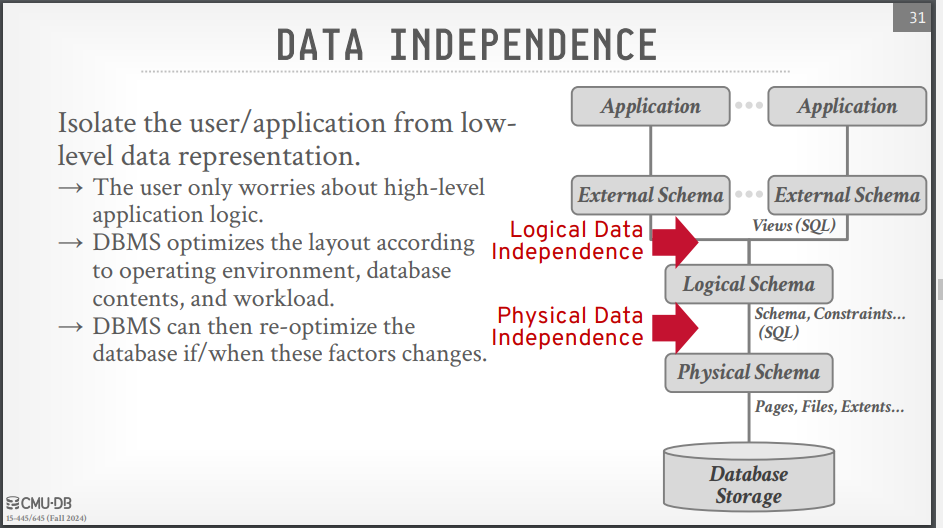

# Relational model & Algebra

> [!tip] Databases Background
>
> - **Database**: an organized collection of related data
> - **Flat file database**: storing the data in a csv(Comma Separated Values) file, not recommended.
> - **DBMS(Database Management System)**: a software that allows applications to store and manipulate data in a database.
> - **Data Model**: a collection of concepts for describing data.

> [!note] early databases 1960 (IMS, CODASYL)
>
> it was built either as a hash table or a tree structure, it was hard to query and maintain and any change in the requirements would require a change in the structure of the database.
> **Relational model** was introduced to solve these problems(1970).

> [!note]
>
> In Theory, the database with its relations can be moved from the hard disk to the RAM, and the database will still work the same way, this is called **Logical Data Independence**.
> but this is not always the case, maybe postgreSQL will work fine but MySQL will not, this is called **Physical Data Independence**.

> [!tip] Data Independence
>
> Isolate the application/user from the low level details of data representation.
> 

> [!note] Physical Data Independence
>
> physical data independence is the ability to create the tables and alter them without needing to worry about how the pages and the files are stored on the disk.

> [!note] Logical Data Independence
>
> logical data independence is the ability to change the schema or recompose a new one to different users without changing the tables structure ... example: creating a view.

> [!note] Relational Model
>
> - Introduced by **Edgar Codd** in 1970.
> - A **Relation** is an unordered set of tuples.
> - **Primary Key**: a unique identifier for each tuple, it can be a single attribute or a combination of attributes, some databases create a PK for each table automatically if not specified.
> - **Foreign Key**: an attribute in a relation that refers to the primary key of another relation, it puts a constraint on the data that refers to as it can't be deleted if it's referred to by another relation.
> - **Constraints**: rules that must be followed when inserting or updating data in a table.

> [!TIP] DML(Data Manipulation Language)
>
> The API that a DBMS provides to manipulate the data in the database, it includes:
>
> - **Procedural DML**: the user specifies what data is needed and how to get it, it uses **Relational Algebra**.
> - **Declarative DML**: the user specifies what data is needed without specifying how to get it, it uses **Relational Calculus**, no body uses that in the real world unless you are writing a query optimizer.

> [!tip] Relational Algebra
>
> - **Selection**: selects a subset of rows from a relation that satisfy a condition, it represents the where clause in SQL for example: `σ (age > 20) (Students)` is the same as `SELECT * FROM Students WHERE age > 20`.
> - **Projection**: selectsZ@ a subset of columns from a relation, it represents the select clause in SQL for example: `π (name, age) (Students)` is the same as `SELECT name, age FROM Students`.
> - **Union**: combines two relations that have the same schema, it represents the union clause in SQL for example: `R ∪ S` is the same as `SELECT * FROM R UNION SELECT * FROM S`.
> - **Difference**: returns the rows that are in the first relation but not in the second relation, it represents the except clause in SQL for example: `R - S` is the same as `SELECT * FROM R EXCEPT SELECT * FROM S`.
> - **Intersection**: returns the rows that are in both relations, it represents the intersect clause in SQL for example: `R ∩ S` is the same as `SELECT * FROM R INTERSECT SELECT * FROM S`.
> - **Cartesian Product**: returns the cross product of two relations, it represents the cross join clause in SQL for example: `R x S` is the same as `SELECT * FROM R CROSS JOIN S`.
> - **Join**: returns the rows that have a match in both relations, it represents the join clause in SQL for example: `R ⨝ S` is the same as `SELECT * FROM R JOIN S ON R.id = S.id`.
> - **Extra Operators**: **Rename**, **Division**, **Natural Join**, **Theta Join**, **Outer Join**.

> [!TIP]
>
> A naive join is a cartesian product followed by a selection, it's not efficient, the DBMS uses different algorithms to optimize the join operation like **Nested Loop Join**, **Hash Join**, **Merge Join**.

> [!TIP] Document Data Model
>
> A collection of documents, Conaining a hirearchy of key-value pairs like JSON, BSON, XML, etc.
> Its concept is to store the data in a way that is easy to read and write, it's not good for complex queries.
> it doesn't depend on the joins, it depends on the nested documents.

> [!Question] how to decide which data model to use?
>
> It depends on the requirements of the application, if the application needs complex queries and joins, the relational model is the best choice, if the application needs to store the data in a way that is easy to read and write, the document model is the best choice.

> [!TIP] Vector Data Model
>
> A collection of vectors, each vector contains a list of values, it's used in data mining and machine learning, it's trending now because of the big data and machine learning.
