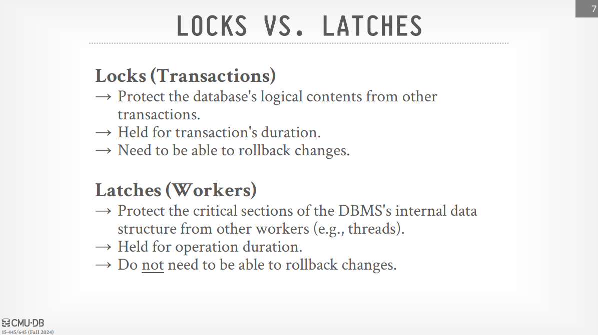
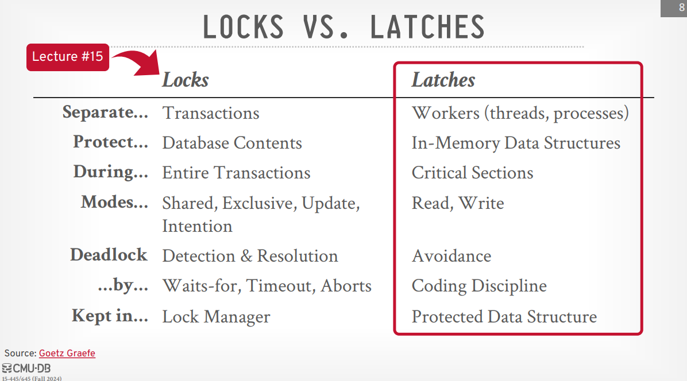
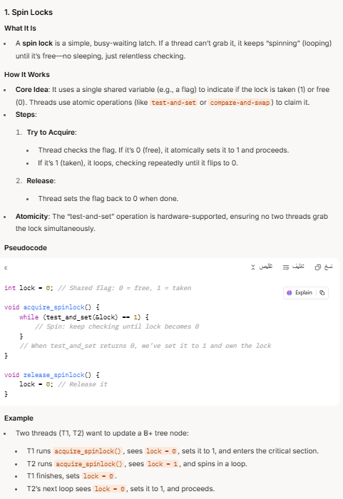
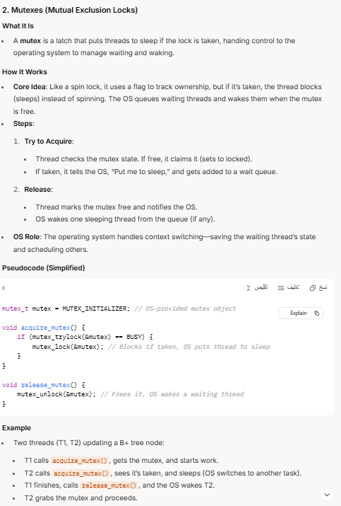
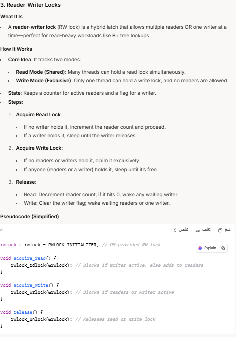
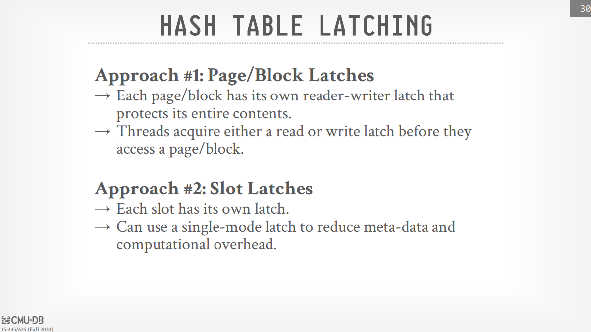
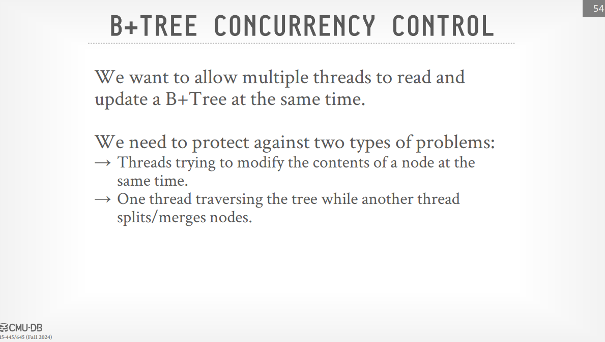
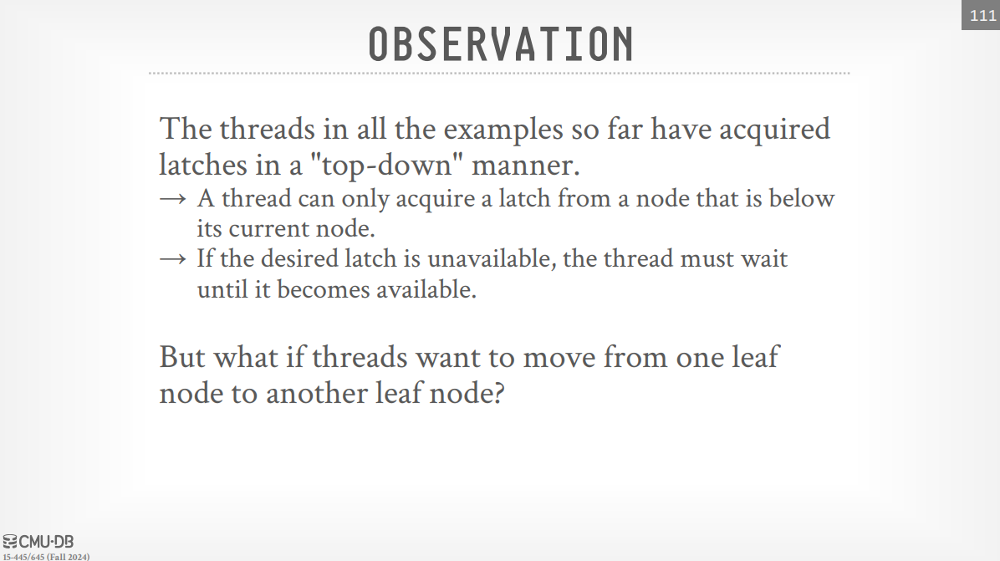

# Index Concurrency Control

In a modern DBMS, multiple workers (threads or processes) need to access and modify data structures concurrently. Without proper control mechanisms, this can lead to inconsistencies and data corruption. Therefore, it's essential to introduce safety mechanisms to ensure that these concurrent operations do not interfere with each other and maintain the integrity of the data structure.

> [!tip] Latches vs. Locks
>
> - 
> - 

> [!note] Latch modes
>
> Latches primarily operate in two modes:
>
> - **Read Mode (Shared):** Multiple threads can hold a read latch on the same object simultaneously. If a latch is already in read mode, another thread can also acquire it in read mode. This allows concurrent read access without interference.
> - **Write Mode (Exclusive):** Only one thread can hold a write latch on an object at any given time. If a latch is held in write mode, no other thread can acquire it in either read or write mode. This ensures exclusive access for modifications.

> [note] Latch Implementation goals
>
> - **Small memory footprint** : This means that the latch should not consume a lot of memory, as it is used frequently and in many places.
> - **Fast execution path when not contended** : This means that the latch should be fast to acquire and release when there is no contention (i.e., when no other thread is trying to acquire the latch at the same time).
> - **Decenteralized management of latches** : This means that the latch should not be managed by a central authority, as this can lead to contention and bottlenecks. Instead, each thread should manage its own latches.
> - **Avoid Expensive System Calls** : This means that the latch should not require expensive system calls to acquire and release, as this can slow down the execution of the program.

> [!note] Latch Implementation
>
> - **Spin Locks:** A thread trying to acquire a spin lock repeatedly checks if it's available in a tight loop. Spin locks can be efficient for short critical sections but can waste CPU cycles if the lock is held for a long time. The professor advises against using spin locks in user space unless you are highly experienced.
> - 
> - **Mutexes (Mutual Exclusion Locks):** A thread trying to acquire a mutex will block (sleep) if the mutex is already held. The operating system will wake up the blocked thread when the mutex is released. Mutexes are generally more suitable for longer critical sections to avoid busy-waiting.
> - 
> - **Reader-Writer Locks (Shared Mutex):** These locks allow multiple concurrent readers but only one writer at a time. They can improve performance in read-heavy workloads, note that the writer has a higher priority than the readers so there is a limit on the number of readers that can hold the lock at the same time to prevent writer starvation.
> - 

> [!note] Hash Table Latching
>
> - The granularity of latching in a hash table differs based on the hashing scheme used, for example in a linear hashung and extendible hashing, the granularity is at the bucket level, anyway the latching is done at either block level or slot level, we decide which based on the workload and what level of parallelism we want to achieve.
> - 

> [!note] B+ Tree Latching (Latch Coupling (Crabbing))
>
> - 
> - for the B+ tree, the latching is done at the node level, basically we have two approaches (optimistic and pessimistic) to do the latching, at search time we can use the optimistic approach which is we acquire the latch by crabbing meaning we traverse when reading the node we put the latch on the node then when going to the chuld node we release the latch on the parent node, this doesn't block the other threads from accessing the parent node, **but it can lead to some problems if the parent node is deleted or modified while we are traversing the tree.**
> - so for deletion and insertion we need to use the pessimistic approach which is we acquire the latch on the whole path from the root to the leaf node untilwe reach the leaf node and insure that the node won't be split or merged and then we release the latches in the above levels, **but this cause the other threads to block and wait as we put a write latch on the whole path including the root node**, so what should we do?
> - Most modifications to a B+Tree will not require a split or merge. Instead of assuming there will be a split/merge, optimistically traverse the tree using read latches. If a worker guesses wrong, repeat traversal with pessimistic algorithm.
> - The lecture slides provide many examples for different cases.

> [!note] B+ Tree Horizontal latching
>
> - 
> - see example slide 111.
> - simply if we tried to acquire a latch on a neighbor node and we found it busy we choose to sleep for a while (like a yield) and then the thread kills itself and then we retry the operation (operation retry is done by the code (we define it)).
