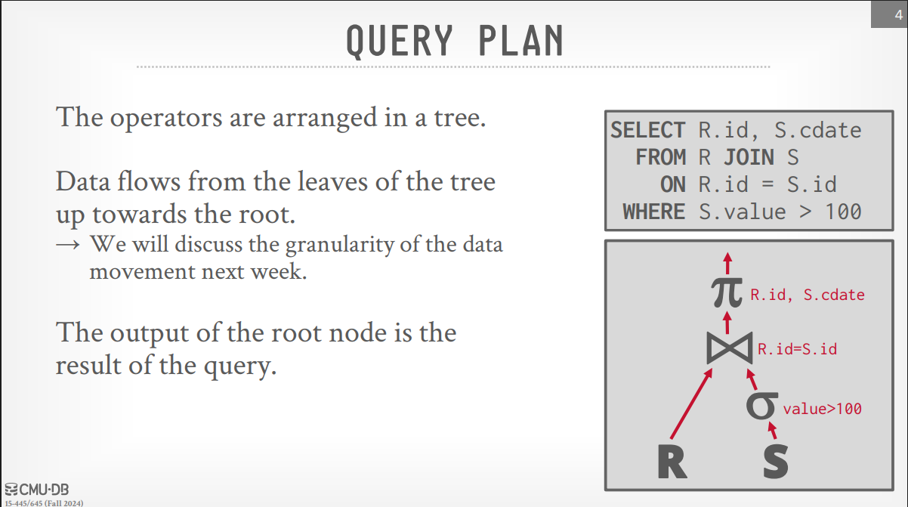
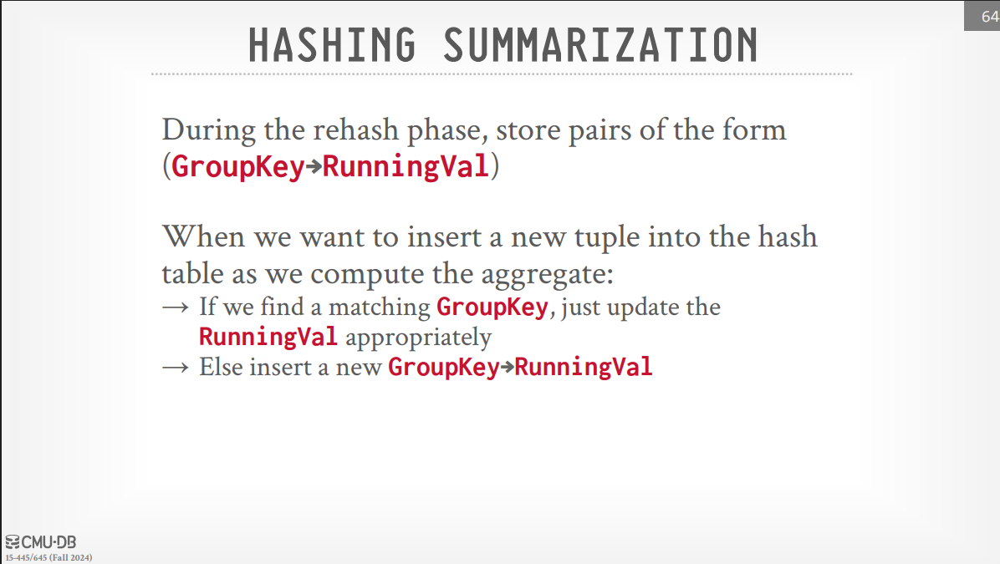

# Sorting & Aggregation Algorithms

> [!note] When a SQL query comes into the system, it goes through a parser and generates an abstract syntax tree. From this, the DBMS creates a query plan, which is often represented as a tree of operators.
>
> - The leaf nodes of this tree are where data is read from some source, like a table or a file.
> - Data then flows up from one operator to the next.
> - The root node of the tree produces the final output of the query, which is sent back to the client.
>   

> [!note] Keep in mind that since we're dealing with disk-based systems, we can't assume all the data we need will fit in main memory when we execute these operators. The lecture then focuses on sorting algorithms that are crucial for many database operations, such as ORDER BY clauses, joins, and aggregations. Two main sorting algorithms are discussed:
>
> - **Top-N Heap Sort**: This is a special case used when a query has an ORDER BY clause combined with a LIMIT clause. In such cases, the DBMS doesn't need to sort the entire dataset globally. It only needs to find the top N (greatest or smallest) values based on the ordering criteria. A heap data structure is efficient for this purpose.
> - **External Merge Sort**: This is the core algorithm used for disk-based sorting when the data to be sorted is too large to fit into main memory.

> [!note] Top-N Heap
>
> - It's a specialized sorting algorithm used when the query has an ORDER BY clause with a LIMIT clause to get the top N results.
> - It's very simple we use a heap data structure (normally an array) to keep track of the top N elements while scanning the data only once.

> [!question] What actually is the heap data structure?
>
> - A heap is a specialized tree-based data structure that satisfies the heap property. In a max heap, for example, the value of each node is greater than or equal to the values of its children. but in implementation, we usually use an array to represent the heap as Arrays are fast for accessing and updating elements (O(1) for reads, O(log N) for insertions/deletions in a heap of size N). also avoids pointer overhead of a tree with nodes in the heap.

> [!note] External Merge Sort
>
> - Divide-and-conquer algorithm that splits data into separate runs, sorts them individually, and then combines them into longer sorted runs.
> - This is the core algorithm used for sorting large datasets that don't fit into main memory.
> - The algorithm is based on the idea of breaking the data into smaller chunks that can fit into memory, sorting each chunk temporarily in the disk, and then merging these sorted chunks together in multiple passes until the entire dataset is sorted.

> [!tip] How external merge sort works?
>
> - The algorithm splits data and sor them into smaller chunks (sorted runs) and then write them back to disk temporarily.
> - The sorted runs are then merged together in multiple passes until the entire dataset is sorted.
> - Pass Zero (Initial Sorting):
>   > - The algorithm reads the table one page at a time from disk into a buffer pool page.
>   > - Each page is sorted in memory (using an in-memory sorting algorithm like quicksort, as mentioned for PostgreSQL) to create a sorted "run".
>   > - This sorted run is then written back out to disk.
>   > - This process is repeated for every page in the table, resulting in multiple sorted runs on disk, each the size of one page. It's mentioned that this pass can be done in parallel since each page is processed independently.
> - Subsequent Passes (Merging):
>   > - In the subsequent passes, the algorithm recursively merges contiguous pairs of sorted runs.
>   > - For each merge operation, two input buffer pool pages are used to read the two runs being merged, and one output buffer pool page is used to write the merged result. So, for a two-way merge, you typically need at least three buffer pool pages.
>   > - Cursors are maintained to iterate through the two input pages sequentially.
>   > - The keys being pointed to by the cursors in the two input pages are compared.
>   > - The smaller key (along with its associated record information) is written to the output buffer page, and the cursor for that input page is advanced.
>   > - This continues until one of the input pages is exhausted. The remaining data from the other input page is then appended to the output buffer.
>   > - Once the output buffer page is full, it is written back to disk.
>   > - This process creates larger sorted runs on disk.
>   > - This merging process is repeated in subsequent passes, merging pairs of increasingly larger sorted runs, until a single, globally sorted run containing all the data is obtained.

> [!tip] Materialization during sorting:
>
> - **Early Materialization**: When sorting, the full tuple (record) associated with the key being sorted is kept together throughout the sorting process. This avoids having to go back to the original data later in the query plan to retrieve other attributes of the tuple.
> - **Late Materialization**: Only the record ID (or some minimal information) along with the sorting key is maintained during the initial sorting phases. The full tuples are fetched from disk only when needed later in the query execution process. (slide 20)

> [!note] Double Buffering optimization
>
> - Prefetch the next run in the background and store it in a second buffer while the system is processing the current run.
>   **→** Reduces the wait time for I/O requests at each step by continuously utilizing the disk(Overlap CPU and I/O operations)
>   **→** Reduces effective buffers available by half

> [!note] During sorting there is key comparison, for key comparison optimization, we can use two techniques:
>
> - **Code Specialization**: This is a technique where the code for comparing keys is specialized for the specific data types being used instead of using a generic comparison function. This can lead to performance improvements by reducing the overhead of function calls and allowing for more efficient comparisons.
> - **Suffix Truncation**: This is a technique used to optimize comparisons of variable-length strings. Instead of comparing the entire string, only the relevant suffix (or part) of the string is compared, if the prefix is equal. This can significantly reduce the number of comparisons needed, especially for long strings, and improve performance.

> [!note] USING B+TREES FOR SORTING
>
> - If the table that must be sorted already has a B+Tree index on the sort attribute(s), then we can use that to accelerate sorting.
> - Retrieve tuples in desired sort order by simply traversing the leaf pages of the tree.
> - Cases to consider:
>   **→ Clustered B+Tree**: Traverse to the left-most leaf page, and then retrieve tuples from all leaf pages. This is always better than external sorting because there is no computational cost, and all disk access is sequential.
>   **→ Unclustered B+Tree**: The leaf pages of the B+Tree are not in sorted order. In this case, This is almost always a bad idea except for Top-N queries where N is small enough relative to total number of tuples in table.

> [!note] AGGREGATION
>
> - Aggregation is a common operation in SQL queries, often used to compute summary statistics like COUNT, SUM, AVG, MIN, and MAX.
> - Two implementation choices:
>   **→ Sorting**: in agreagation if we needthe results sorted we sort the data based on the grouping attributes and then apply the aggregation function (slide 47).
>   **→ Hashing**: if we do not need the data to be ordered? → Forming groups in GROUP BY (no ordering) → Removing duplicates in DISTINCT (no ordering), Hashing is a better alternative in this scenario.

> [!note] External Hash Aggregation
>
> - From slide (49) important.
> - The algorithm is similar to external merge sort, but instead of sorting the data, it partitions it into buckets based on a hash function applied to the grouping attributes then rehash the data into a smaller number of buckets to get the final result.
> - The algorithm is divided into two main phases:
>
> 1. **Partitioning Phase**: The data is read from disk, and a hash function is applied to the grouping attributes to determine which bucket each record belongs to. Each bucket is then written to disk as a separate file.
> 1. **Rehashing Phase**: The algorithm reads each bucket from disk, applies a second hash function to the records in that bucket, and writes the results to a smaller number of output buckets. This process continues until the final result is obtained.

> [!tip] HASHING SUMMARIZATION
>
> 
> see slide 60
