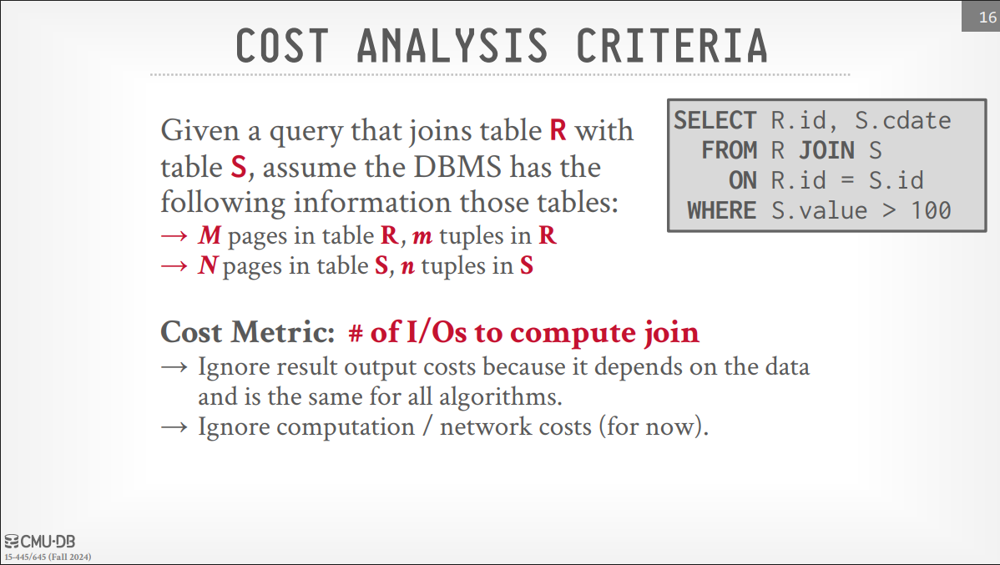
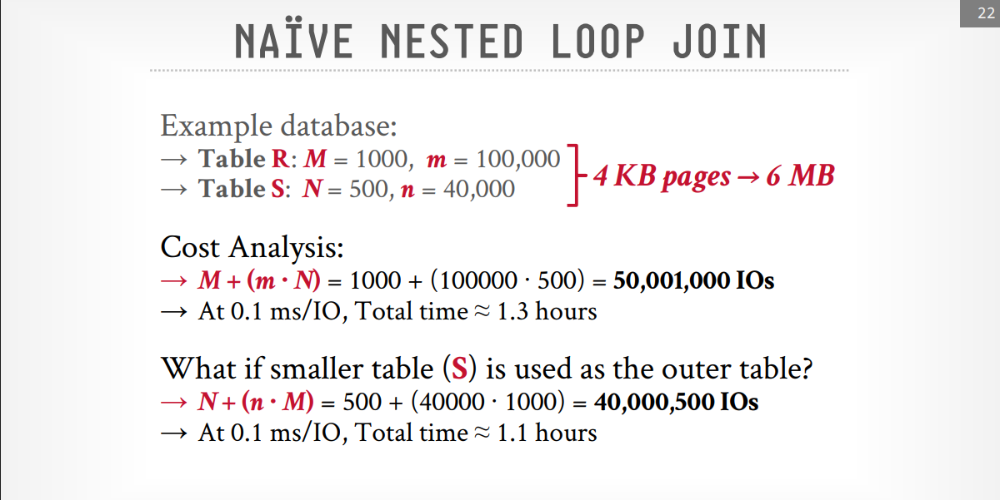
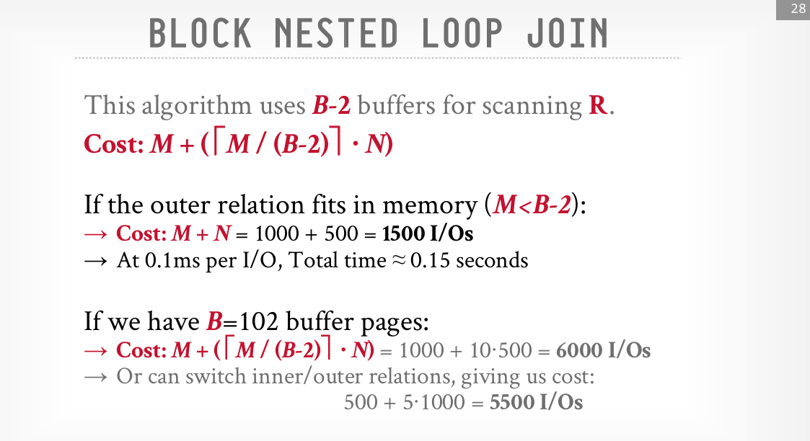
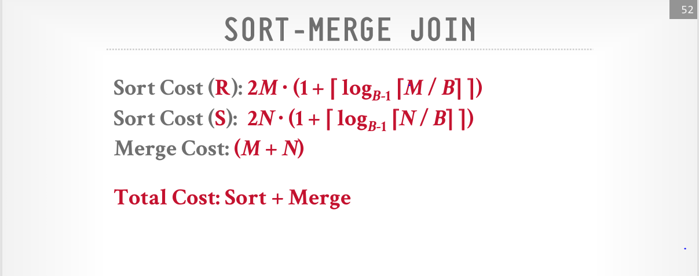
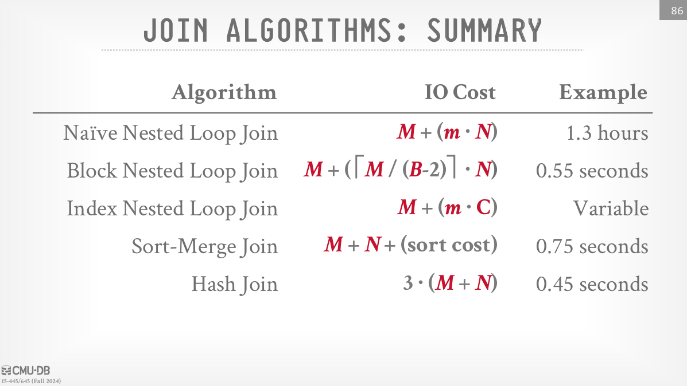

# Join Algorithms: Hash, Sort-Merge, Nested Loop Joins

Data is usually larger than the memory, so we need to use disk-based algorithms for joins using divide-and-conquer techniques. Join is done eeither by sorting or hashing. Hashing is better we will see why with example for both. Note that both approaches are usable and have certain benefits.

## Why we need to join?

because we normalize the data to avoid data redundancy, so we need to join the data from different tables to get the complete information.

## Join Algorithms

We will focus on the equijoin, In general we want the smallest table to be the outer table, so we can use the smallest amount of memory and disk space (more details will be discussed at the lecture).
Joining process or algorithm depends on some factors: Output (What data does the join operator emit to its parent operator?), cost analysis.

> [!note] Operator Output
>
> **Early Materialization**: The join operator emits the full tuple (record) associated with the join key, which allows for immediate access to all attributes of the joined records.
> **Late Materialization**: The join operator emits only the record ID (or some minimal information) along with the join key. The full tuples are fetched from disk only when needed later in the query execution process.

> [!note] Cost Analysis
>
> 

> [!note] Join Algorithms
>
> - **Nested Loop Join**: This is the simplest join algorithm, where for each record in the outer table, we scan the inner table to find matching records. It's not efficient for large datasets.
> - **Sort-Merge Join**: This algorithm sorts both tables on the join key and then merges them. It's efficient for large datasets, especially when both tables are already sorted.
> - **Hash Join**: This algorithm uses a hash table to store the records of one table (usually the smaller one) and then probes this hash table with records from the other table. It's efficient for large datasets, especially when the join key is not sorted.

## Naive Nested Loop Join

> [!note]
>
> I/O Cost for Nested Loop Join is M + (m\*N), where M is the number of pages in the outer table, m is the number of tuples in the outer table, and N is the number of pages in the inner table.
> see the example below and notice what happens when putting the smaller table as the outer table and vice versa.
> 

## Block Nested Loop Join

> [!note]
>
> I/O Cost for Block Nested Loop Join is M + (M/(B-2)) * N, where M is the number of pages in the outer table, B is the number of pages in the buffer, and N is the number of pages in the inner table.
> the explanation for I/O Cost is as follows:
> - M is the number of pages in the outer table.
> - B - 2 is the number of pages in the buffer (from the outer table) and the -2 is because we need to keep one page for the inner table and one page for the output.
> - N is the number of pages in the inner table.
> see the previous example using the block nested loop join and notice the difference in the I/O cost.
> 

> [!question] Why Block Nested Loop Join is better than Naive Nested Loop Join?
>
> because it reduces the number of I/O operations by processing multiple pages of the outer table at once, rather than one tuple at a time. 

> [!question] How can we avoid sequential scan of the inner table?
>
> by using an index on the join key of the inner table, which allows us to quickly find matching records without scanning the entire table ... some DBMSs do this automatically like SQL Server do something called **spooling** which is a temporary storage generated as index on the fly for the inner table and probe it for the join then after the join is done it will be deleted.

## Index Nested Loop Join

> [!note]
>
> I/O Cost for Index Nested Loop Join is M + (m * C), where M is the number of pages in the outer table, m is the number of tuples in the outer table, and C is the average cost of accessing the index for the inner table including the cost of fetching the data pages.

## Sort-Merge Join

> [!note]
>
> I/O Cost for Sort-Merge Join is as follows:
> 

> [!question] How sort-merge join works?
>
> - Sort both tables on the join key using external merge sort or any other sorting algorithm.
> - Merge the sorted tables by scanning both tables simultaneously and matching records based on the join key.
> - Sometimes we need to backtrack in the inner table if there are repeated values in the outer table, so we need to keep track of the last matched record in the inner table. see the lecture examples for more details (slide 54).

> [!question] When to use sort-merge join?
>
> - When both tables or at least one are already sorted on the join key.
> - When the output must be sorted on the join key.

> [!note] Best Case for Sort-Merge Join
>
> Both tables are already sorted on the join key, and the join key has no duplicates them we don't need to backtrack.

> [!note] Worst Case for Sort-Merge Join
>
> Both tables are not sorted on the join key, and the join key has many duplicates, so we need to backtrack frequently in the inner table.

## Hash Join

> [!note] How hash join works?
>
> - Build a hash table on the join key of the smaller table (normally the outer).
> - Probe the hash table with the join key of the larger table (probe input) to find matching records (we use the inner table key and hash it and prope or look it up in the hash table).
> - This approach is efficient because it reduces the need for nested loops and can quickly find matches using the hash table.

> [!question] How to optimize hash join?
>
> By using a bloom filter to reduce the number of probes on the hash table.

> [!note] This approach is good as long as the hash table fits in memory, and we need not to let the buffer bool manager swap the pages in and out of memory randomly so the another approach is to use **partitioned hash join**.

## Partitioned Hash Join (Grace Hash Join)

> [!note] How partitioned hash join works?
>
> - **Partitioning Phase**: Divide both tables into partitions based on the hash value of the join key. Each partition is processed independently and can fit into memory then moved to disk.
> - **Join Phase**:  Read corresponding partitions into memory one pair at a time , get the first partition of the outer table( the smaller table) and build a hash table on it with another hashing function, then hash every key from the partition of the inner table and probe the hash table to find matching records.
> - This approach allows us to handle larger datasets that do not fit into memory by processing them in smaller partitions.

> [!note] using the same hash function for both tables is important to ensure that the same partitioning is applied to both tables, and ensure the same keys end up in the same partition.

> [!note] If a partition does not fit in memory, recursively 
partition it with a different hash function
>
> →Repeat as needed
> →Eventually hash join the corresponding (sub-)partitions

> [!note] If a single join key has too many matching records 
that do not fit in memory, use a block nested loop 
join just for that key.
>
> →Avoids random I/O in exchange for sequential I/O

> [!note] Cost of Partitioned Hash Join
>
> **Partitioning Phase**: 2 * (M + N) I/Os, where M is the number of pages in the outer table and N is the number of pages in the inner table.
> **Join Phase**: M + N I/Os.
> **Total Cost**: 3 * (M + N) I/Os.

> [!note] Hybrid Hash Join (Optimized Partitioned Hash Join)
>
> If the keys are skewed(the distribution of the key values is uneven, some partitions have many more tuples than others), then the DBMS keeps the hot partition in-memory and immediately perform the comparison instead of spilling it to disk. Difficult to get to work correctly. Rarely done in practice.

## Summary

