```mermaid
graph TB
    subgraph Architecture["<b>1. ARCHITECTURE</b>"]
        A1[Parallel DBMS<br/>Resources: Close & Fast<br/>Communication: Reliable]
        A2[Distributed DBMS<br/>Resources: Far & Slow<br/>Communication: Unreliable]
    end

    subgraph ProcessModel["<b>2. PROCESS MODEL</b>"]
        PM1[Process per Worker<br/>Isolated, Fault-Tolerant<br/>Heavy Context Switch]
        PM2[Thread per Worker<br/>Shared Memory, Fast<br/>Most Common]
        PM3[Embedded DBMS<br/>Runs in App Space<br/>App Controls Threads]
    end

    subgraph QueryEntry["Query Arrives"]
        Q[SQL Query<br/>SELECT * FROM orders<br/>WHERE year = 2024]
    end

    subgraph ParallelStrategy["<b>3. PARALLEL STRATEGY</b> (The Assignment)"]
        PS1{What Type of<br/>Parallelism?}
        
        subgraph InterQuery["Inter-Query Parallelism"]
            IQ[Run Multiple Different<br/>Queries Simultaneously<br/>Goal: Higher Throughput]
        end
        
        subgraph IntraQuery["Intra-Query Parallelism"]
            direction TB
            IQP[Split ONE Query<br/>Goal: Faster Response]
            
            subgraph IntraOp["Intra-Operator (Horizontal)"]
                IO[Same Operation<br/>Different Data Subsets<br/>Example: 4 workers each scan<br/>1/4 of the table]
            end
            
            subgraph InterOp["Inter-Operator (Vertical/Pipeline)"]
                EO[Different Operations<br/>Pipeline Data Flow<br/>Example: One scans while<br/>another joins]
            end
            
            subgraph Bushy["Bushy Parallelism"]
                BP[Hybrid Approach<br/>Multiple branches of<br/>query tree execute<br/>simultaneously]
            end
            
            IQP --> IO
            IQP --> EO
            IQP --> BP
        end
        
        PS1 --> InterQuery
        PS1 --> IntraQuery
    end

    subgraph Coordination["<b>4. COORDINATION</b> (The Hand-off)"]
        EX[Exchange Operator]
        
        subgraph ExchangeTypes["Exchange Types"]
            EX1[Gather<br/>Many → One<br/>Combine worker results]
            EX2[Distribute<br/>One → Many<br/>Split input stream]
            EX3[Repartition<br/>Many → Many<br/>Shuffle/Rebalance data]
        end
        
        EX --> ExchangeTypes
    end

    subgraph Storage["<b>5. STORAGE</b>"]
        IO_PAR[I/O Parallelism<br/>Avoid Disk Bottleneck]
        
        subgraph StorageTypes["Storage Strategies"]
            ST1[RAID 0 Striping<br/>Spread pages across disks<br/>Max Performance]
            ST2[RAID 1 Mirroring<br/>Duplicate pages<br/>Max Reliability]
            ST3[Database Partitioning<br/>Split tables by attribute<br/>Store on separate devices]
        end
        
        IO_PAR --> StorageTypes
    end

    subgraph Execution["Worker Execution Phase"]
        W1[Worker 1<br/>Scan Partition 1]
        W2[Worker 2<br/>Scan Partition 2]
        W3[Worker 3<br/>Scan Partition 3]
        W4[Worker 4<br/>Scan Partition 4]
    end

    subgraph Result["<b>6. RESULT ASSEMBLY</b>"]
        RA[Combine Results<br/>Apply Final Operations<br/>Return to Client]
    end

    %% Flow connections
    QueryEntry --> Architecture
    Architecture --> ProcessModel
    ProcessModel --> ParallelStrategy
    ParallelStrategy --> Storage
    Storage --> Execution
    Execution --> Coordination
    Coordination --> Result

    %% Styling
    classDef envStyle fill:#e1f5ff,stroke:#0066cc,stroke-width:2px
    classDef workerStyle fill:#fff4e1,stroke:#ff9900,stroke-width:2px
    classDef strategyStyle fill:#e8f5e9,stroke:#2e7d32,stroke-width:2px
    classDef coordStyle fill:#f3e5f5,stroke:#7b1fa2,stroke-width:2px
    classDef storageStyle fill:#fce4ec,stroke:#c2185b,stroke-width:2px
    classDef resultStyle fill:#fff9c4,stroke:#f57f17,stroke-width:2px

    class A1,A2 envStyle
    class PM1,PM2,PM3,W1,W2,W3,W4 workerStyle
    class IQ,IQP,IO,EO,BP strategyStyle
    class EX,EX1,EX2,EX3 coordStyle
    class IO_PAR,ST1,ST2,ST3 storageStyle
    class RA resultStyle
```

# Query Execution Part 2

> [!tip] Workers
>
> The lecture use workers to describe the units of execution in DBMS, not (process or thread) as worker could be a process, a thread or a combination of both.

## Parallel vs. Distributed Databases
While both use multiple resources, they differ based on the physical proximity and reliability of those resources:

• **Parallel DBMS**: Resources are physically close (e.g., in the same machine or rack) and communicate over high-speed interconnects. Communication is assumed to be cheap and reliable.
• **Distributed DBMS**: Resources are geographically distant and communicate over slower, less reliable networks. Communication costs and potential network failures cannot be ignored.

## Process Models (The Worker Architecture)
A worker is the DBMS component responsible for executing tasks on behalf of a client. Systems are architected in three main ways:
• **Process per DBMS Worker**: Each worker is a separate OS process. This relies on the OS dispatcher and requires shared memory for global data structures (like the lock table or buffer pool). A process crash is isolated and doesn't crash the whole system.
• **Thread per DBMS Worker**: A single process contains multiple worker threads. This is the most common modern model because it has lower context-switch overhead and simplifies data sharing.
• **Embedded DBMS**: The database runs directly in the application’s address space, and the application manages the threads.

## Types of Parallel Execution
The DBMS maximizes hardware utilization by running multiple tasks at once:
• **Inter-Query Parallelism**: Different queries are executed simultaneously to improve overall system throughput. If queries are read-only, little coordination is needed beyond the buffer pool.
• **Intra-Query Parallelism**: A single query is decomposed into smaller tasks assigned to different workers to reduce response time.

### Sub-types of Intra-Query Parallelism
1. **Intra-Operator (Horizontal)**: A single operator (like a Join or Scan) is decomposed into independent instances that perform the same function on different subsets of data.
2. **Inter-Operator (Vertical)**: Different operators in the query plan are overlapped so that data is pipelined from one stage to the next without waiting for materialization. This is also called Pipelined Parallelism.
3. **Bushy Parallelism**: A hybrid where workers execute multiple operators from different segments of the query plan tree at the same time.

## Coordination: The Exchange Operator
To manage the flow of data between parallel workers, the DBMS uses an Exchange Operator. This acts as a barrier to coalesce or split results:
• **Gather**: Combines results from multiple workers into a single output stream.
• **Distribute**: Splits a single input stream into multiple output streams.
• **Repartition**: Shuffles multiple input streams across multiple output streams, often to re-balance data based on a hash or range.

## I/O Parallelism
Parallel compute is ineffective if the disk is the main bottleneck. I/O Parallelism improves bandwidth by splitting the database across multiple storage devices:
• **RAID 0 (Striping)**: Spreads pages across disks in a round-robin fashion to maximize performance and capacity.
• **RAID 1 (Mirroring)**: Duplicates every page across multiple disks to ensure durability and high availability.
• **Database Partitioning**: Splitting a logical table into physical segments (often based on attributes like "Year") that are stored on separate devices. This should ideally be transparent to the application.

## My questions about this lecture

> [!question] What is exactly the Embedded DBMS process model? 
>
> An Embedded DBMS is not embedded into the database itself; rather, it is embedded into the application.
> - __Simple Terms__: In a standard system (like Postgres), the database is a separate "house" (server) your app talks to. In an embedded system, the database is a "toolbox" kept inside your app's house.
> - __How it Works__: The DBMS runs in the same address space as your application. It doesn't have its own "brain" for scheduling; instead, your application is responsible for managing the threads and deciding when the database does work.
> - __Example__: SQLite or RocksDB. When you use an app on your phone that saves data locally, it is likely using an embedded DBMS.

> [!question] Process VS Thread per DBMS Worker?
>
> - **Process per DBMS Worker**: Each worker is its own OS process. they communicate through shared memory. If one crashes, it doesn't affect the others. However, context switching is more expensive, and sharing data is more complex.
> - **Thread per DBMS Worker**: All workers are threads within a single process. This allows for easier data sharing and lower context-switch overhead. However, if one thread crashes, it can (may) bring down the entire process.

> [!question] Types of parallel execution in simple terms?
>
> - **Inter-Query Parallelism(Multiple Queries)**: Running multiple, different and unrelated queries at the same time to improve overall throughput.
> - - **Example**: The kitchen is cooking a burger for Table 1 and a salad for Table 2 simultaneously.
> - **Intra-Query Parallelism(Single Query, many workers)**: Breaking down a single query into smaller tasks to run faster.
> - - **Example**: Five chefs work together to prepare a large complex meal.
> - **Intra-Operator (Horizontal)**:  The query is divided by data. Each worker does the same operation on different parts of the data.
> - - **Example**: Five chefs each make a batch of fries using different potatoes.
> - **Inter-Operator (Vertical/Pipelining)**: The query is divided by steps.
> - - **Example**: One chef chops vegetables, another cooks them, and a third plates the dish, all working in a sequence.
> - **Bushy Parallelism**: A mix of both intra-operator and inter-operator parallelism.
> - - **Example**: Two chefs work on the appetizer (Horizontal) while two other chefs work on the dessert (Vertical/Pipelining) at the very same time.

> [!question] The "Parallel Execution Cycle" Diagram
>
> 
