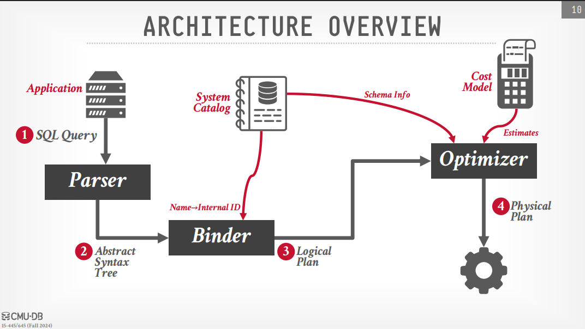

# Query Planning and Optimization

## Overview
The goal of query optimization is to `transform a declarative SQL query into an efficient physical execution plan`. Because SQL is a high-level language that describes what data is needed rather than how to get it, the DBMS must evaluate multiple strategies to find a plan that minimizes resource consumption, primarily I/O costs.

## The Lifecycle of a Query

When a SQL query is submitted to the DBMS, it passes through several architectural stages before execution:

• **Parser**: Converts the SQL string into an Abstract Syntax Tree (AST) and checks for syntax errors.
• **Binder**: Maps tokens in the tree to internal identifiers (Object IDs) in the System Catalog, ensuring the tables and columns actually exist. This produces a Logical Plan.
• **Optimizer**: Transforms the logical plan into the best Physical Plan. It uses a Cost Model and Statistics to compare different physical strategies.
• **Physical Plan**: The final tree of operators (e.g., Hash Join, Index Scan) that the engine actually runs.

### Motivating Example: The Value of Optimization
Professor Pavlo illustrates the necessity of optimization with a simple join between an Employee table (1,000 pages) and a Department table (50 pages) ... lecture slides 5-8.
• **Naive Approach**: Using a Cartesian product followed by a filter results in approximately 2 million I/Os.
• **Physical Operator Optimization**: Simply replacing the Cartesian product with a Block Nested-Loop Join drops the cost to 54,000 I/Os. Switching to a Sort-Merge Join further reduces it to 7,159 I/Os.
• **Logical Reordering & Indexing**: By pushing the filter below the join (Predicate Pushdown) and using available Indices, the cost drops dramatically to just 37 I/Os.

## Rule-Based Optimization (Heuristics)

This approach uses static rules to rewrite a logical plan into an equivalent, presumably better, logical plan. These rules do not require looking at the actual data values.

• **Predicate Pushdown**: Moving selection filters as far down the tree as possible to reduce the number of tuples processed by higher-level operators like joins.
• **Projection Pushdown**: Performing projections early (By duplicating the projection in the child nodes, see slide 18) to remove unnecessary columns, keeping more useful data in memory.
• **Replace Cartesian Products**: Converting a cross-join followed by a filter into an inner join to avoid massive intermediate results.

## Cost-Based Optimization Search Space

> [!note]
>
> Cost-Based Optimization is DBMS specific and cannot be easily compared across different systems. However, the general principles of how optimizers search for the best plan are similar.

In a cost-based optimization search, the DBMS must evaluate three distinct categories of query structures: single-relation queries, multiple-relation joins, and nested subqueries. The goal is to enumerate various physical plans for each category and pick the one with the lowest estimated internal cost.

### Single-Relation Query Planning

For queries involving only one table, the optimizer’s job is relatively straightforward and primarily focuses on finding the most efficient way to access the data.

• **Access Method Selection**: The optimizer compares the cost of a sequential scan (the fallback method) against available index scans. It prioritizes the access path that is the most selective, meaning it retrieves the smallest fraction of tuples.
• **Predicate Evaluation Ordering**: The DBMS chooses the order in which it evaluates the filters in a WHERE clause. It aims to evaluate the most selective predicates first to discard as much "useless" data as possible early in the process.
• **Statistics and Heuristics**: To make these decisions, the system relies on catalog statistics, such as histograms, to estimate the distribution of data. For single-table queries, simple heuristics are often sufficient to identify the optimal plan.

### Multi-Relation Query Planning
When a query involves joining multiple tables, the search space becomes exponentially larger, making this task NP-hard. The optimizer must determine the join ordering and the specific join algorithms (e.g., Hash Join vs. Sort-Merge Join).

• **Bottom-Up Search (System R Model)**: This approach uses dynamic programming to build the query plan starting from the leaves. To reduce complexity, it often restricts itself to left-deep trees, which are more efficient for pipelining. It also tracks "interesting sort orders"—plans that might be slightly more expensive but produce sorted data that saves cost later.
• **Top-Down Search (Volcano/Cascades Model)**: This approach starts with the desired final output and works down using branch-and-bound search. It uses a memo table to store and reuse the best plans found for sub-expressions, allowing it to "prune" branches that are already more expensive than the best known alternative.
    
### Nested Subqueries
Nested subqueries (or subqueries in general) are often the most difficult part of query planning because they are not traditional joins.

• **Decorrelation and Flattening**: The optimizer’s primary goal is to flatten the subquery into a join or semijoin. This allows the DBMS to use its efficient join algorithms rather than re-executing the subquery for every single tuple in the outer query.
• **Correlated Evaluation**: If the subquery cannot be decorrelated, the DBMS falls back on correlated evaluation, where the inner query is invoked repeatedly for each row of the outer query. This is generally the slowest option.
• **Treatment as CTEs**: Another fallback is to extract the subquery, run it once (like a Common Table Expression or CTE), and inject the resulting value or set into the main query.

## The Cost Model and Statistics
To choose the best plan, the DBMS must estimate the cost of candidate plans.

• **Cost Components**: These include Physical Costs (I/O, CPU cycles, cache misses) and Logical Costs (the number of tuples produced by an operator).
• **Selectivity**: The fraction of tuples expected to satisfy a predicate.
• **Assumption of Independence**: Most optimizers assume predicates are independent, which can lead to massive errors. For example, assuming "Make=Honda" and "Model=Accord" are independent might underestimate the selectivity by an order of magnitude.
**Statistic Collection Methods**
• **Histograms**: Equi-width (all buckets have same range) or Equi-depth (buckets are adjusted so each has the same number of values to prevent skew).
• **Sketches**: Probabilistic data structures like HyperLogLog provide approximate counts of distinct values with minimal memory.
• **Sampling**: The DBMS maintains a small random subset of a table to evaluate predicates and estimate selectivity.

## Complex Query Rewriting
• **Nested Subqueries**: The optimizer tries to decorrelate or flatten subqueries into joins or semijoins to allow for more efficient parallel execution.
• **Expression Trees**: predicates are represented as trees.
• **Constant Folding**: Pre-computing constant expressions (e.g., WHERE 1=0 becomes FALSE).
• **Common Sub-expression Elimination**: Identifying identical sub-expressions and computing them only once.
• **JIT Compilation**: Modern systems like PostgreSQL can "Just-In-Time" compile expression trees into machine code to avoid the overhead of tree traversal.

## My questions

> [!question] What is NP-Hard?
NP-Hard is a classification in computational complexity theory. A problem is NP-Hard if solving it in polynomial time would allow us to solve all problems in NP (nondeterministic polynomial time) in other words, NP-Hard refers to a class of problems for which there is no known efficient (polynomial-time) algorithm to find an absolute optimal solution as the problem size increases.

> [!question] Why is query optimization NP-Hard?
Query optimization is NP-Hard because the number of possible query execution plans grows factorially with the number of tables involved in the query:`
> 
> - **The Combinatorial Explosion**: The most common example of an NP-hard problem in databases is `join ordering`. When a query involves joining multiple tables, the optimizer must decide which tables to join first. As the number of tables (n) grows, the number of possible join orderings explodes.
> > - A join of only 3 tables has 12 possible orderings.
> > - A join of 10 tables results in more than 17.6 billion possible orderings.
> > - In extreme cases, machine-generated queries can involve up to 1,000 joins, at which point the number of possibilities is astronomical.
> - **Why Exhaustive Search is Impossible**: Because the problem is NP-hard, it is computationally impossible for the DBMS to perform an exhaustive search—meaning it cannot look at every single possible execution plan to find the perfect one for a complex query.
> - **Practical Solutions: Heuristics and Rules**: Since the problem cannot be solved perfectly in a reasonable amount of time, database optimizers use "intelligent" strategies to find a "good enough" plan quickly. These include:
> > - **Heuristics and Rules**: Applying pre-defined rules to throw away "stupid" plans and narrow down the search space.
> > - **Cost-Based Search**:  Estimating the cost of a subset of promising plans and picking the best one among them before a timer (timeout) runs out.
> > - **Pruning**: If the optimizer finds a plan that is already more expensive than the best plan found so far, it can prune that branch of the search space without further exploration.

> [!todo] Summary of NP-hard in the lecture
> 
> |Problem|Context|Why it's NP-hard|
|---|---|---|
|**Join Ordering**|Query Optimization|The number of permutations for joins grows factorially with the number of tables.|
|**3NF Testing**|Schema Design|Determining if a specific schema satisfies Third Normal Form requirements is computationally complex.|
|**View Serializability**|Concurrency Control|Determining if a schedule is view serializable is too complex for practical use in most engines.|

> [!question] Why bottom up approach in system R model uses left-deep trees and avoids bushy trees?
> 
> The bottom-up approach in the System R model uses left-deep trees primarily for efficiency reasons. Left-deep trees allow for pipelining, where the output of one operator can be fed directly into the next without needing to materialize intermediate results on disk. This is particularly beneficial for joins, as it allows the DBMS to process tuples as they are produced, reducing I/O costs and improving performance. In contrast, bushy trees may require materializing intermediate results, which can lead to increased I/O and slower query execution.