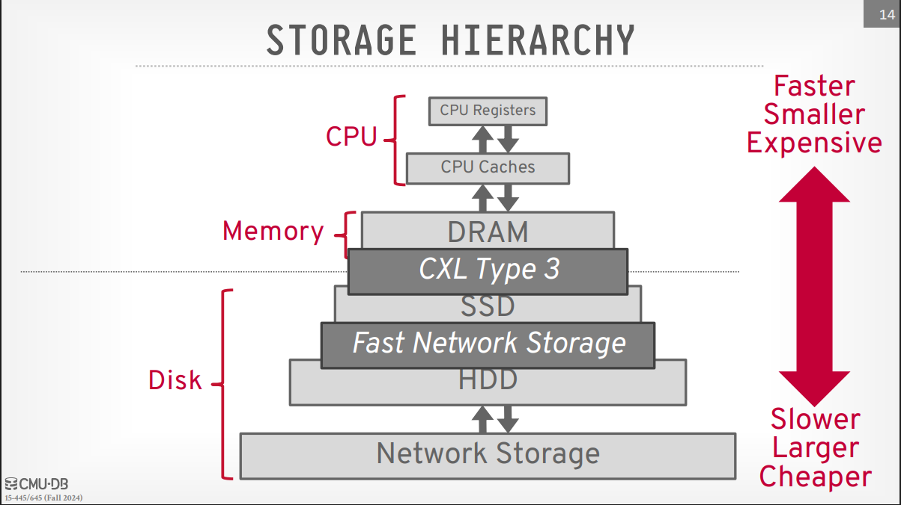
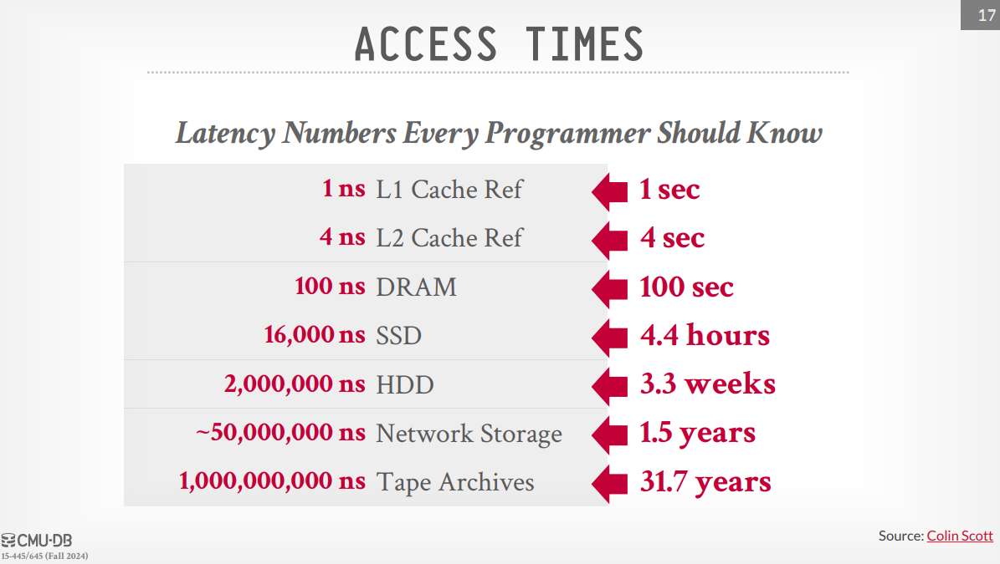
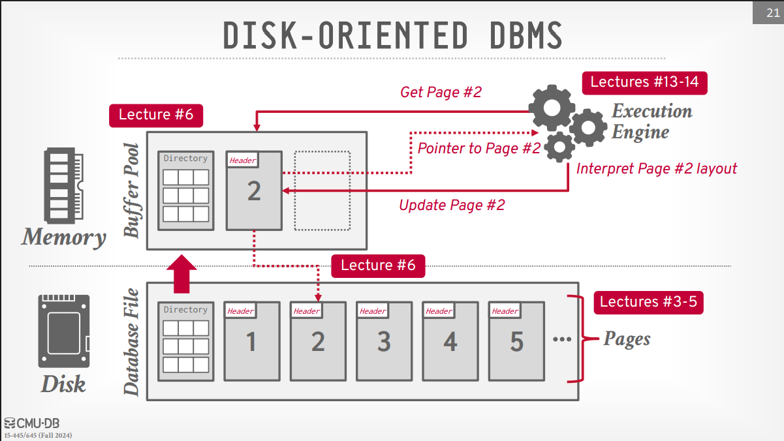
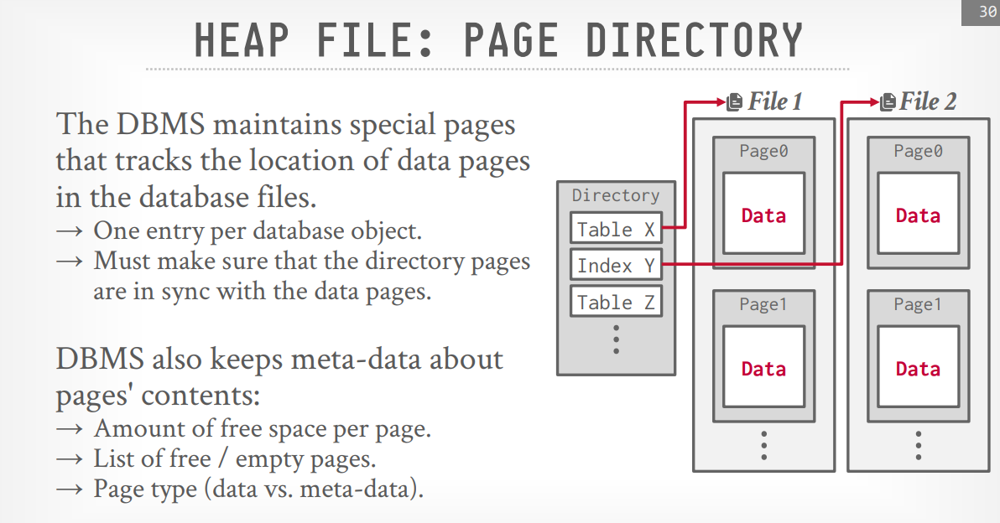
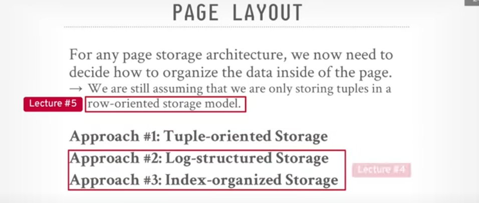
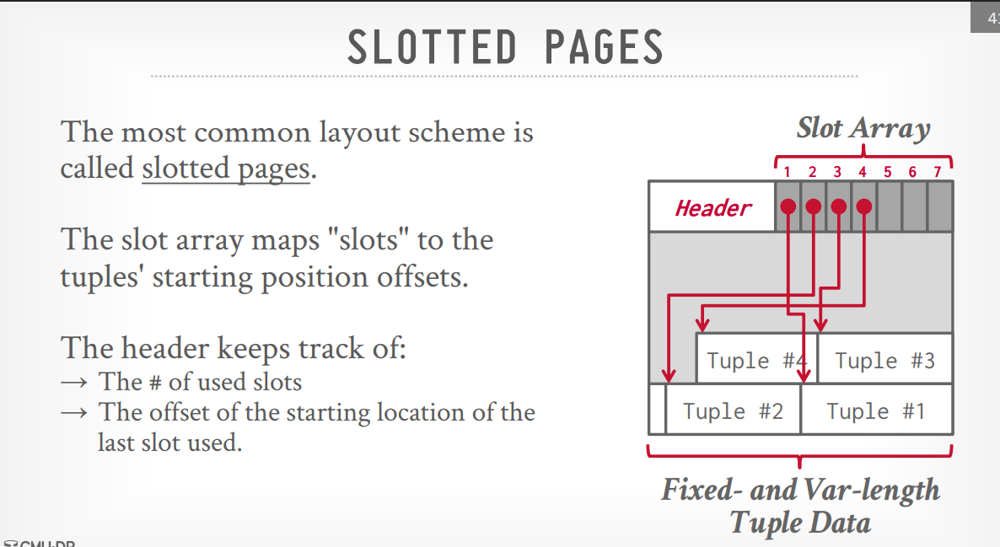

# DB Storage : Files & Pages

> [!note]
>
> This lecture is about Disk-based architecture ... The DBMS assumes that the primary storage is disk-based. The DBMS is responsible for managing the data on disk and moving data between disk and memory.

> [!tip] Storage Hirearchy
>
> - cpu registers
> - cpu cache
> - DRAM
> - SSD
> - HDD
> - Network Storage (distributed file system, Amazon S3, etc.)

> [!note] Fast Network Storage
>
> Betweeen SSD and HDD, there is a fast network storage.

> [!note] Persistent Memory
>
> It is a Kind of memory that is a DRAM but it is persistent, when the power goes off the data is still there, like **Optane** from intel but it's killed now.
> Also it's slower than DRAM but faster than SSD.

> [!note] CXL(Compute Express Link) type 3
>
> It is a Byte addressable memory that is not actually resides on your physical machine, it could be on the netwwork ... it's also called disaggregated memory.

> [!question] What is disaggregated memory?
>
> Disaggregated memory is a computing architecture where memory is decoupled from individual servers and made available as a shared resource across multiple computing nodes. Instead of each server having its own dedicated RAM, memory is pooled separately and accessed over a high-speed interconnect like CXL(Compute Express Link) or RDMA(Remote Direct Memory Access).
> The instructor said it could be a game changer when it comes to databases as we can write the data to CXL and on the other side we have SSD.

> [!question] Byte addressable vs Block addressable(Word addressable)?
>
> Byte addressable means that the cell in the memory is addressed by a byte, while block addressable means that the cell in the memory is addressed by a block(usually 4 bytes).

> [!note] Access Time
>
> 
> The real time is in nanoseconds but in the right side it's converted into seconds to illustrate the huge difference it makes having the data in the DRAM rather than in the Hard disk.

> [!tip] sequential vs random access
>
> sequential access is when you read the data in order, while random access is when you read the data in a random order.
> sequential access is faster than random access.
> so when writing data we try to write it in a sequential order.
> also reading/ writing to disk is expensive so we have to manage these operations carefully.

> [!tip] Disk-oriented DBMS
>
> 1. **Disk** :The DB is stored on disk as a **collection of files** (just regular files).
> 1. The files are divided into fixed-size blocks called pages and there is a file have a directory that maps the pages to the disk.
> 1. **Memory**: The Memory have a **buffer pool** that is the memory managed by the DBMS to store the pages that are read from disk, also the execution Engine access the data in the buffer pool.

> [!note] pages directory
>
> The pages directory is a file that knows where the pages are stored on the disk also it maps the pages to the disk.
> The pages directory is stored in the disk, but the buffer pool also loads it into memory.
> 
> The previous image shows how the execution engine refrence the pages in the buffer pool operate on them and then write them back to the disk.

> [!tip] File storage
>
> The file storage is the storage that is used to store the data in the database.
>
> 1. The OS doesn't know anything about the data stored in the file, it only sees the file as a collection of bytes.
> 1. The File is stored on its Proprietary format, which is a format that is understood only by the DBMS, its DBMS but not the other DBMSs.

> [!note] Storage Manager
>
> The Storage Manager is a component in the DBMS that is responsible for maintaining the database files.

> [!tip] Database pages
>
> A page is a fixed-size block of data that can contain data(tuples), metadata, indexes, log records, etc.
> Most of the DBMSs doesn't mix the different types of data in the same page, but some DBMSs do.
> Some systems require the page to be self-contained, which means that it has all the information needed to access the data in it.

> [!question] What is self-contained used for?
>
> Self-contained is used to make the page independent of the other pages, so if other pages are lost we can still access the data in that page and it won't be corrupted.
> having a self-contained page is important for the recovery process as the data extracted will have a meaning for us.

> [!note] Page ID
>
> The Page ID is a unique identifier for the page, the DBMS uses an indirection layer to map the page ID to the actual location of the page on the disk.

> [!tip] Pages notions
>
> pages notion means how different components see the pages
>
> 1. **Hardware page**: It's the largest block of data that is failsafe or atomic (the operation on it is all or nothing), it's usually 4KB.
> 1. **OS page**: we will talk about it later ... it's usually 4KB.
> 1. **DB page**: It's the smallest unit of storage and retrieval in a database system, it's usually 512B - 32KB depending on the DBMS.

> [!tip] File Organization Methods in Databases
>
> 1. **Heap File Organization**: The pages are stored in a heap, the pages are not ordered in any way.
> 1. **Tree-based File Organization**: The pages are stored in a tree structure, the tree is used to access the pages in a log(n) time.
> 1. **Hash-based File Organization**: The pages are stored in a hash table, the hash table is used to access the pages in a constant time, but range queries are inefficient.
> 1. **Sequential File Organization**: The pages are stored in a sequential order, the pages are accessed in a sequential order.

> [!note] The most common architecture is the **Heap File Organization**.
>
> - If the database is only one file, then accessing the pages will be very simple as we can access it with an offset, offset = Page# \* PageSize.
> - If the database is multiple files, then we need to have a page directory that tells us where the pages are.

> [!tip] Page Directory
>
> The DBMS maintains a special pages that tracks the location of the pages on the database files.
> 
> next the instructor starting writing some commands in different DBMSss to show how to see the freespace in pages and how to see the pages in the database.

> [!tip] Page layout
>
> 1. **Header**: The header contains the metadata about the page, like the page size, checksum, DBMS version, compression/ encoding metadata, schema information, data summary, etc.
> 1. **Data**: The data contains the actual data stored in the page, like the tuples, indexes, etc.

> [!tip] tuples storing methods on the page
>
> 1. **Tuple oriented**.
> 1. **log-structured oriented**.
> 1. **index organized**.
>    

> [!note] Tuple oriented storage
>
> the tuples are stored using a slotted page structure, the slots (slot array) are used to store the metadata about the tuples like the offset of the tuple and the date is appended to the end of the page and so on until the page is full.
> 

> [!question] what happens when we delete a tuple from the slutted page?
>
> When we delete a tuple from the slotted page, we mark the slot as deleted and we don't actually delete the tuple from the page, this is because we don't want to move the tuples in the page as it's expensive.
> The instructor said that it depends, some mark as deleted and some actually delete the tuple and move the tuples to use the space.
