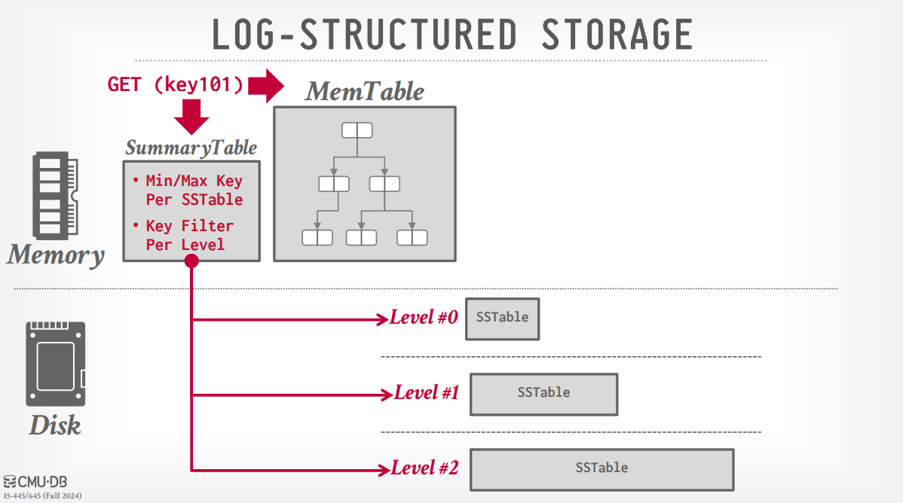
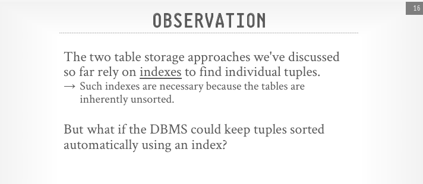
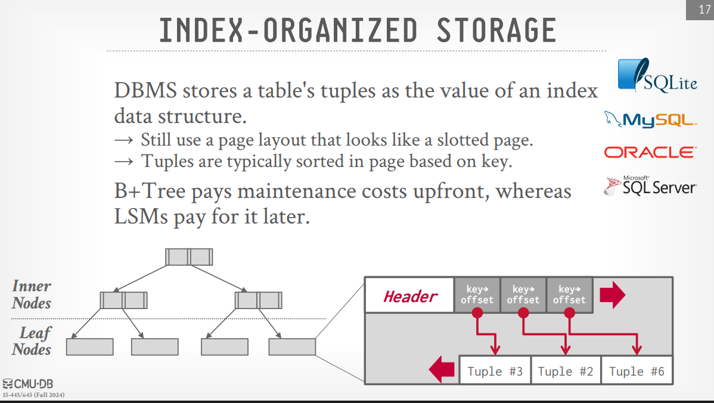
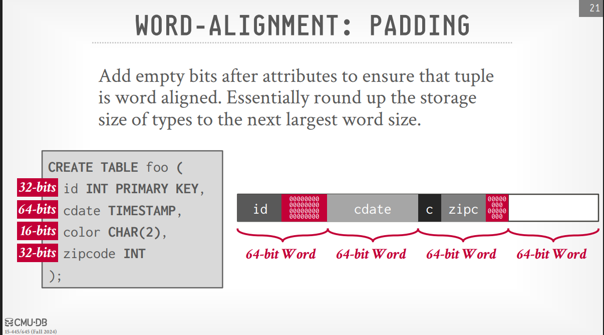
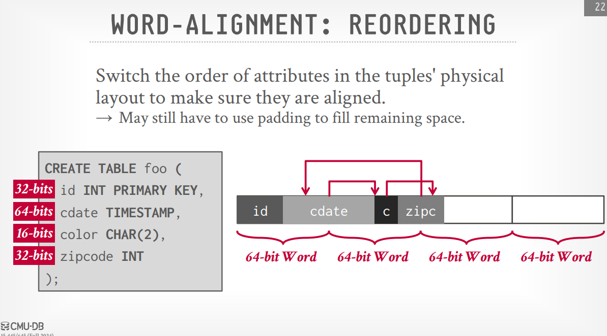
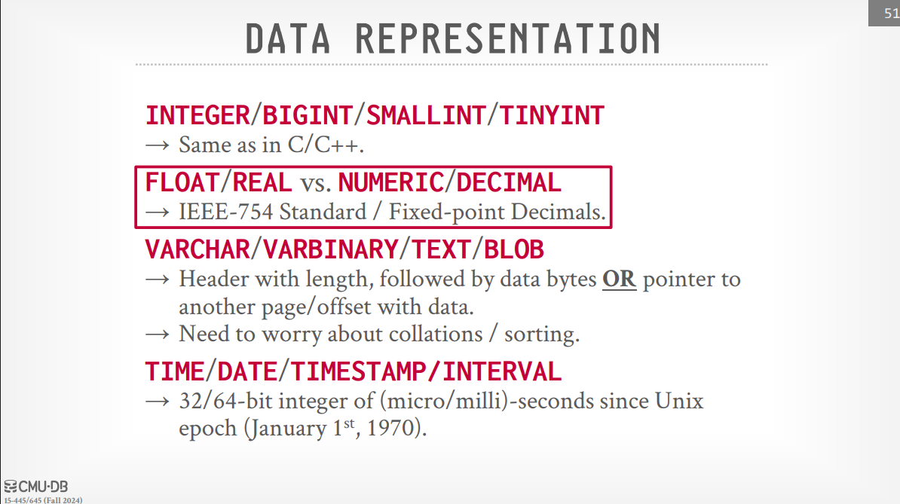
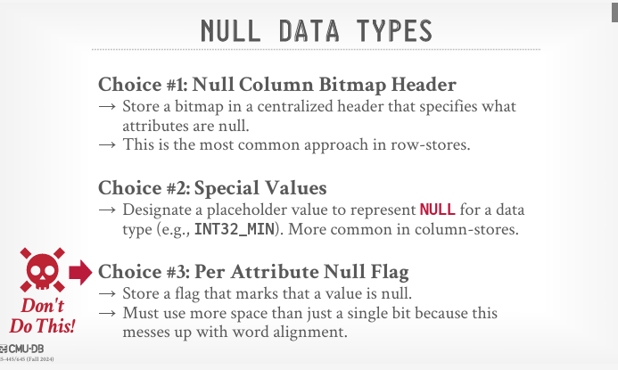
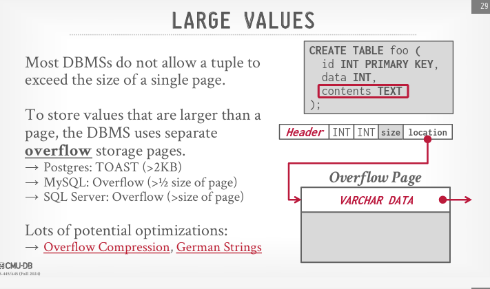
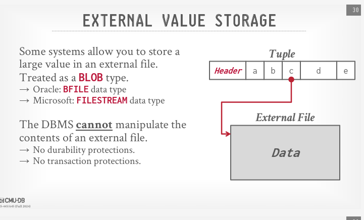

# Log-Structured Merge Trees & Tuples

> [!note] Record IDs
>
> Record Id is the physical location of the tuple.
>
> - for accesing the tuple in the page from the outside, we need to have a unique identifier for each tuple, this unique identifier is called the **Record ID**.
> - the Record ID is a combination of the file ID, page ID and the slot number.
> - Most DBMSs doesn't store the Record ID in the page as it not necessary to store it on the same page saying i'm in this page and this is my slot number, we already know that from the page ID and the slot number, but some systems do store it like SQLite.
> - The instructor started navigatins some DBMSs illustrating the page numbder and the slot number and how to get them in different DBMSs for example in SQLserver you can use the `Select %%physloc%%` to get the physical location of the tuple in the page, we can use `Select sys fn_PhysLocFormatter(%%physloc%%) As [file:page:slot] from table` to get the file, page and slot number in a more readable way.
> - He illustrated how the memory is compacted after deleting a tuple from the page, to use the space of the deleted tuple for the new tuples.

> [!tip] tuple oriented storage
>
> Until now we were talking about the tuple oriented storage.
>
> - **Adding a new tuple steps**:
>   > 1. **Check page directory for page with free slots**.
>   > 1. **Retrieve the page from the disk if not in memory**.
>   > 1. **Check slot array for free space that fits the tuple**.
>   > 1. **Append the tuple to the end of the page and append the slot to the slot array**.
>   > 1. **Update the page then write it back to the disk**.
> - **Updating a tuple steps**:
>   > 1. **Find the tuple using the Record ID**.
>   > 1. **Retrieve the page from the disk if not in memory**.
>   > 1. **Find offset of the tuple in the page using the slot array**.
>   > 1. **If new data fits in the same slot, update the tuple in place otherwise mark the tuple as deleted and add a new one in a different page**.

> [!question] what are the problems with the tuple oriented storage?
>
> 1. **Fragmentation**: the tuples are stored in a page in a fragmented way, the tuples are stored in a slotted page structure, the tuples are appended to the end of the page and the slots are used to store the metadata about the tuples like the offset of the tuple, the data is appended to the end of the page and so on until the page is full (but most of the time there is an unsed space), this causes fragmentation.
> 1. **Uselss Disk I/O**: when we update a tuple and the new data doesn't fit in the same slot, we mark the tuple as deleted and add a new one in a different page, this causes a lot of disk I/O.
> 1. **Random Access**: the tuple oriented storage is not good for random access, as we need to read the whole page to get the tuple,, so when trying to update different tuples in different pages, we need to read the whole page and write it back to the disk, this is not efficient.

> [!note] Some databases **cannot** overwrite the data in pages, instead they write the new data to a new page, example: **HDFS, Google colossus**.

> [!tip] Log-Structured Storage
>
> - **Log-Structured Merge Trees (LSM)**: is a storage structure that uses a log to store the changes made to the data and at the time of data retrieval, it merges the changes to the main data.
> - It's used in database systems to reduce the disk I/O and to improve the write performance.

> [!note] How LSM works?
>
> LSM trees improve performance by writing data sequentially to disk instead of performing random writes. The structure is divided into two main parts:
>
> - **Memtable**: is a write-back cache that stores the data in memory before writing it to the disk, it uses data structures like **Red-Black Tree or Skip List**, any lookup structure that supports insert, delete and search in O(log n) time.
> - **SSTables (Sorted String Table) **: are the on-disk storage that stores the data, it's **immutable** and **append-only**, data is stored at multiple levels to reduce the disk I/O and create a compaction process to merge and organize the data.

> [!tip] writing data steps in LSM
>
> 1. **Write to Memtable**: the data is written to the Memtable in memory until it reaches a certain threshold, then it's flushed to the disk.
> 1. **Write to SSTable**: the data is written to the SSTable on the disk at level-0, the SSTable is immutable and append-only.
> 1. **Compaction**: at some point, the multiple SSTables are merged and organized into a single SSTable into another level from 0 to 1, 1 to 2, 2 to 3, etc and delete the small tables to reduce the disk I/O.
>     > 

> [!note] Reading data from LSM
>
> - **Read from Memtable**: the data is first read from the Memtable in memory, if the data is not found, then it's read from the SSTables on the disk.
> - **Read from SSTables**: the data is read from the SSTables on the disk, we can use the key to search for the data in the SSTables using bloom filters to know which level and which SSTable to read from.

> [!note] Deleting data from LSM
>
> - **Tombstones**: when we delete a tuple from the Memtable, we don't actually delete it, we mark it as deleted and write a tombstone to the SSTable, the tombstone is a special marker that tells the DBMS that this tuple is deleted, then at the compaction process, the tombstone indicates that the tuple is deleted and it's not needed anymore, it's removed from the result SSTable.

> [!note] SSTables are self-contained meaning that it has metadata about the data stored in it sometiems it has the bloom filters to know which SSTable to read from.

> [!tip] Summary table
>
> some DBMSs use a summary table to store the metadata about the data stored in the SSTables, the keys rabges for each SSTable, the bloom filters, etc.

> [!note] WAL (Write-Ahead Logging)
>
> - **WAL**: is a technique used in DBMSs to ensure the durability of the data, it writes the changes to the log before writing them to the Memtable, so in case of a failure, the data can be recovered from the log.

> [!question] Log Structured storage is fast in writing but slow in reading, why?
>
> **Fast** in writing because:
>
> - The data is written to the Memtable in memory which gives a fast write performance.
> - The data is written sequentially to the disk as SSTables which are immutable and append-only.
>
> **Slow** in reading because:
>
> - must search through multiple log segments to find the most recent version of a record.

> [!question] why we need databases that are fast in writing and slow in reading (give some examples)?
>
> There are some use cases where we need databases that are fast in writing and slow in reading, for example:
>
> - When we need to write a huge amount of data like **IOT** or **Logs** and we need to read it in batchs or in ways that doesn't require querying specific records.

> [!tip] Log-Structured Compaction
>
> It's the process of merging and organizing the SSTables to reduce the disk I/O and to improve the read performance, it's done in the background and it's a continuous process.
> In simple terms it compares the SSTables and merges them into a single SSTable keeping the key updates from the newer SSTable.

> [!example] log-structured DBMSs
>
> 

> [!question] what are the disadvantages of LSM trees?
>
> 1. **Write Amplification**: the data is written multiple times to the disk, first to the Memtable, then to the SSTable, then to the compaction process, this causes a lot of disk I/O, also there is multiple data copies in the SSTables.
> 1. **Compaction is expensive**: the compaction process is expensive as it needs to read multiple SSTables ((high disk reads)) and merge them into a single SSTable (high disk writes), this causes a lot of disk I/O.

> [!note]
>
> 

> [!note] Index-orgainzed storage
>
> It's a storage mechanism where the data is stored in the index structure itself, the data is stored in the leaf nodes of the index, the structure may be a B+ tree, trie, skip list, etc.
> 

> [!tip] what actually is the tuple?
>
> It's a sequence of bytes prefixed with a header that contains the metadata about it, it's the DBMS job to interpret the tuple and extract the data from it.

> [!tip] Data Layout
>
> the tuple is represented as unsigned char array, at the beginning we have the header (different DBs have different header sizes), then we have the bits for the id, then the bits for other fields, etc.

> [!note] Word-aligned tuples
>
> the tuples are word-aligned, meaning that the tuple size is a multiple of the word size, for example if the word size is 4 bytes, then the tuple size is 4, 8, 12, 16, etc.

> [!note] word-alignment approachs
>
> - **Padding**: Add empty bits after attributes ensure that the tuple size is word aligned.
>   
> - **Reordering**: Reorder the attributes to use the empty bits efficiently but we may need to add padding to fill remaining space.
>   

> [!tip] Data Representation
>
> 

> [!tip] Null Data Types Representation
>
> 
> Row and column stores will be discussed in the next lecture.

> [!note] Large Value Storage
>
> - 
> - 

> [!question] should you blob or not?
>
> - **Blob**: is a data type used to store large binary data like images, videos, etc.
>   It's recommended to blob if the data size is less than 256KB, and not to blob if the data size is 1MB or more, for the range between 256KB and 1MB, it depends on the write and read ratio.
>   This paper is a good reference for the topic: [To Blob or Not To Blob: Large Object Storage in a Database or a Filesystem?](https://www.microsoft.com/en-us/research/publication/to-blob-or-not-to-blob-large-object-storage-in-a-database-or-a-filesystem/)
