# Memory & Disk I/O Management

> [!tip] Mainly there are two things we atry to optimize while managing memory and disk I/O:
>
> - **Spatial Control**: where to write pages on disk.
> - **Temporal Control**: when to write pages on disk, and when to readthem into memory.

> [!note]
>
> The pig picture ofmoving data between memory and disk is as follows:
>
> - First, we read the page from disk to buffer pool (by making a copy).
> - Then we give a pointer to the page in the buffer pool to the execution engine.
> - 

> [!tip] Buffer Pool organization
>
> - 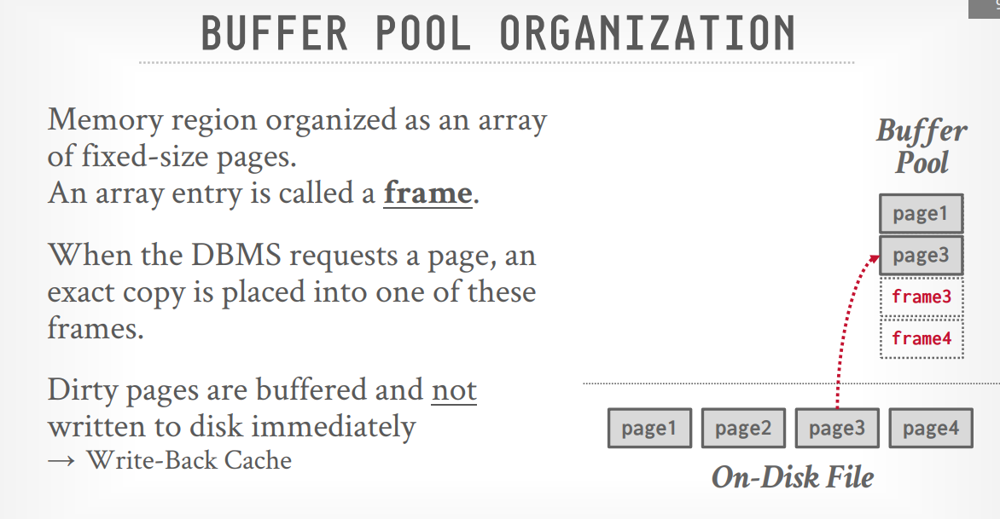
> - 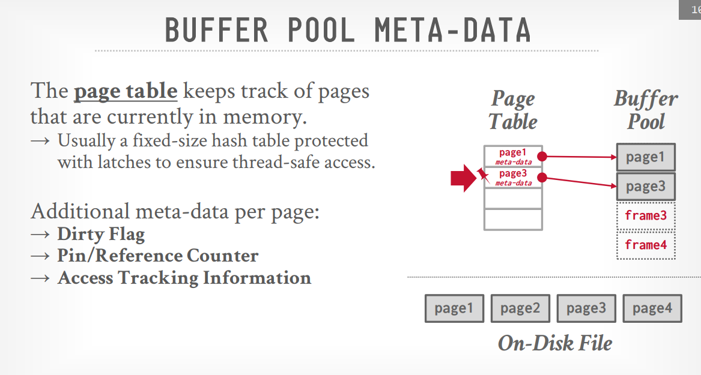
>   We have another data structure called **Page table** that maps the page ID to the page in the buffer pool.
>
> - 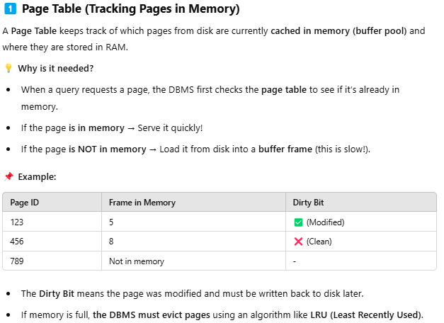
>   what if there are two threads that want to read or write the same page at the same time? we need to have a lock manager to manage the locks on the pages, the lock manager in this case is a **Latch**.
>   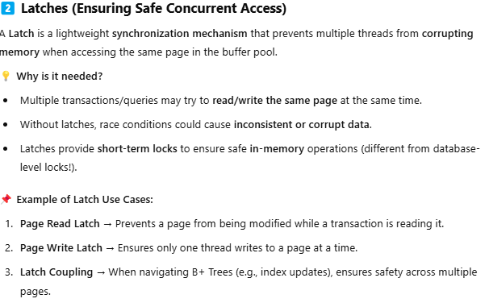

> [!note] The latch is a mutex that is used to protect the page from being accessed by multiple threads at the same time.

> [!question] Lock vs Latch
>
> - 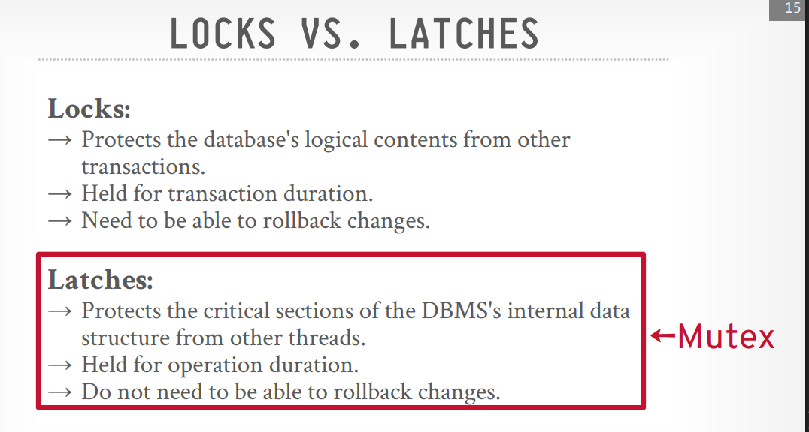
> - 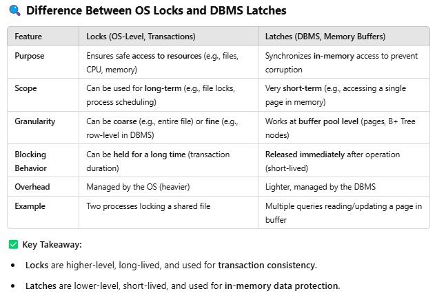
> - The instructor said that lock for OS and latch for DBMS, and also said that latch is more right than lock, but I didn't get the point.

> [!question] what is mutex?
>
> 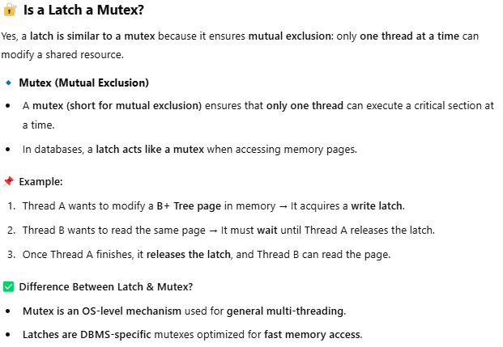

> [!question] page table vs page directory
>
> 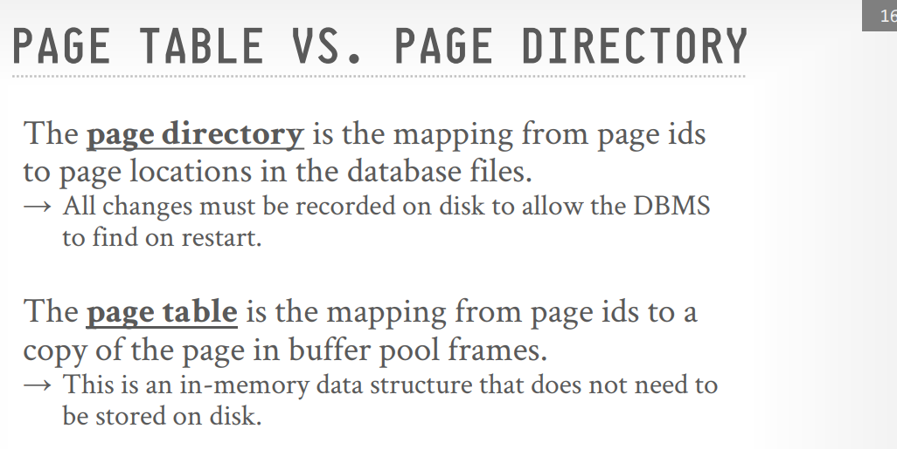

> [!question] why not use the OS mmap?
>
> - 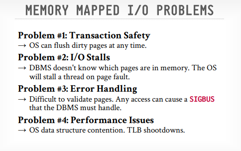
> - 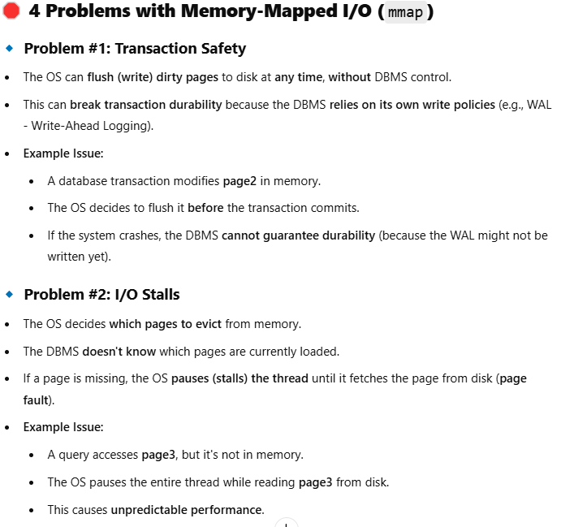
> - 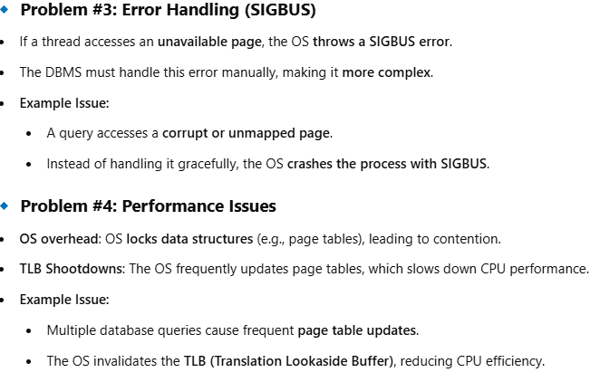

> [!question] what is SIGBUS?
>
> SIGBUS (signal bus error) is a signal the OS sends to a process when it tries to access a memory location that doesn't exist.

> [!tip] Some solutions for the problem of using OS mmap:
>
> - 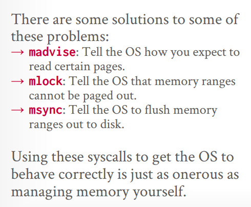
> - 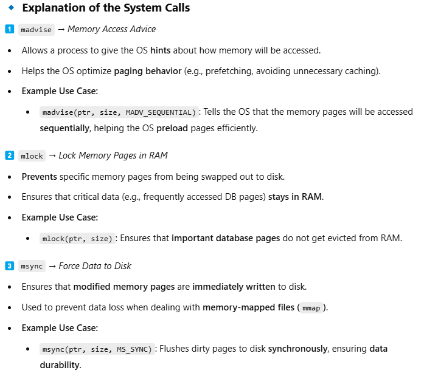
>   But these solutions itselfs are not perfect, thy require a lot of work to be done, some DBMSs use them, but the best solution is to use the buffer pool so that the DBMS can manage the memory itself.
>   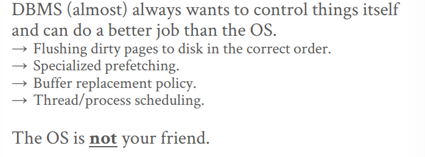

> [!tip] Buffer Replacement Policies
>
> - LRU (Least Recently Used): evict the page that has not been used for the longest time.
> - CLOCK (Clock): evict the page with refrence bit 0, and set the refrence bit to 0, if the refrence bit is 1, set it to 0 and move to the next page.
> - LRU-K: evict the page that has not been used for the longest time, but also consider the frequency of use, if the page has been used equal or more than K times, it is considered an important page, and it will not be evicted until all the pages have been used K times the we will evict the page that has not been used for the longest time.
> - Approximate LRU-K: it is a variation of LRU-K, it uses a two linked lists to keep track of the pages one for old and one for young pages, the pages that are used more than K times will be moved to the old list, and the pages that are used less than K times will be moved to the young list, and we will evict the page that has not been used for the longest time in the young list.

> [!question] what is sequential flood in LRU and CLOCK?
>
> Sequential flood is a problem that occurs where sequential access to data causes high page replacement and poor caching efficiency (as the pages replaced may be needed again soon), LRU-K and Approximate LRU-K are designed to solve this problem by keeping track of the frequency of use of the pages.

> [!bug] Now we decided to evict some pages ans we found them dirty (modified), we need to write them back to disk before evicting them, so this might cause overhead, so some solution for this problem is to make a background writing that will write the dirty pages to disk in the background, and remove the dirty flag after writing them to disk, but we need to make sure that the dirty pages are not written to the disk before their log records are written to the disk, as this may cause inconsistency in the database, so we need to make sure that the log records are written to the disk before writing the dirty pages to the disk, this is called **Write Ahead Logging** (WAL), and it is a very important concept in DBMS, and it is used in most of the DBMSs for reccovery and consistency.

> [!tip] Observation
>
> 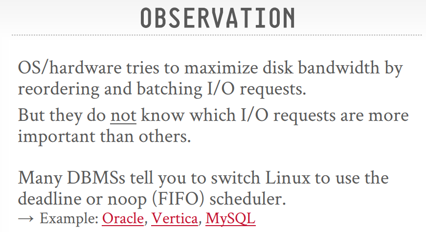

> [!tip] Disk I/O Scheduling
>
> - The operating system and hardware often reorder and batch disk I/O requests to maximize disk bandwidth.
> - However, they lack the DBMS's knowledge of which I/O requests are more critical.
> - Therefore, many DBMSs prefer to use disk schedulers like deadline or noop (FIFO) in Linux to have more control over the order of operations.

> [!tip] OS Page Cache
>
> - Unless instructed otherwise, the OS maintains its own filesystem cache (page cache or buffer cache).
> - To avoid redundant caching, different eviction policies, and loss of control over file I/O, **most DBMSs use direct I/O (O_DIRECT)** to **bypass** the OS's cache

> [!tip] FSYNC Problems
>
> - Relying on standard file system operations like fwrite and fsync can be problematic.
> - If fsync fails (e.g., due to an I/O error), Linux might incorrectly mark the dirty pages as clean, potentially leading to data loss if the DBMS assumes the write was successful. The source strongly advises against relying solely on the OS for ensuring data persistence

> [!tip] Buffer Pool Optimizations
>
> 1. **Multiple Buffer Pools:** Partitioning memory into multiple buffer pools (e.g., per-database or per-page type) can reduce latch contention and improve data locality. This can be achieved using object IDs embedded in record IDs or by hashing page IDs to select a buffer pool.
> 1. **Pre-Fetching:** The DBMS can predict and load pages into the buffer pool before they are actually needed based on the query plan (e.g., for sequential or index scans).
> 1. **Scan Sharing:** Multiple concurrent queries performing the same table scan can attach to a single cursor, avoiding redundant I/O and buffer pool usage
> 1. **Buffer Pool Bypass:** For operations like large sequential scans or temporary data (sorting, joins), the DBMS might choose to bypass the buffer pool to avoid polluting it with pages that won't be reused.

## Conclusion

DBMSs generally manage memory and disk I/O better than the OS because they have a deeper understanding of the database workload and query execution plans. This allows for more informed decisions regarding page evictions, allocations, and pre-fetching.
