# Hash Tables ✸ RelationalAI Database Talk

This lecture focuses on hash tables, which are fundamental unordered data structures used extensively within Database Management Systems (DBMS) like **Indexing(Less Common)**, **Joins**, **Internal Meta-data**, **Temporary Data Structures**, and **Aggregation** may be we will know about them later.

> [!note] Datalog
>
> **Datalog** is a declarative logic programming language that is considered an alternative to SQL. It is based on the concept of logic programming and is used for querying databases, It's a higher-level language than SQL. (Read more about later)

> [!note] Agenda
>
> 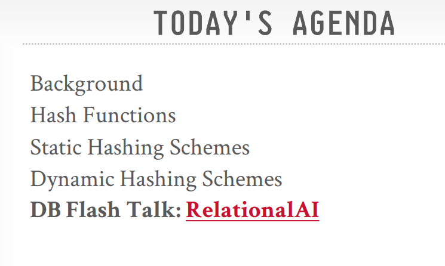

> [!note] What are Hash Tables?
>
> - At their core, hash tables implement an unordered associative array. This means they allow you to map keys to values without maintaining any specific order of the elements.
> - They use a hash function to take a given key and compute an offset (or index) into an underlying array. This offset ideally points directly to the location where the desired value is stored.
> - The average time complexity for common operations like insertion, deletion, and lookup is O(1), meaning they are very fast on average. However, the worst-case complexity is O(n), which can occur under certain conditions (e.g., many collisions).
> - The lecture emphasizes that **databases care about constant factors in performance, so even O(1)** operations can have different real-world speeds based on implementation details (I don't know how that applies yet).

> [!tip] Static Hash Tables
>
> A simple approach is to use a static hash table. This involves:
>
> - Allocating a giant array with a fixed number of slots, ideally one for every element you plan to store.
> - To find the location for a key, you would typically calculate hash(key) % N, where N is the number of slots in the array.
>
>   **However, this approach relies on several unrealistic assumptions**:
>
> - **Assumption #1**: Number of elements is known ahead of time and fixed. In reality, the amount of data a database needs to store can change.
> - **Assumption #2**: Each key is unique. Databases often need to handle duplicate keys.
> - **Assumption #3**: Perfect hash function guarantees no collisions. A collision occurs when two different keys produce the same hash value. Perfect hash functions (where if key1 ≠ key2, then hash(key1) ≠ hash(key2)) are difficult to achieve in practice for arbitrary data.

> [!tip] Key Design Decisions for Hash Tables
>
> Given these limitations, designing an effective hash table involves two crucial decisions:
>
> 1. **Hash Function**
>
> - The goal of a hash function is to map a large key space into a smaller domain (the indices of the hash table).
> - There's a trade-off between the speed of the hash function (how quickly it can be computed) and its collision rate (how likely it is to produce the same output for different inputs).
>
> 1. **Hashing Scheme**
>
> - The hashing scheme defines how to handle key collisions that inevitably occur.
> - This involves a trade-off between allocating a very large hash table (to reduce collisions) versus using additional instructions to find or store keys when collisions happen.

> [!tip] Hash Functions in Detail
>
> - A hash function takes an input key and returns an integer representation of that key. Essentially, it converts an arbitrary sequence of bytes into a fixed-length code.
> - We want hash functions that are fast to compute and have a low probability of collisions.
> - For DBMS internal hash tables (used for things like data structures, not necessarily security), cryptographic hash functions like SHA-2 are generally too slow and are thus not preferred.
> - 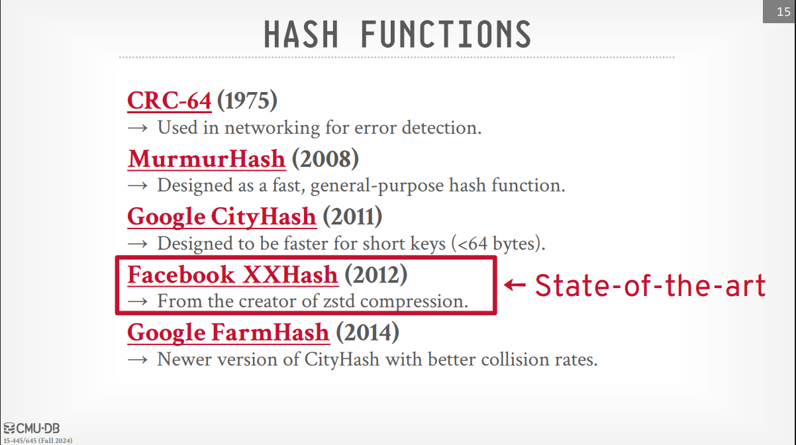.
>
> Above their are some examples of hash functions xxhash from facebook is considered the best as the instructor said.
> The choice of hash function often depends on the specific workload and the characteristics of the keys being hashed, anyway we need to handle collisions so it's handled by the hashing scheme.

> [!tip] Static Hashing Schemes (Collision Resolution)
> 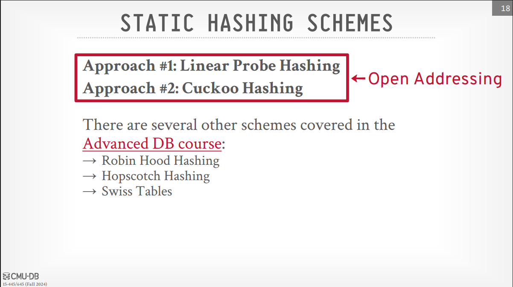

> [!tip] Linear Probe Hashing:
>
> - Uses a single, fixed-size table.
> - When a collision occurs during insertion, the scheme linearly searches for the next available empty slot in the table.
> - To find an element, you hash to its expected location and then scan linearly until you find the key or an empty slot (indicating the key is not present).
> - Keys are typically stored in the table itself to know when to stop scanning during a lookup.
> - **Load factor** (the ratio of filled slots to the total number of slots) is crucial. If the table becomes too full, performance degrades, and the table needs to be resized (usually doubled in size), **and all existing entries need to be rehashed into the new table**.
> - Handling Deletes in linear probing can be tricky. Two main approaches exist:
>   > - **Movement** (Rehashing): When an element is deleted, subsequent elements might need to be rehashed and moved to fill the gap. This is expensive and not typically used by DBMSs.
>   > - **Tombstones**: Instead of physically removing the element, a special tombstone marker is placed in the slot to indicate it was deleted. This allows subsequent searches to continue past the deleted slot. However, tombstones can clutter the table and might require periodic garbage collection to reclaim space.

> [!tip] Cuckoo Hashing:
>
> - Uses multiple hash functions (typically two).
> - When inserting a key, it calculates the possible locations using each hash function.
> - It tries to insert the key into the first available of these locations.
> - If both locations are occupied, it evicts the element from one of the locations and then re-hashes the evicted element using its other hash function to find a new location for it. This process might repeat (like a cuckoo bird pushing other eggs out of the nest) until an empty slot is found or **a cycle is detected** (in which case, the table might need to be resized).
> - Lookups and deletions are generally O(1) because you only need to check a small number of locations (corresponding to the hash functions).
> - The lecture mentions that CMU has a best open-source implementation of cuckoo hashing made by a student (the link is in the lecture slides).

> [!tip] Handling Non-Unique Keys
>
> Databases often need to store multiple values associated with the same key. The lecture presents two common choices for handling non-unique keys in hash tables:
> 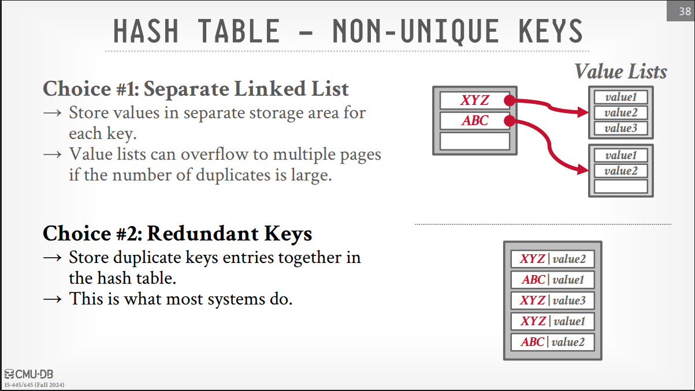

> [!tip] Optimizations for Hash Tables
>
> 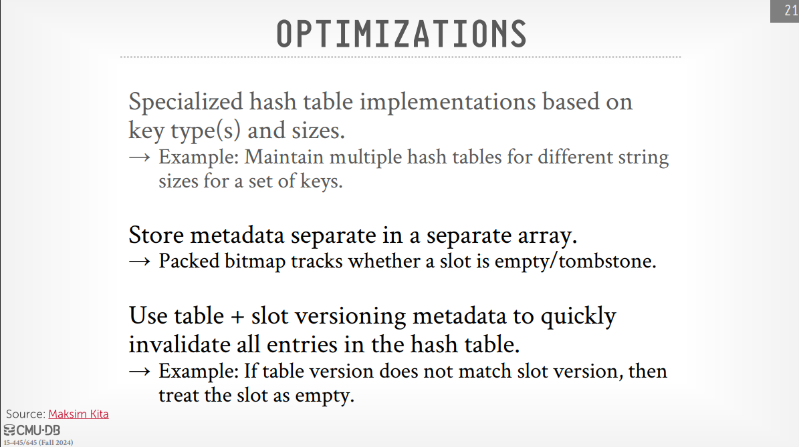
> Note: I don't get this part for the optimizations yet.

> [!question] For the non unique keys how we retrieve the exact value we want?
>
> 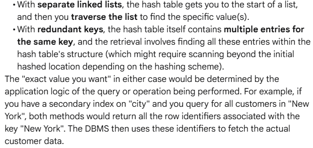

> [!tip] Dynamic Hashing Schemes
>
> Static hash tables require knowing the number of elements in advance, which is often impractical. Dynamic hash tables address this by incrementally resizing themselves as the number of elements changes. The lecture introduces three main dynamic hashing schemes (**Chained Hashing**, **Extendible Hashing**, and **Linear Hashing**).

> [!tip] Chained Hashing:
>
> - Instead of storing the values directly in the hash table slots, each slot contains a pointer to a bucket (often implemented as a linked list).
> - When a collision occurs, the new key-value pair is simply added to the linked list associated with the hashed slot.
> - Lookups involve hashing to the slot and then scanning the linked list to find the desired key.
> - Insertions and deletions are straightforward list operations.
> - The load factor can become high if the lists grow too long, degrading performance. To mitigate this, the hash table can be resized (more slots allocated), and the elements are redistributed. Filters can be used within the buckets to potentially speed up searches.
>   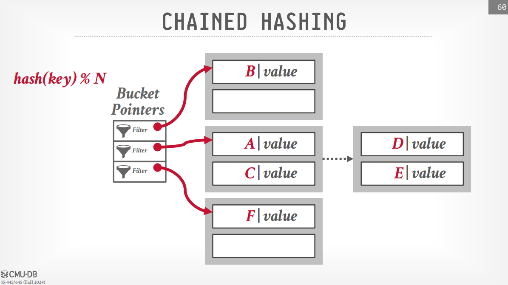

> [!tip] Extendible Hashing:
>
> - This is a form of chained hashing that aims to avoid very long linked lists by splitting buckets incrementally.
> - Multiple slots in the hash table's directory can point to the same underlying bucket chain.
> - The scheme uses a **global depth** (number of bits of the hash to consider for the directory) and a **local depth** for each bucket.
> - When a bucket overflows, it is split into two new buckets. The directory might also need to double in size (by increasing the global depth) to accommodate the new bucket pointers.
> - The key advantage is that data movement during a split is localized to the bucket being split.
>   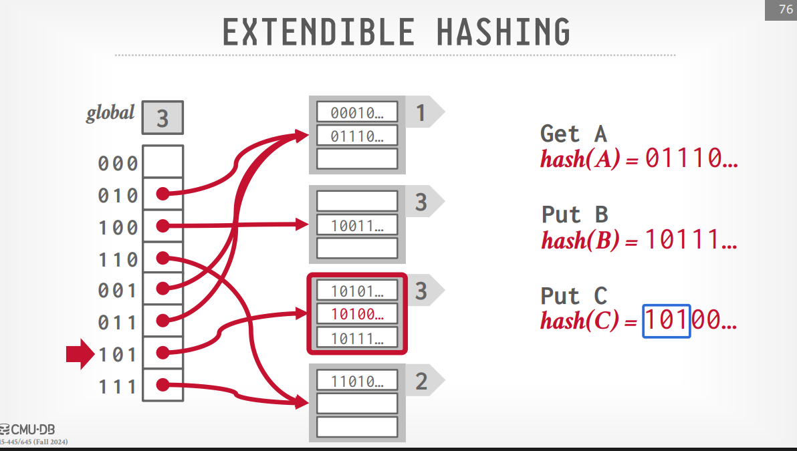

> [!note] Extendible Hashing in more details
>
> - 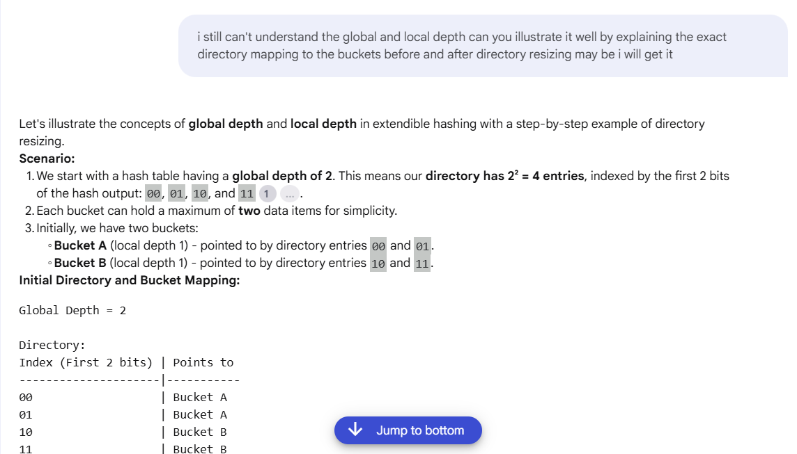
> - 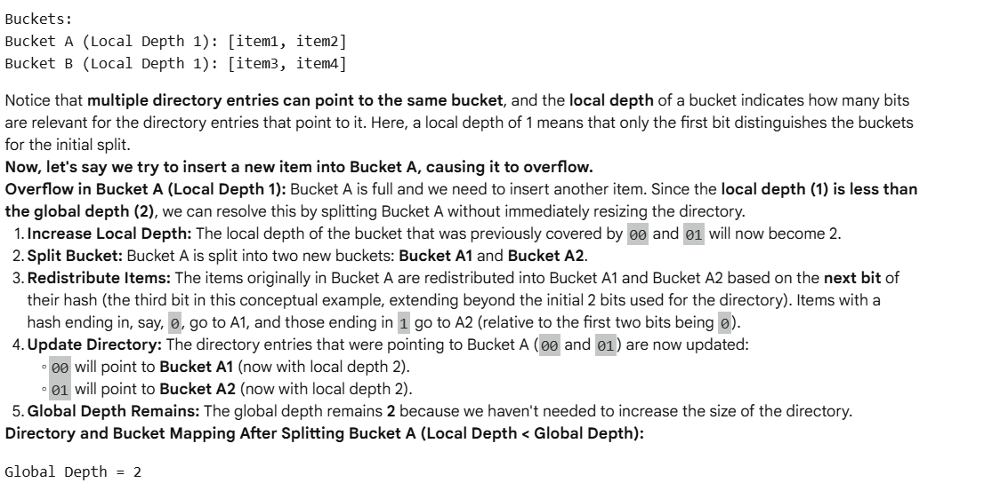
> - 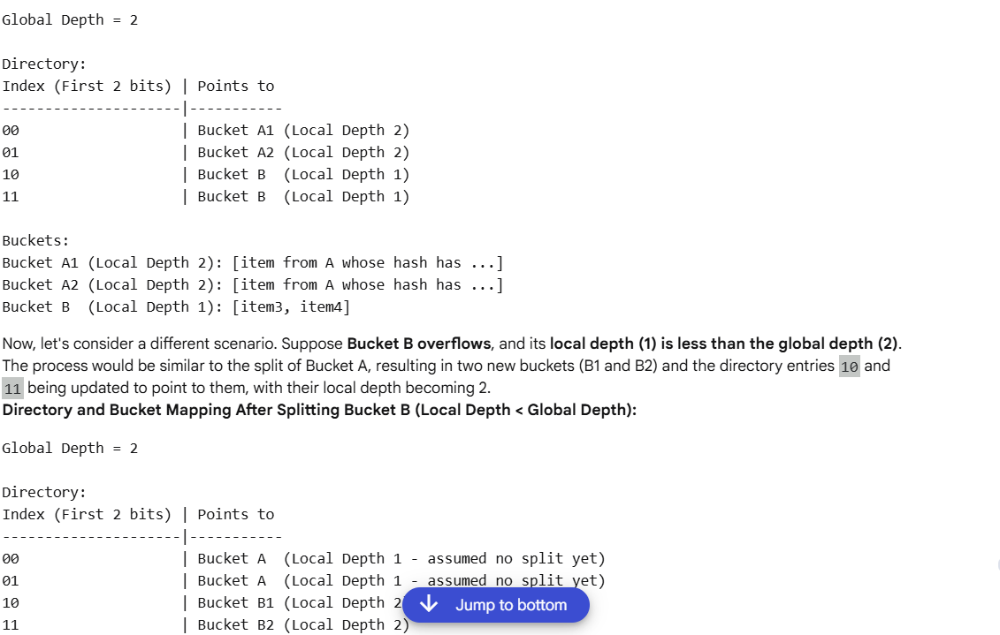
> - 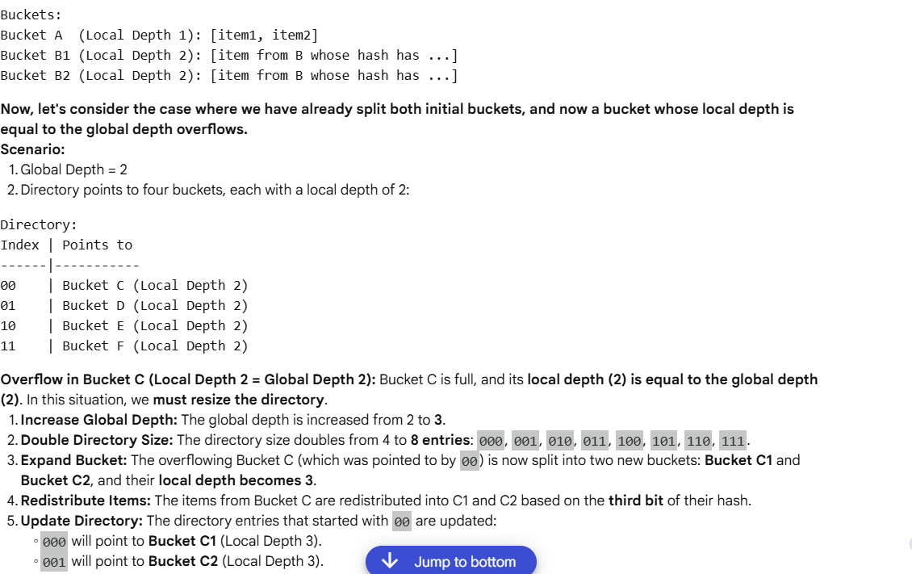
> - 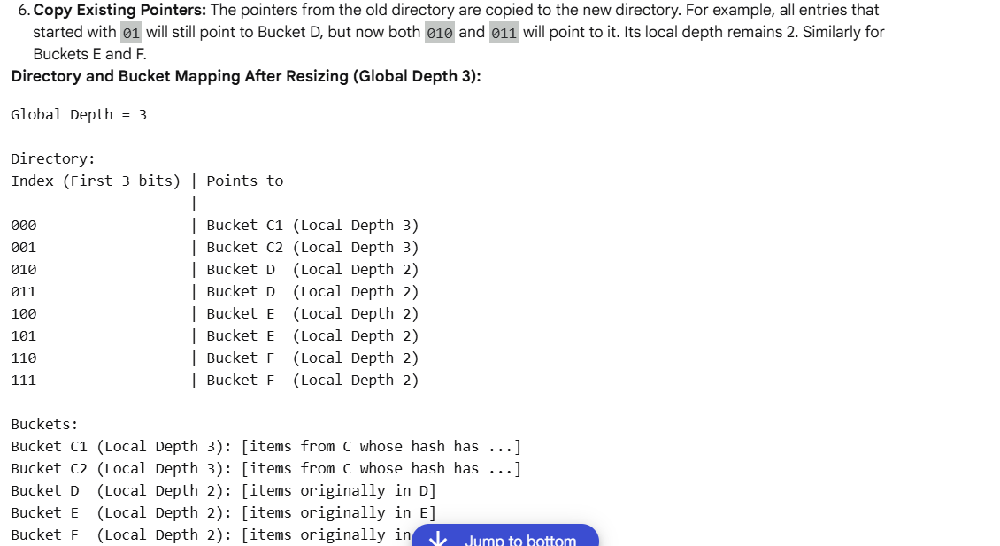
> - 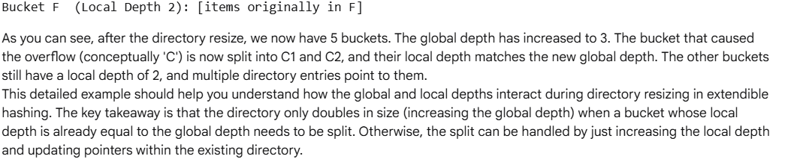

> [!tip] Linear Hashing:
>
> - This scheme also grows the hash table but does so in a linear fashion using a split pointer, It starts with a hash function that maps keys to a certain number of buckets.
> - When any bucket overflows (based on a defined criterion like space utilization or average chain length), the bucket pointed to by the split pointer is split.
> - A second hash function (often based on twice the number of buckets) is used to redistribute the elements of the split bucket into the original bucket and a new bucket.
> - The split pointer is then incremented to the next bucket. This process continues, and eventually, all buckets will have been split, effectively doubling the size of the hash table. At that point, the first hash function is no longer needed.
> - Lookups need to consider which hash function to use based on the key and the current value of the split pointer.
> - Deletes can potentially trigger a reverse process where empty buckets are merged, and the split pointer moves backward.
> - 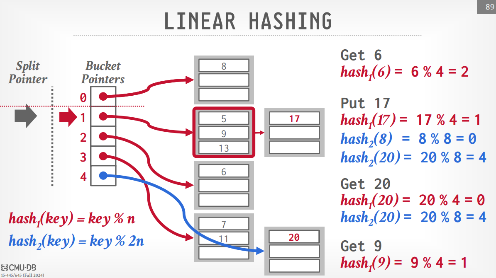

> [!tip] Better explanation of Linear Hashing
>
> - 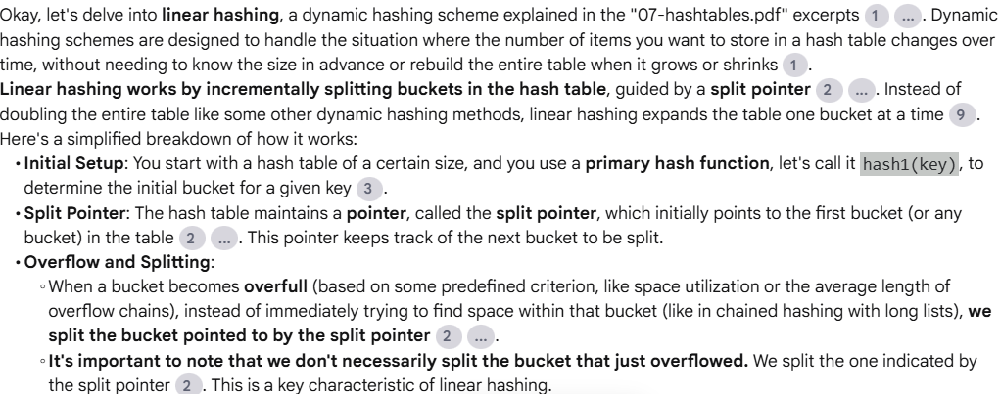
> - 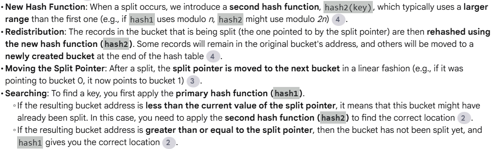
> - 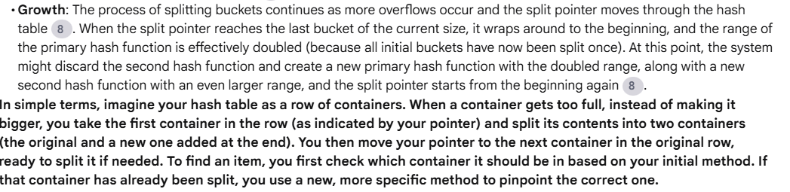
> - 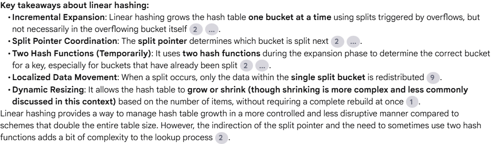

> [!tip] What happens when the splait pointer reaches the end of the table?
>
> - 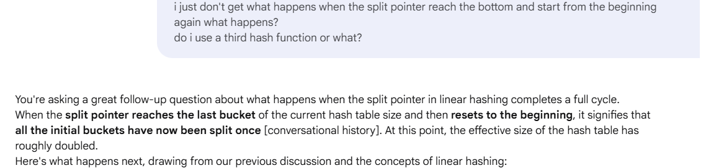
> - 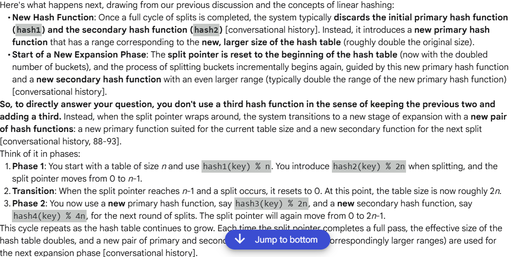
