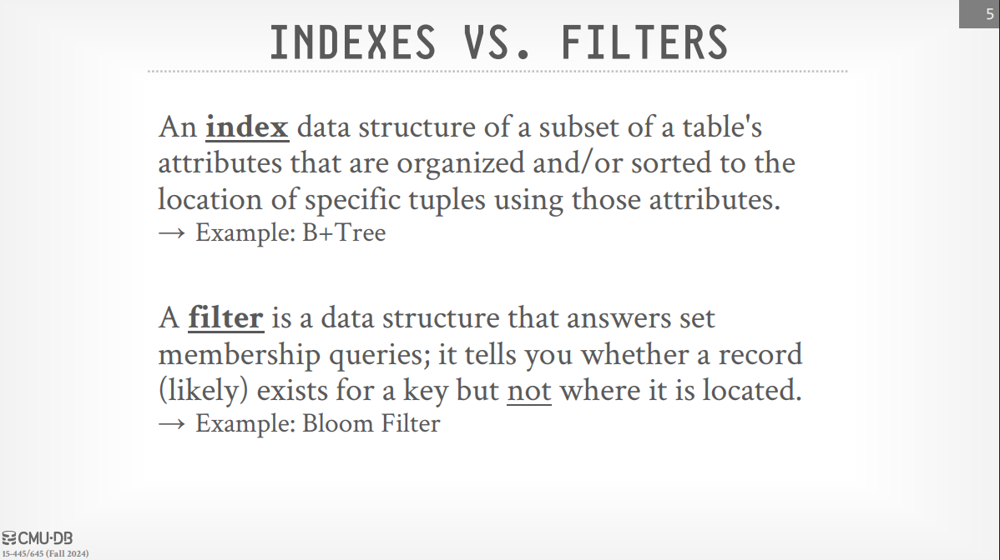
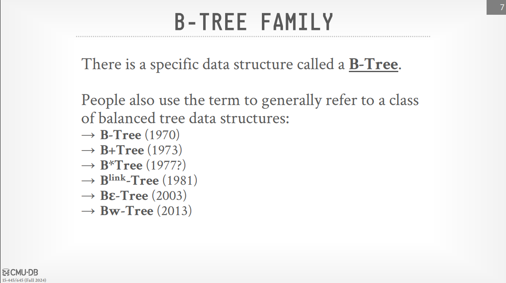
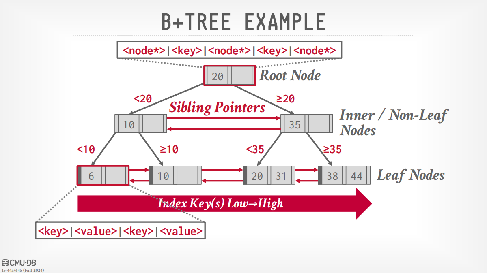
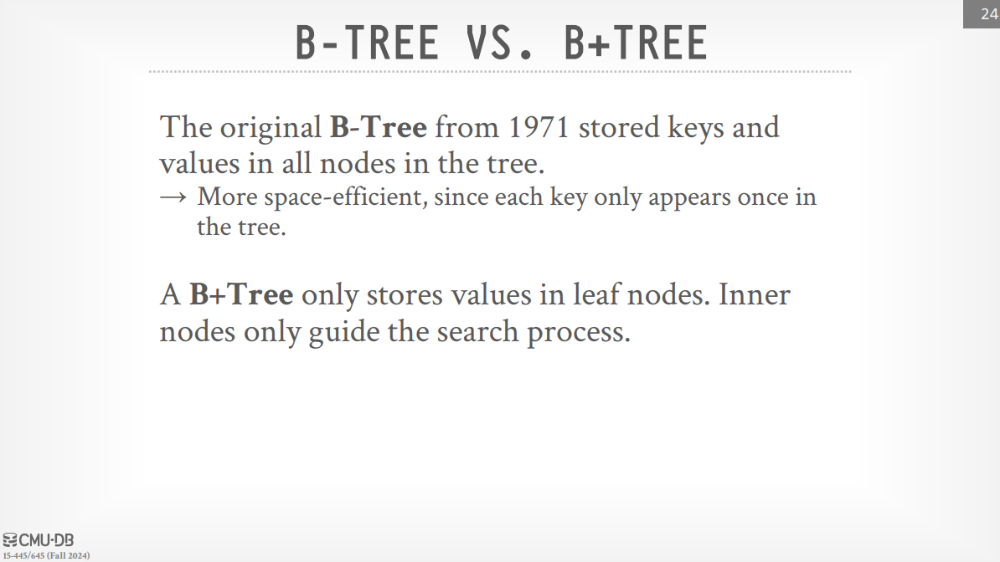
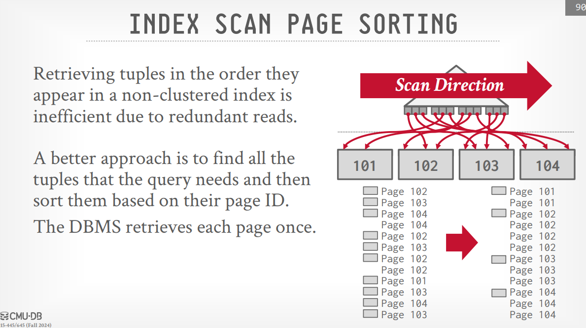
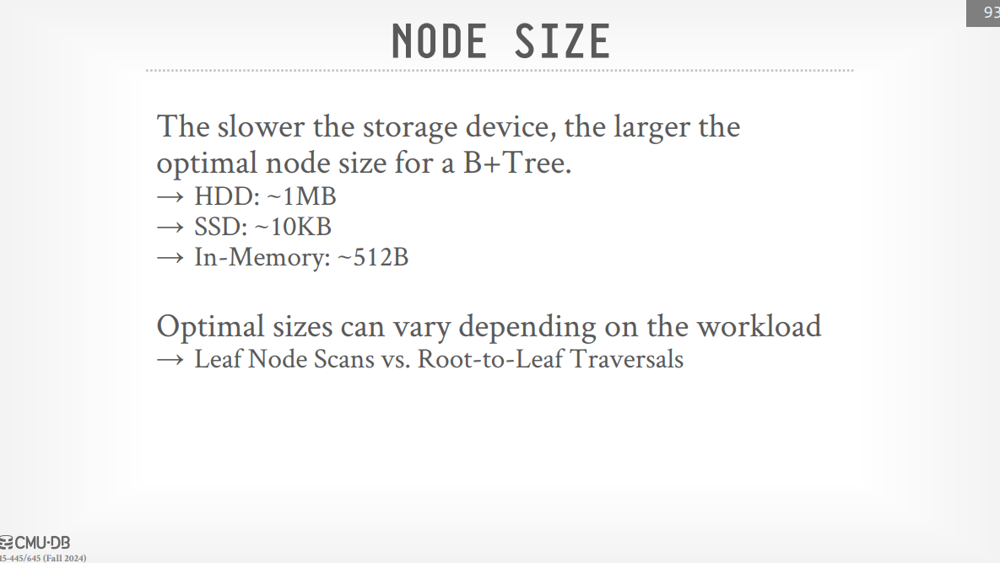
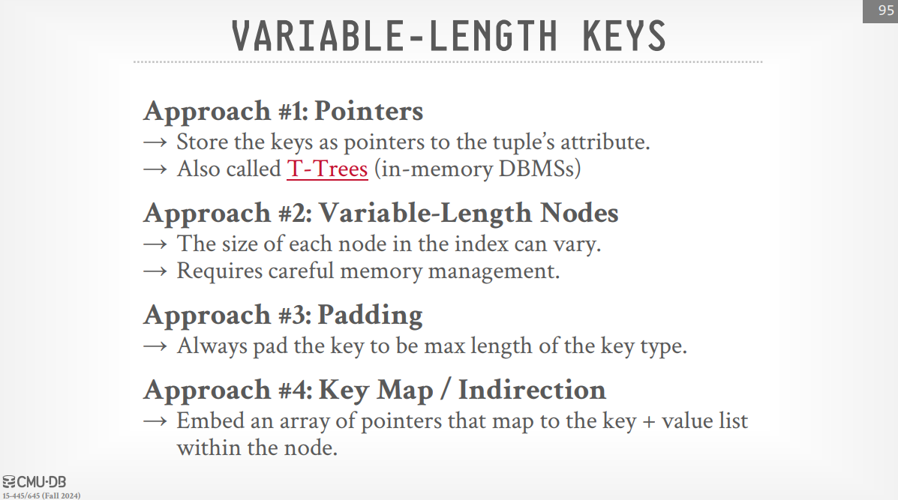

# Tree Indexes: B+Trees

> [!NOTE] B+ Trees are considered the best data structure ever learned in computer science and are what database systems primarily use for indexes.

> [!NOTE] Index VS Filter
>
> 

> [!TIP]
>
> 

> [!TIP] B+ Tree
>
> - A B+ Tree is a self-balancing ordered n-way tree that supports efficient searching, sequential access, insertions, and deletions, all in log n time.
> - The 'n-way' refers to the fan-out, which is the number of branches or pointers coming out of a node (we can say the maximum number of children), and in real database systems, this fan-out can be quite large. This large fan-out keeps the height of the B+ Tree relatively small, making data access efficient.
> - The B+ Tree is considered perfectly balanced, meaning every leaf node is at the same distance from the root. Every node, except possibly the root, is at least half full. This property ensures efficient space utilization and predictable performance. But note that while textbooks define these properties, real-world implementations like PostgreSQL might deviate from strict balance for performance reasons.
> - 

> [!TIP] B+ Tree Nodes
>
> - **Root Node**: The entry point to the tree.
> - **Inner Nodes (Non-Leaf Nodes)**: Located between the root and the leaf nodes. They contain keys that act as separators or guideposts, directing the search for a particular key down the appropriate branch. They consist of pointers to child nodes and the keys that delineate the ranges of keys in those child nodes.
> - **Leaf Nodes**: The bottommost level of the tree. They contain the actual key-value pairs, where the value is typically a **pointer to the location of the tuple** (record ID) to which the index entry corresponds. In Index-Organized Storage, the leaf nodes of the primary key index store the contents of the tuple itself, and **secondary indexes in this model store the tuples**' primary key as their values. **The leaf nodes are also typically linked together using sibling pointers, forming a sorted linked list**. This is crucial for efficient sequential access and range scans. The transcript mentions that the original B+ Tree definition had sibling pointers only at the leaf level, but the B-link tree added them for inner nodes as well, which helps with concurrent access.

> [!NOTE] The keys within the inner and root nodes serve as separators. For example, if an inner node has a key '20', all keys less than 20 will be in the subtree to its left, and all keys greater than or equal to 20 will be in the subtree to its right.

> [!QUESTION] B-Trees VS B+ Trees?
>
> 

## B+ Tree Operations

> [!NOTE] Insertion
>
> 1. **Search**: Traverse the tree from the root to find the leaf node where the new key should be inserted.
> 1. **Insertion** (if space): If the leaf node has space, insert the key in sorted order, and the operation is complete.
> 1. **Splitting (if no space)**: If the leaf node is full, it needs to be split:
>    > 1. A new leaf node is created.
>    > 1. Approximately half of the keys from the original leaf node are moved to the new leaf node.
>    > 1. The new leaf node and the original leaf node will now each be roughly half full.
>    > 1. A new separator key (typically the smallest key in the new leaf node) needs to be inserted into the parent inner node. This key, along with a pointer to the new leaf node, is added to the parent.
>    > 1. If the parent inner node is also full, it is also split using a similar process, and a separator key is promoted up to its parent, potentially leading to a recursive splitting process all the way up to the root. If the root splits, a new root node is created, increasing the height of the tree by one.
>
> The lecture uses visual examples in the PDF to illustrate the split process (see slide 26 - very important).

> [!NOTE] Deletion:
>
> 1. **Search**: Traverse the tree to find the leaf node containing the key to be deleted.
> 1. **Deletion**: Remove the key from the leaf node.
> 1. **Rebalancing (if underfull)**: If the leaf node now has fewer than the minimum required number of keys (typically half full), the tree needs to be rebalanced:
>    > - **Borrowing**: Check the sibling nodes (nodes immediately to the left or right at the same level, accessible via sibling pointers). If a sibling has more than the minimum number of keys, a key can be "borrowed" from the sibling. This might involve moving the largest (or smallest) key from the sibling to the current node and updating the separator key in their parent inner node.
>    > - **Merging**: If no sibling can lend a key (i.e., all siblings are at the minimum occupancy), the current underfull node is merged with one of its siblings. This involves combining the keys of the two leaf nodes and also bringing down the separator key from their parent inner node into the merged leaf node. The now-empty (or underfull) inner node entry is then removed. This removal might also cause the parent inner node to become underfull, requiring a recursive rebalancing process up the tree. The height of the tree can decrease if the root node becomes empty after a merge.
>
> The PDF provides examples to illustrate both borrowing and merging during deletion (see slide 48).

> [!NOTE] The transcript notes that different systems might have different strategies for borrowing (left or right sibling) and merging. The goal of maintaining the half-full property (or a relaxed version in some implementations) is to ensure that lookups remain efficient (logarithmic time).

> [!NOTE] Composite Index
>
> - A composite index is an index created on two or more attributes (columns). For example, an index on <a, b, c>.
> - A B+Tree index on a composite key can be efficiently used by queries that provide a "prefix" of the key in their search conditions.
> - Supported: (a=1 AND b=2 AND c=3), (a=1 AND b=2), (a=1 AND b=\*).
> - Rarely Supported (i.e., less efficient index usage): (b=2), (c=3), (\*, b=2). The tree is primarily sorted by the first attribute, then the second, and so on.
> - **see slide 67**

> [!NOTE] Handling Duplicate Keys (in B+Trees)
>
> - **Append Record ID**: Append the unique Record ID of the tuple to the key in the leaf node. This ensures all keys in the B+Tree are unique, allowing the standard insertion and deletion algorithms to work. The DBMS can still use partial keys for searching (example slide 77).
> - **Overflow Leaf Nodes**: Allow leaf nodes to spill into additional "overflow" nodes that contain the duplicate keys and their values. This adds complexity to maintenance (example slide 81).

> [!NOTE] Clustered vs. Non-Clustered Indexes:
>
> **Clustered index** determines the physical order in which the data in a table is stored on disk. The leaf nodes of a clustered B+Tree actually contain the data records (or a pointer to them, depending on the storage organization) in the order of the index key. A table can typically have only one clustered index (usually on the primary key).
> **A non-clustered index** is a separate structure from the data itself. Its leaf nodes contain the index key and pointers (e.g., record IDs) back to the actual data rows, which are stored in a different order (e.g., heap file). A table can have multiple non-clustered indexes.

> [!NOTE] Index Scan Page Sorting
>
> When retrieving multiple tuples based on a **non-clustered index**, the order of record IDs in the leaf nodes might lead to inefficient disk I/O (repeatedly fetching the same data pages). A better approach is to sort the retrieved record IDs by their page ID before fetching the actual data, minimizing redundant page reads.
> 

## B+ Tree Design Choices:

> [!NOTE] Node Size
>
> The optimal size of a B+ Tree node depends on the underlying storage device. Slower storage devices (like disk) benefit from larger node sizes, as this maximizes the amount of data read or written in a single I/O operation, improving sequential access. Faster storage (like in-memory databases) might use smaller node sizes. Enterprise systems like DB2 allow specifying different buffer pool managers and page sizes for different indexes.
> 

> [!NOTE] Merge Threshold
>
> The textbook definition often states merging occurs when a node becomes less than half full. However, to avoid excessive splitting and merging in high-update environments, implementations might use a lower threshold (allowing nodes to be less than half full before merging). Different sizes for leaf and inner nodes might also be used.

> [!NOTE] Variable-Length Keys
>
> Handling keys of varying lengths requires different approaches:
>
> 
> A more practical approach is to store variable-length keys directly within the slotted structure of a page, potentially with overflow within the page.

> [!NOTE] Intra-Node Search
>
> When searching for a key within a B+ Tree node, several techniques can be used:
>
> > - **Linear Search**: Simple but can be slow for large nodes. SIMD (Single Instruction Multiple Data) instructions can be used to vectorize comparisons and speed up linear scans (slide 96).
> > - **Binary Search**: Efficient if the keys within the node are sorted (which is typically the case).
> > - **Interpolation Search**: (Mentioned in the transcript) Can be faster than binary search if the key distribution is uniform and monotonically increasing, but it's less commonly implemented in practice (Academic use).

> [!NOTE] Optimizations for B+ Trees
>
> - **Prefix Compression (Prefix Impression)**: If consecutive keys in the index share a common prefix (especially likely in sorted data), the prefix can be stored only once, and subsequent keys store only the suffix. This reduces storage space. This can also be applied to values, such as record IDs if multiple entries have the same key.
> - **Suffix Truncation**: For inner nodes, the full key might not be necessary to direct traffic down the tree. A minimum prefix that is sufficient to distinguish between the ranges of child nodes can be stored instead, reducing the size of inner nodes and potentially increasing fan-out.
> - **Pointer Swizzling**: B+ Tree nodes typically use page IDs to refer to other nodes. During traversal, the DBMS needs to retrieve the actual memory location (pointer) for a given page ID from the buffer pool's page table. Pointer swizzling is an optimization where, if a page is pinned in the buffer pool (likely to be accessed frequently), the raw memory pointers to child nodes are stored directly in the parent node instead of page IDs. This avoids the overhead of repeated lookups in the page table during traversal, especially for hot parts of the tree (like the root and frequently accessed inner nodes). However, this adds complexity in managing these direct memory pointers, especially when pages are flushed to disk or evicted from the buffer pool.
> - **Bulk Inserts**: When inserting a large number of keys at once (e.g., when initially creating an index or loading a table), it's much more efficient to presort the keys and then build the B+ Tree from the bottom up (leaf nodes first). This avoids many of the splits and rebalances that would occur with individual insertions and can result in a more densely packed and efficient tree. The transcript mentions that in some cases, database systems might build a temporary B+ Tree in this manner to execute a query and then discard it.
> - **Write-Optimized B+ Tree (Bε-tree / Fractal Tree)**: (Covered at the very end of the transcript) To handle write-heavy workloads more efficiently, a log-structured approach can be used. This involves having a mod log (or buffer) for each node. Inserts and deletes are initially applied to these in-memory logs without immediately modifying the on-disk B+ Tree structure. When a mod log becomes full, the changes are then applied in batches down to the child nodes. Lookups require checking the mod log at each level before traversing the tree. This amortizes the cost of writes and reduces the frequency of expensive splits and merges. The transcript mentions systems like TokuDB (now deprecated), SplinterDB, and possibly others as using variations of this approach.
>   slides from 106 to the end
