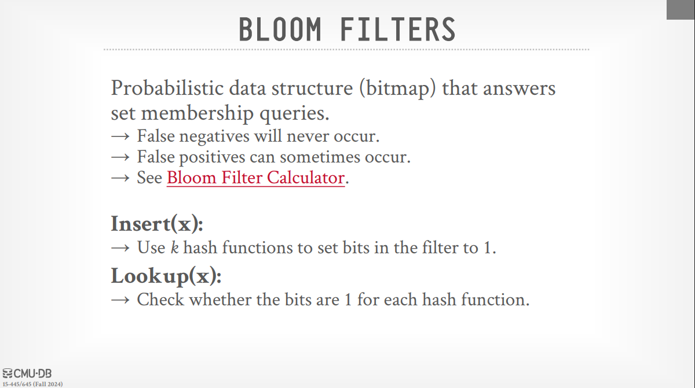
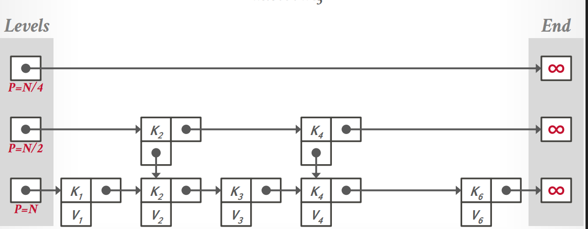
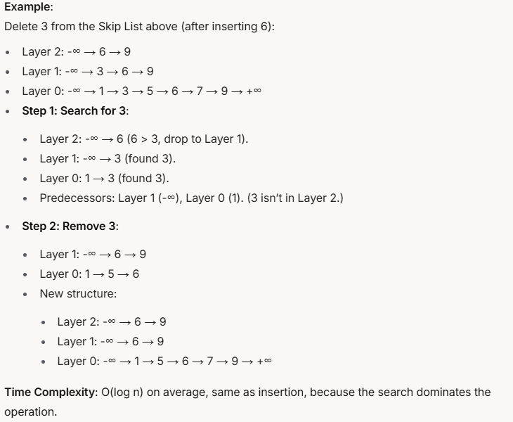
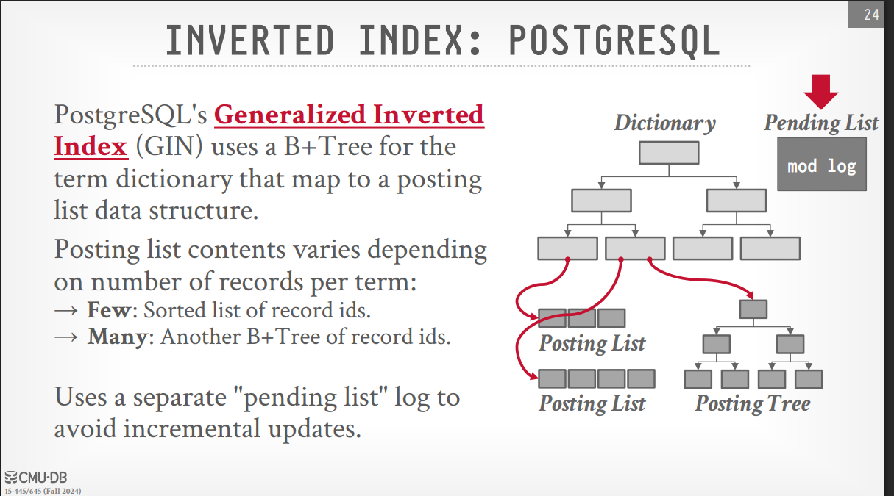
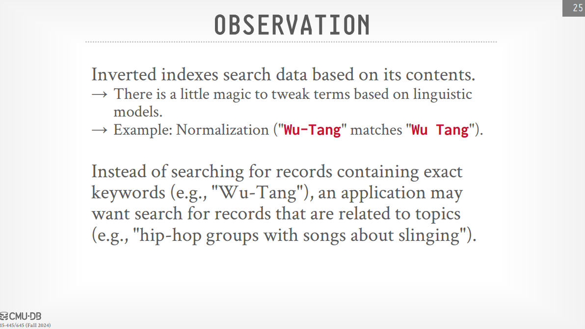
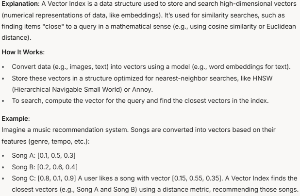
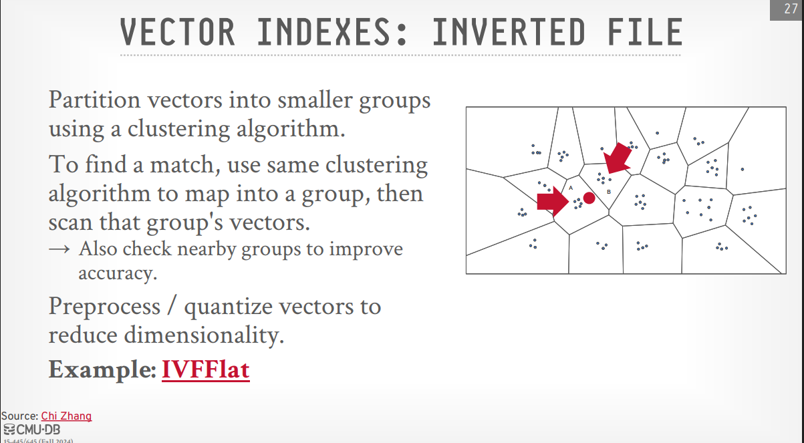
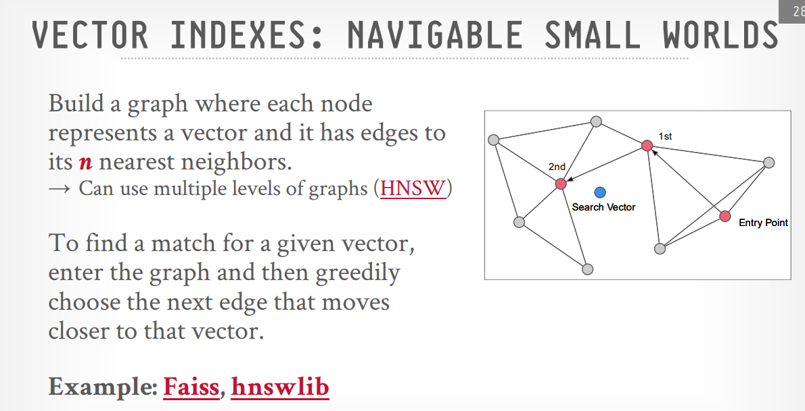

# Vector Indexes, Inverted Indexes, Filters, Tries

## Filters

> [!NOTE] Regular Bloom Filter
>
> - A Bloom Filter is a space-efficient probabilistic data structure used to test whether an element is likely in a set. It can tell you if an item is definitely not in the set or possibly in the set, but it might give false positives (i.e., it might say an item is in the set when it’s not). It uses multiple hash functions to map elements to a bit array.
> - We can insert and lookup elements in a Bloom filter, but we cannot delete them (example slide 6).
> - Bloom filters are highly useful for reducing unnecessary lookups. For example, before querying a potentially large index or even disk, a database can check a Bloom filter. If the filter says the key is definitely not there, the expensive lookup can be avoided.
> - 

> [!Question] How bloom filter works?
>
> - You have a bit array (all bits start as 0).
> - To add an element, hash it with several hash functions, and set the corresponding bits to 1.
> - To check if an element exists, hash it again and see if all corresponding bits are 1. If any bit is 0, the element is definitely not in the set.

> [!Note] Common Bloom Filter
>
> - A common Bloom filter is a variation of the standard Bloom filter that allows for the deletion of elements. It uses a counting array instead of a bit array, where each position in the array keeps track of how many times an element has been added. When an element is deleted, the count is decremented.

> [!question] Cons of common bloom filter
>
> - More space than a regular Bloom Filter (e.g., 4 bits per position instead of 1).
> - Counters can overflow if too many items hash to the same position, leading to errors.
> - Still may give false positives.

> [!Note] Cuckoo Filter
>
> - A Cuckoo Filter is a probabilistic data structure that, like a Bloom Filter, tests if an element is in a set, but it also supports deletions and often uses less space for low false-positive rates. It’s based on cuckoo hashing, where each item has two possible "nests" (buckets) to sit in, and it can "kick out" other items to make space.

> [!question] How Cuckoo Filter works?
>
> - The filter is an array of buckets, each holding a few fingerprints (small hashes of the items).
> - Each item is hashed to two possible buckets using two hash functions.
> - To add an item, compute its fingerprint and try to place it in one of its two buckets. If both buckets are full, "kick out" an existing item to its alternate bucket and place the new item.Repeat this "kicking" process until everything fits or a maximum number of kicks is reached (then the insertion fails).
> - To check an item, look for its fingerprint in either of its two buckets. To delete, remove the fingerprint from the bucket.

> [!Note] Cuckoo Filter props
>
> - Faster lookups than Bloom Filters (only checks two buckets), but insertions can be slower when the filter is nearly full due to the "kicking" process.
> - Insertion can fail if the filter gets too full (e.g., at 95% capacity), requiring resizing.

> [!Note] Succinct Range Filter (SuRF)
>
> - A Succinct Range Filter (SuRF) is a data structure that supports both single-key lookups (like Bloom or Cuckoo Filters) and range queries (e.g., "find all keys between 10 and 20"). It’s built on a Fast Succinct Trie (FST), a compressed trie that uses minimal space (about 10 bits per node), and adds suffix bits to handle approximate membership and range queries.

> [!question] How Succinct Range Filter works?
>
> - Start with a trie (like the one I described earlier) to store keys, but compress it into a Fast Succinct Trie for space efficiency.
> - To support approximate membership, cut off the trie at a certain level and store a few suffix bits (or hashed suffix bits) for each key. More suffix bits reduce false positives but use more space.
> - For a single-key lookup, traverse the trie and check the suffix bits. For a range query, traverse the trie to find all keys in the range, using the suffix bits to filter out false positives.

> [!Note] SuRF props
>
> - More versatile than Bloom or Cuckoo Filters because it supports range queries, but it’s more complex to implement.
> - Slightly higher false-positive rate for point queries compared to Bloom Filters, but it saves I/O for range queries (e.g., up to 5x faster in some database workloads).

## Other Indexes

> [!Note] Skip Lists
>
> - Skip lists are presented as a dynamic, order-preserving index that is relatively easy to implement. They offer a **probabilistic O(log n)** search time on average.
> - **Structure** : A skip list consists of multiple levels of sorted linked lists. Higher levels have fewer elements and allow for longer "skips" over the data. This multi-level structure enables faster searching than a single linked list.
> - 

> [!question] How Skip Lists are created?
>
> - The skip list is created from bottom to top. The bottom level is a sorted linked list of keys. Each key has a probabilistic chance of being promoted to the next level, which is also a sorted linked list. This continues until the top level, which may have only a few keys.
> - The probability of promotion is typically set to 1/2, meaning that **on average, half of the keys** at one level will be promoted to the next level. This results in a logarithmic number of levels. (the lecture slides mentions that every level is half the size of the previous level, but this is not strictly true; it’s more about probability).

### Skip List Operations

> [!NOTE] Insertion
>
> - **Search for the Position**: Start at the top layer and search for where the new value should go, just like a regular search. For each layer, move right until you find a node greater than the value (or reach the end), then drop down to the next layer. Keep track of the nodes you pass (these are the "predecessors" where you’ll insert the new node).
> - **Create the New Node**: Create a new node with the value. Randomly decide how many layers this node will span (e.g., flip a coin: 50% chance to add it to the next layer, repeat until you "lose" the coin flip). This determines the "height" of the node.
> - **Insert the Node**: For each layer up to the node’s height, link the new node between its predecessors and successors in that layer. Update the pointers accordingly.
> - **Adjust the Top Layer**: If the new node’s height is greater than the current top layer, increase the Skip List’s top layer to match.
> - see example slide 17.

> [!NOTE] Deletion
>
> - **Search for the Node**.
> - **Mark for Deletion**: Instead of immediately removing the node, mark it as deleted (e.g., set a flag). And when it's safe (Ensuring no threads are accessing the node), remove it from the list.
> - **Remove the Node**: When it's safe remove the node physically from the list by adjusting the pointers of its predecessors and successors.
> - .
> - Also see example slide 36.

> [!NOTE] Skip List Probs
>
> - Skip lists generally use less memory than B+ trees and avoid the complexities of node splitting and merging during deletion.
> - **Usage**: skip lists are often used for in-memory data structures. Examples include their use in the M-table of Log-Structured Merge Trees (LSM trees), as well as in storage engines like WireTiger (MongoDB) and Couchbase. The instructor notes that Cassandra initially used skip lists for its MemTable before switching to Tries.
> - **Potential Issue**: A potential issue with very long chains in a skip list, resembling a single linked list, which would degrade search performance. However, optimizations can address this.

> [!NOTE] Tries / Radix Trees / Patricia Trees
>
> - Tries are tree-like data structures where the key is formed by the path from the root to the leaf node, rather than being stored entirely at each node. They are also known as digital search trees or prefix trees.
> - **Structure**: Each node in a trie typically represents a character or a part of a key. Edges are labeled with these components. To retrieve a key, you traverse the trie from the root, following the edges corresponding to the characters of the key.
> - **Performance**: All operations (search, insertion, deletion) in a trie have a time complexity of O(k), where k is the length of the key. This can be more efficient than B+ trees for very long keys.
> - **Radix Trees (Patricia Trees)**: A radix tree is a compressed trie. If a node in a trie has only one child, the radix tree can merge this node with its child, effectively compressing paths with unique prefixes. Radix trees are also sometimes called Patricia trees. The instructor humorously mentions being unsure of the origin of the name "Patricia" may be it's the name of the inventor.
> - **Optimization and Potential for False Positives**: The compression in radix trees can lead to having a pointer to the tuple from a higher level, where only a prefix of the key has been matched. In such cases, a false positive might occur where the trie indicates a key exists based on a prefix match, but the full key in the actual data is different. Therefore, an extra check might be needed.
> - **Use Cases**: Tries and radix trees are used in various systems. The transcript mentions that Cassandra switched from skip lists to tries for its MemTable. Other systems like ART (Adaptive Radix Tree), used in HyPer (an influential German in-memory database system), DuckDB, Umbra, SolidDB, and Gunn also utilize tries or radix trees. DuckDB, in particular, reportedly doesn't use B+ trees and relies on radix trees. There is also a commercial incarnation of Umbra called cEDB.
> - **Modifications**: The slides briefly shows how insertion and deletion can be supported in tries (slide 56), including merging nodes based on certain thresholds (though not as strict as the half-full rule in B+ trees).

> [!NOTE]
>
> 

> [!NOTE] **Inverted Indexes**
>
> - An inverted index is a data structure that maps terms (e.g., words) to the locations where they appear (e.g., documents or rows). It’s "inverted" because it flips the usual mapping: instead of listing all words in a document (a forward index), it lists all documents containing a word.
> - An inverted index consists of two main components:
>   > - **Dictionary**: A mapping of terms (words or other relevant units within the data) to their frequency and pointers to posting lists.
>   > - **Posting Lists**: For each term in the dictionary, a list of record IDs (or document IDs) that contain that term in the target attribute.

> [!NOTE] Inverted Index : Lucene
>
> - Lucene is a search engine library (used by tools like Elasticsearch) designed for fast full-text search. Its inverted index is the core of its efficiency.

> [!question] How Lucene works?
>
> - **Document Processing:** When you add a document to Lucene, it’s broken into terms using an analyzer. This process (called tokenization) splits text into words, removes punctuation, converts to lowercase, and might apply stemming (e.g., "running" → "run"), Each term is associated with a document ID and its position in the text.
> - **Structure of the Inverted Index**: Terms Dictionary and Postings List.
> - **Storage and Search:** The index is stored on disk in segments (immutable chunks of the index). New documents are added to in-memory buffers, then flushed to disk as new segments. Segments are periodically merged for efficiency.To speed up searches, Lucene loads parts of the term dictionary into memory using a Finite State Transducer (FST), a compact data structure for quick lookups.
> - **Searching involves**:
>   > - Finding the terms in the dictionary (fast because it’s sorted).
>   > - Retrieving their postings lists.
>   > - Combining results (e.g., intersecting lists for multi-term queries) and ranking them using relevance scores (e.g., TF-IDF: term frequency-inverse document frequency).

> [!NOTE] Inverted Index : PostgreSQL
>
> PostgreSQL supports inverted indexes through its GIN (Generalized Inverted Index) index type, primarily for full-text search and complex data types like JSONB or arrays.

> [!question] How GIN(Generalized Inverted Index) works?
>
> - GIN maps each key (e.g., a word, array element, or JSONB key/value) to a list of row IDs (called a "posting list") where that key appears in the table.
> - It’s stored as a B-tree-like structure internally, but the leaves contain inverted lists rather than single values.
> - We face a problem if we decided to add a new key to the index, as we need to do all the work of inserting a key into B+ tree(splitting the tree, etc.), to solve this problem we have a pending list that will be used to store the new keys, and when we reach a certain threshold we will flush the pending list to the index.
> - 

> [!NOTE] 

> [!NOTE] Vector Indexes
>
> - Vector indexes are used for searching based on the semantic meaning of data, where data is represented as high-dimensional vectors (embeddings) generated by models like those from OpenAI or Google's BERT. Traditional keyword-based indexes cannot capture this semantic similarity.
> - 
> - Embeddings: These floating-point arrays encode the higher-level meaning of the data. Similar concepts should have "close" embeddings in the vector space.
> - Nearest Neighbor Search: Searching in vector indexes relies on nearest neighbor search (NNS) or approximate nearest neighbor search (ANN), as exact matches are unlikely. The goal is to find the vectors that are closest to the query vector in the embedding space.
> - Challenges: One significant challenge is handling additional predicates in queries (e.g., filtering by date) that are not captured in the vector embedding. Deciding whether to filter before or after the vector search is a key optimization problem.
> - **Approaches**: Two basic approaches for vector indexing are discussed:
>   > - **Inverted File (IVF)**: This method uses clustering algorithms (like k-means) to partition the vector space into smaller groups. During a search, the query vector is compared to the cluster centroids, and only the most relevant clusters are searched for nearest neighbors. Techniques like quantization can be used to speed up lookups. The transcript mentions IVF-Flat as a common variation.
>   > - 
>   > - **Navigable Small Worlds (NSW)**: This approach builds a graph where each vector is a node, and edges connect to its nearest neighbors. Searching starts at an entry point in the graph and greedily follows edges to nodes that are progressively closer to the query vector. The search stops when no closer neighbors can be found within the graph's local structure. Hierarchical NSW (HNSW) extends this to multiple levels for better scalability. Facebook's Faiss and the hnswlib library are mentioned as well-known implementations. The transcript also notes that Pinecone uses Faiss.
>   > - 
