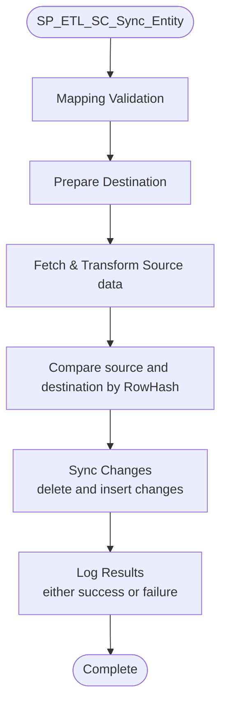

## ETL Overview
The ETL goal is to synchronize the data from 6 sources (distinct schemas) to only one database with one unified schema ... the ETL process is divided into two parts:
1. Mapping Preparation.
2. ETL process (FastChange and SlowChange).
> [!Note]
All the code, design and documentation files mentioned in this document can be found at the following repo: [OMAP_ETL](https://KAGSI@dev.azure.com/KAGSI/OMAP/_git/OMAP.ETL)

## Mapping Preparation
Mapping definition (Schema and values) is represented through mapping sheet provided by the data team through an excel file, the mapping excel contains 4 sheets.
- **Object Classes (valuesMapping):** Defines subtypes mapping.
- **Fields (fieldsMapping):** Defines schema mapping (how individual entities and fields (columns) are mapped from source to destination).
- **Domains (valuesMapping):** Lists domain values mappings (like enums or categories).
- **Domains | Subtypes | Values (valuesMapping):** Details how specific source values are converted to destination values.   
however these 4 sheets are converted to only 2 tables `fieldsMapping` and `valuesMapping` in our logical layer ( `OMAP_ETL` database ) to be used in the ETL process.
### How Mapping is reflected
The mapping excel file is reflected through the ETL Tool interface (`Upload mapping` tab), after uploading the mapping excel file and running the tool an automated process through a geoprocessing tool (the code exists in `Upload_OMAP_ETL_Mapping_Service.py` file). 
The steps as follows:
1. The sheets are extracted from the excel files as tables into a temp gdb file.
2. The tables are then deleted from `OMAP_ETL` if exists and then copied into the `OMAP_ETL` to reflect the new changes.
3. The stored procedure `SP_ETL_Mapping_Tables_Preparation` is run to calculate the new data from the new tables into  `fieldsMapping` and `valuesMapping` which are the actual tables integrated into the ETL process.
## Fast Change
The fast change process doesn't require any external actions ... It's sql server jobs that run every 10 seconds two exactly:
1. `FastChange_Plot_Duqm_Job`: Runs every 10 seconds and calls `SP_ETL_FastChange_Duqm` stored procedure.
2. `FastChange_Plots_Other_Than_Duqm_Job`: Runs every 10 seconds and calls `SP_ETL_FastChange_Plots_Other_Than_Duqm` stored procedure.
The zones in fast change are divided into Duqm and other than Duqm as we are limited to 10 seconds per change and the ETL ==**at worst case**== for Duqm plot takes around 5 seconds and the other zones takes around 8 seconds so we need to run them in parallel to ensure the changes are reflected within our 10 seconds timeframe that's why we have 2 jobs with two different procedures.

### Procedure steps

Both procedures follow the same steps:
1. validate if the server is currently the primary one in the availability group (as we have two servers that have these jobs duplicated for high availability).
2. Run `SP_ETL_Plot_Pre_Sync`: This SP responsible for making the necessary preparation for the plot mapping in `OMAP` database: 
	- Add necessary fields (for ETL process) at plot destination tables the fields are:
		- `RowHash`: to identify changes.
		- `source_objectID`: to store the source object id.
		- `source_globalID`: to store the source global id.
		- `sourceEntityGroup`: to specify the source tables group used inn mapping.
		- `LastSyncAt`: to specify the last change time.
	- Create plot archive to store the old changes.
	- Create Cpplotpoint table.
	- Create Statistics table.
	- Create views one for domains `VW_Domains` and one for subtybes `VW_Subtypes` both are used later in calculating statistics.
3. Run the plot sync SPs (`SP_ETL_FC_Sync_Entity` with the desired zone parameters): either it's Duqm in `SP_ETL_FastChange_Duqm`, or the other zones in `SP_ETL_FastChange_Plots_Other_Than_Duqm`, the sync process ensures capturing new changes, archiving the old ones and inserting the new ones into either `cpplot39` or `cpplot40`.
4. Synchronizing the deleted records in both `CppLotWGS84` and `Cpplotpoint` by running the SP `SP_ETL_CppLotWGS84_Cpplotpoint_Sync_Delete`.
5. Run the projection SP `SP_ETL_Plot_Projection` to convert the data from `cpplot39` and `cpplot40` to `cpplotWGS84` as it is the one used in the application map, the SP `SP_ETL_Plot_Projection` runs a python script (`projectionScript.py`) that makes the projection process and also loads the data inside `cpplotWGS84` .
6. The last step is to run the SP `SP_ETL_Plot_Post_Sync` to load the new data into `cpplotPoint` and recalculate the `statistics`.
## Slow Change
The ETL for Slow Change is initiated from the ETL tool application (Experience builder app) provided full description for the tool and how a user can use it at the `ETL_Tool_Overview.docx`

The ETL for Slow change will also be initiated through a daily job (Not created yet).

both the initiation from ETL tool and the daily job are the same and the operation steps are as follows:
1. A new record is added to the `ETL_Jobs` table, the record contains 3 parameters:
	- `Destination Entity`: The destination table or feature class that we want to map to it.
	- `Source Database`: The source Database to get data from.
	- `Source Entity Group`: The source Group to get the data from.
	all these parameters are optional and the mapping ETL process starts for Entities that satisfy these 3 parameters conditions if one parameter isn't provided then we will consider all the values for this parameter during mapping.
2. Once the the record is added a trigger on the `ETL_Jobs` called `TRGR_ETL_JOBS_After_Insert` is fired and start the job `ETL_SC_RUN_NotExecuted_Job`.
3. This job `ETL_SC_RUN_NotExecuted_Job` in turn calls the SP `SP_ETL_SC_Run_Job`, so why we add this additional `ETL_SC_RUN_NotExecuted_Job` job at the first place? ... Because Executing the stored procedure `SP_ETL_SC_Run_Job` via a SQL Agent Job (instead of directly) is used as a workaround to decouple the trigger’s context and transaction from the execution result of  `SP_ETL_SC_Run_Job`, The reason is that `SP_ETL_SC_Run_Job` contains dynamic SQL. If this dynamic SQL fails, it causes the entire transaction to fail, which in turn makes the trigger fail and rolls back the insert that initiated it. This behavior is not desired, hence we need to run it separately through a SQL Job.
4. `SP_ETL_SC_Run_Job` consists of two steps:
	1. Run `SP_ETL_SC_Prepare_Job` which add any missing views  for the databases that have versioning.
	2. Then get all the unique cases of the 3 parameters result (`SourceDB` , `destEntity` and `sourceEntityGroup`) and loop over them and call the sync procedure `SP_ETL_SC_Sync_Entity` for each possible combination.
5. The final step `SP_ETL_SC_Sync_Entity` which is the main part for syncing the data and  consists of multiple steps:
	1. **Validation**: starting with validating specific rules for data representation in mapping sheets like: (mapping existence, no duplications, etc) all the validations are listed and commented on the SP code and all rules are listed in `Mapping_Rules.pdf` file.
	2. `Destination table preparation`: Add the necessary fields for mapping process in the destination table (`RowHash, source_globalID, source_objectid, LastSyncAt, sourceEntityGroup`).
	3. `Fetching source Data`: in this phase we form the sync SQL queries dynamically and execute them, the steps are as follows:
	    1. `Select Statement Creation` : and this requires preparation for some meta fileds mapping that doesn't exist in the mapping sheet and fields representation for query and values mapping, through the following steps: 
		    1. `Update all the fields with a prefix of their source table name`: to know which table the fields is from as in case of joins there might be ambiguity.
		    2. `Replace the field name with mapping function in case of mapping existance`.
		    3. `ID and its related foreign keys representation`: the `ID` represent the main key for relations between tables in the destination so it has to be unique so to ensure uniqueness over all the zones we put the ID in this formula `Concat((opazZoneID + utmZone), sourceFieldValue)`.
		    4. `String to Number formula`: In this case the team Data (Ahmad Koubiessy) mentioned that we should take the valid numbers from the string so we use the function `fn_ExtractDigitsAsFloat` .
		    5. `Add meta fields mapping`: meta fields are fields needed but aren't represented in the mapping sheet like (`Shape, GlobalID, source_globalID, objectid, source_objectid, OPAZZoneID, RowHash(empty placeholder for now), sourceEntityGroup`).
		    6. `Put the fields in the AS destinationField format`: we make this as the selection is done into a temp table so we wanna make it take the same schema as destination that's why we add `AS destField`  .
		    7. `Select statement formation`: we aggregate the fields from the mapping table to form the final select statement.
		2. `From Statement Creation`: From statement is created from all sourceTables that maps to this feature class (in case of join).
		3. `Fetch the data into a temp table`: make a full query and insert the data into a global temp table `##source_table (global temp to make sure it will be presistence for the ramining parts of the code as it created inside a dynamic query)` 
		4. `Calculate the RowHash for comparison`: Keep in mind that while calculating the `RowHash` we have to ensure that the order of concatenating the fields during hashing is the same every time to ensure the `RowHash` remain consistent
	4. `Compare and synchronize data between source and destination tables` : comparing the `RowHash` from the source and destination we know what is changed (added, updated or deleted) and we take the following actions in order: 
		1. `Delete changed rows from destination`.
		2. `Insert new and updated rows from source to destination`
	5. `Logging the SP result`: after finishing we add the SP result to `ETL_Logs` table for tracking success or failures indicating the errors or the warnings if any, also logging the queries for debugging if needed.

![[Pasted image 20251106111216.png]]

mainlanduse and detailed landuse not added to query filteration when they are null

Feedback
1. madayn repition because of grouping by opazsubOneid
![[Pasted image 20251106153909.png]]

Review
1. the reason of invalid joins is because of unnecessary mapping (also i preffere to leave it the way i make as if there is any future joins in this case we can't put the source entity as primary table name)
2. i modified detailed land use in cards and in drop down search and all the other parts in the application in search filter function
3. Structure is maintained correctly data through service, and map data operations exist inside map component and called through the map service.
4. when search by extent is enabled unknown resultss madayn also (i think it search by detailed land use) also the result for khazaen and sohar drop down have a problem.
5. don't forget zone filter

structure problems
1. data called directly from land search component, as agreed it should be called from the service and the component call the service.
   ![[Pasted image 20251109160735.png]]
2. ![[Pasted image 20251111130159.png]]
   when changing the extent i found that resullt are none and the old cards weren't removed.
3. 