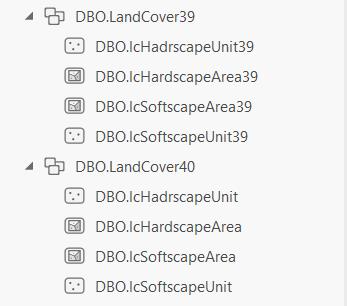
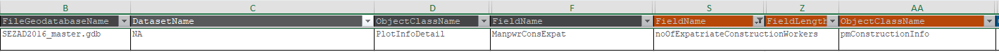

# Destination Schema Issues

> [!TIP] Inconsistent Entity Naming Conventions
>
> All the destination entities ends with either `39` or `40` except for the following:
> 
> Naming Convention should be **unified across all entities**, please if there any other entities that do not follow this convention, update them as well.

> [!TIP] Mismatch between fields names in the mapping sheet and actual destination schema
>
> in the mapping sheet field `noOfExpatriateConstructionWorkers` at entity `pmConstructionInfo40` have wrong name the destination schema which is `noOfExpatriateConstructionWorke` (missing `rs` at the end).
> 
> 

> [!TIP] Missing fields in the destination schema
>
> At `Duqm` fields `opazZoneID` and `opazSubzoneID` are missing in the destination entity `pmStatisticalValue40`.
