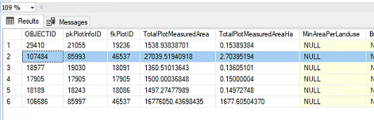
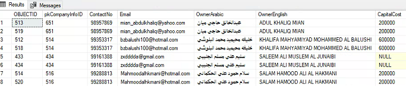
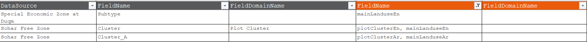
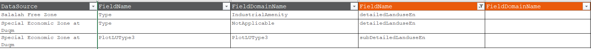

# Duqm Issues

> [!tip]
>
> - Fields exist in the mapping sheet and doesn't exist in OMAP database. (see Missing fields below).
> - OMAP Spatial refrerence is not UTM, SRID = 4326 (WGS 84).
> - Mismatch in fields types during mapping (see the table below).
> - plotinfo_evw has duplicate ROW with fkplotid = 46537
> - 
> - plotinfodetils has multiple duplicates with fkplotids=(17905,18086,18091,19236,46537).
> - 
> - mainlanduse and detailed landuse domains keys mapping.
> - 
> - 

> [!bug] Missing fields
>
> - companyInfoID
> - dateOfSign
> - generalMasterPlan
> - developmentPhase
> - contactNo
> - contactEmail
> - dateOfConstructionStart
> - dateOfConstructionEnd
> - waterDemand
> - sewageOutput
> - electricityDemand
> - naturalGasDemand
> - noOfOmaniConstructionWorkers
> - noOfExpatriateConstructionWorkers
> - noOfOmaniOperators
> - noOfExpatriateOperationsWorkers

> [!bug] Fields Types Mismatch
>
> | Duqm Field | OMAP Field | 
> |-------------|---------------|
> | PlotInvestmentType nvarchar(200) | InvestmentType smallint |
> | TotalPlotMeasuredArea numeric(38, 8) | measuredArea numeric(7, 1) |
> | BuiltUpArea numeric(38, 8) | BUA numeric(7, 1) |
> | MaxBuildingHeight numeric(38, 8) | maxBuildingHeightAllowed numeric(7, 1) |
> | price numeric(38, 8) | pricePerSquareMeter numeric(7, 1) |
> | PlotLUType3 nvarchar(200) | subDetailedLanduseEn smallint |
