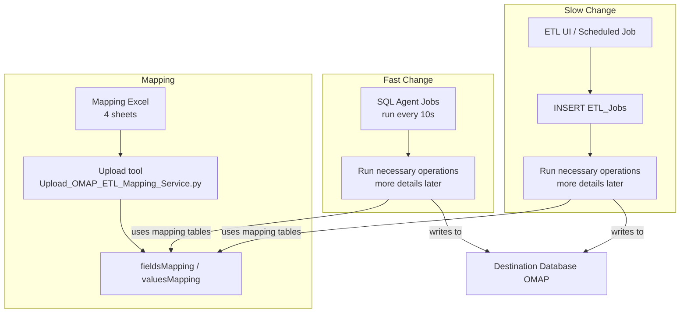
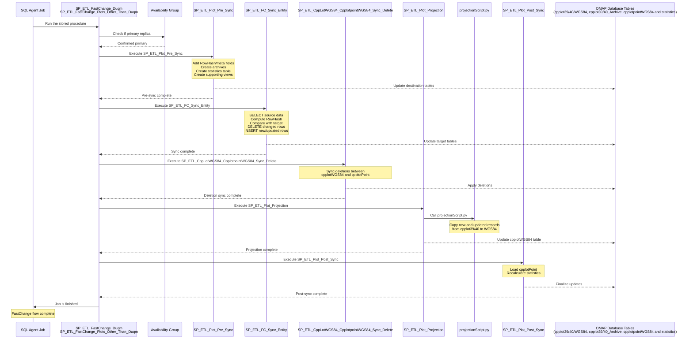
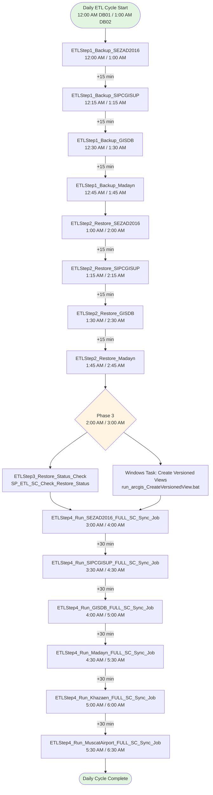
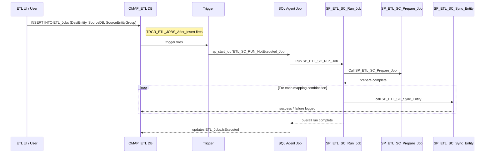

# **Purpose**
This document is a developer-focused guide to the OMAP ETL: what it does, how the mapping is represented, the two runtime modes (FastChange and SlowChange), the main files and stored procedures and how to run and debug.

The ETL synchronizes data from multiple source schemas/databases into a single unified destination schema (the `OMAP` DB). It supports near-real-time updates (FastChange) and bulk runs (SlowChange).

# **Content**
1. High-level architecture
2. Mapping 
3. FastChange
4. SlowChange
5. Stored Procedures
<div style="page-break-before: always;"></div>

# **High_Level_Architecture**
- **Mapping definition**: Data team provides an Excel file (4 sheets). The mapping upload tool extracts sheets, copies them into the `OMAP_ETL` database and runs `SP_ETL_Mapping_Tables_Preparation` which converts the raw sheets into tables `fieldsMapping` and `valuesMapping`.
- **FastChange**: SQL Agent jobs execute stored procedures at ~10s frequency to sync recent changes from source to destination.
- **SlowChange**: Insert into `ETL_Jobs` via UI or scheduled jobs which loops over mapping combinations and calls `SP_ETL_SC_Sync_Entity` which is responsible for synchronizing the data.



<div style="page-break-before: always;"></div>

# **Mapping**
- Excel sheets (provided by data team):
  - **Object Classes (valuesMapping)**: represents subtypes and their value mappings.
  - **Fields (fieldsMapping)**: represents schema mapping.
  - **Domains (valuesMapping)**: represents domains mapping.
  - **Domains | Subtypes | Values(valuesMapping)**: represents other values mappings text to number, number to text, domain to text or number ... etc.
- Final tables:
	The 4 sheets are converted to the following two tables to be used in the app:
  - `fieldsMapping` — field/entity-level mapping used by sync procedures.
  - `valuesMapping` — domain/value mapping used to convert coded values.
- Mapping pipeline:
  1. Upload Excel via ETL tool (`Upload mapping` tab): this is a Geoprocessing tool, it's code could be found at `Upload_OMAP_ETL_Mapping_Service.py`.
  2. Sheets extracted to a temporary geodatabase and then copied into `OMAP_ETL` raw tables.
  3. The script runs `SP_ETL_Mapping_Tables_Preparation` to populate `fieldsMapping` and `valuesMapping`.

  <div style="page-break-before: always;"></div>

# **Fast_Change**
Purpose: capture and apply source edits quickly (two pipelines run in parallel to meet time limitation).

- **Jobs & procedures**:
  - `FastChange_Plot_Duqm_Job` → `SP_ETL_FastChange_Duqm`
  - `FastChange_Plots_Other_Than_Duqm_Job` → `SP_ETL_FastChange_Plots_Other_Than_Duqm`
- Why two jobs: Duqm and non-Duqm zones have different worst-case run times and must both complete within ~10s; running them in parallel avoids missing the time window.

## **FastChange flow (per job):**
1. Confirm node is primary replica (AG check).
2. Run `SP_ETL_Plot_Pre_Sync` — adds RowHash/meta fields, creates archives, statistics table and supporting views.
3. Run `SP_ETL_FC_Sync_Entity` — core sync (select, compute RowHash, compare, delete/insert rows).
4. Sync deletions via `SP_ETL_CppLotWGS84_Cpplotpoint_Sync_Delete`.
5. Project results to WGS84 via `SP_ETL_Plot_Projection` + `projectionScript.py`.
6. Finalize via `SP_ETL_Plot_Post_Sync` (load cpplotPoint, recalc stats).

<div style="page-break-before: always;"></div>


<div style="page-break-before: always;"></div>

# **Slow_Change**
**Purpose**: Run full or filtered synchronizations initiated via UI or scheduled job.
The SlowChange ETL process synchronizes data from multiple source databases to a centralized OMAP DB through a **multi-phase daily** orchestration involving **backup, restore, validation, and synchronization.**
## **Daily Orchestration Process**
We have two servers in a cluster PGISMSSQLDB01 and PGISMSSQLDB02, only one of them run the whole process and this one is the **current primary** one.
### **Phase 1: Database Backup
**Purpose:** Create full backups of source databases from remote zones.
Sequential backup jobs extract data from source systems with 15-minute intervals between each database:
> [!TIP] Backup Schedule
> 
| Job Name                                  | Source Database | Source Server | Start Time (DB01) | Start Time (DB02) |
| ----------------------------------------- | --------------- | ------------- | ----------------- | ----------------- |
| ETLStep1_Backup_SEZAD2016_Full_From_DUQM  | SEZAD2016       | DUQM          | 12:00 AM          | 1:00 AM           |
| ETLStep1_Backup_SIPCGISUP_Full_From_Sohar | SIPCGISUP       | Sohar         | 12:15 AM          | 2:45 AM           |
| ETLStep1_Backup_GISDB_Full_From_Salalah   | GISDB           | Salalah       | 12:30 AM          | 1:30 AM           |
| ETLStep1_Backup_Madayn_Full_From_Madayn   | Madayn          | Madayn        | 12:45 AM          | 1:45 AM           |

**Prerequisite:** None (initiates daily cycle)
***
### **Phase 2: Database Restore
**Purpose:** Restore backed-up databases to local ETL server databases.
Sequential restore jobs load backups into local databases with 15-minute intervals:
<div style="page-break-before: always;"></div>

> [!TIP] Restore Schedule
>
|Job Name|Destination Database|Start Time (DB01)|Start Time (DB02)|
|---|---|---|---|
|ETLStep2_Restore_SEZAD2016_Full_From_DUQM|SEZAD2016|1:00 AM|2:00 AM|
|ETLStep2_Restore_SIPCGISUP_Full_From_Sohar|SIPCGISUP|1:15 AM|3:15 AM|
|ETLStep2_Restore_GISDB_Full_From_Salalah|SALALAH_GISDB|1:30 AM|2:30 AM|
|ETLStep2_Restore_Madayn_Full_From_Madayn|Madayn|1:45 AM|2:45 AM|

**Prerequisite:** Completion of corresponding backup jobs.
***
<div style="page-break-before: always;"></div>

### **Phase 3: Restore Validation & View Creation
**Purpose:** Verify restore integrity and prepare versioned database views.
#### **3A. Restore Status Check**
- **Job:** `ETLStep3_Restore_Status_Check`
- **Procedure:** `SP_ETL_SC_Check_Restore_Status`
- **Start Time:** 2:00 AM (DB01) / 3:00 AM (DB02)
- **Validation Logic:**
    - Checks for presence of a dump table in each restored database
    - **Success:** Dump table does not exist → inserts dump table marker
    - **Failure:** Dump table exists → restore failed or incomplete
#### **3B. Versioned View Creation**
- **Task:** Windows Scheduled Task - "Run ArcGIS Create Versioned Views on Restored Databases From Zones"
- **Script:** `run_arcgis_CreateVersionedView.bat`
- **Start Time:** 2:00 AM (DB01) / 3:00 AM (DB02)
- **Purpose:** Creates versioned views for tables with versioning or archiving enabled
- **Note:** Runs concurrently with restore status check (not dependent)

**Prerequisite:** Completion of all restore jobs
***
### **Phase 4: Full Synchronization**
**Purpose:** Execute full SlowChange sync from restored databases to OMAP destination entities.
Sequential sync jobs run with 30-minute intervals between databases:
<div style="page-break-before: always;"></div>


> [!TIP] Full Sync Schedule
> 
|Job Name|Source Database|Start Time (DB01)|Start Time (DB02)|
|---|---|---|---|
|ETLStep4_Run_SEZAD2016_FULL_SC_Sync_Job|SEZAD2016|3:00 AM|4:00 AM|
|ETLStep4_Run_SIPCGISUP_FULL_SC_Sync_Job|SIPCGISUP|3:30 AM|4:30 AM|
|ETLStep4_Run_GISDB_FULL_SC_Sync_Job|SALALAH_GISDB|4:00 AM|5:00 AM|
|ETLStep4_Run_Madayn_FULL_SC_Sync_Job|Madayn|4:30 AM|5:30 AM|
|ETLStep4_Run_Khazaen_FULL_SC_Sync_Job|Khazaen|5:00 AM|6:00 AM|
|ETLStep4_Run_MuscatAirport_FULL_SC_Sync_Job|MuscatAirport|5:30 AM|6:30 AM|

**Prerequisite:** Successful completion of restore validation (Step 3)
***
<div style="page-break-before: always;"></div>

## **Process Flow Diagram**


***

<div style="page-break-before: always;"></div>

## **Slow Change Sync Execution (Phase 4 Detail)**

### **Initiation & orchestration**:
- **Job Insertion:** Scheduled Step 4 jobs or ETL_tool User insert a row into `OMAP_ETL.dbo.ETL_Jobs`
    - Fields: `DestEntity`, `SourceDB`, `SourceEntityGroup` (all optional; unspecified = full sync)
- **Trigger Activation:** `TRGR_ETL_JOBS_After_Insert` fires and starts SQL Agent job `ETL_SC_RUN_NotExecuted_Job`
    - This decouples the trigger transaction from dynamic SQL execution
- **Job Execution:** `ETL_SC_RUN_NotExecuted_Job` picks the not-executed job and calls `SP_ETL_SC_Run_Job`
- **Entity Processing:** `SP_ETL_SC_Run_Job` calls `SP_ETL_SC_Prepare_Job`, then loops over distinct mapping combinations and calls `SP_ETL_SC_Sync_Entity` for each


---

<div style="page-break-before: always;"></div>

# **Stored_Procedures**

## **`SP_ETL_SC_Sync_Entity`**
### **Overview**

`SP_ETL_SC_Sync_Entity` is a Slow Change ETL stored procedure that synchronizes spatial entity data from a local backup source database to the OMAP destination database. It includes validation checks, handles field mappings different cases, and performs hash-based change detection for incremental updates. Unlike the Fast Change procedure, this operates on local database copies rather than linked servers.
### **Purpose**
This procedure performs full data synchronization for entities that change infrequently, with extensive pre-validation to ensure data integrity before any modifications occur. 
### **Parameters**

> [!TIP] 
>
|Parameter|Type|Description|
|---|---|---|
|`@SourceDB`|NVARCHAR(128)|Source database identifier used for mapping lookups|
|`@SourceEntityGroup`|NVARCHAR(255)|Logical grouping of related source entities/tables|
|`@DestEntity`|NVARCHAR(128)|Target entity/table name in the destination database|
|`@JobID`|BIGINT|Unique identifier for the ETL job execution|
### **Process Flow**
#### **Phase 1:  Validation (9 Steps)**

#### 1. Verify Mapping Configuration Exists
- Checks if mapping exists in `FieldsMapping` table for the specified source DB, entity group, and destination entity
- **Fails early** if no mapping configuration is found
- Ensures the ETL job has valid metadata to proceed
#### 2. Validate Source Tables Existence
- Extracts all source entities involved in the synchronization from `FieldsMapping`
- Creates `#sourceTables` temporary table with:
    - Source entity names
    - Primary key relationships
    - Foreign key relationships
- Removes duplicate entries for tables without primary keys
- **Fails** if no source tables are identified
- Identifies the primary table (the one without a primary key reference)
#### 3. Check for Duplicate Field Mappings
- Identifies any destination fields that are mapped from multiple source fields
- Creates `#DuplicateFields` temporary table
- Aggregates duplicate fields into a comma-separated error message
- **Fails** if duplicate mappings are detected
- Prevents data conflicts and ambiguous field assignments
#### 4. Verify Destination Entity Exists
- Checks physical existence of destination table in OMAP database
- Validates table exists in the correct schema
- **Fails** if destination table is not found
- Ensures target table is ready to receive data
#### 5. Validate Destination Fields Exist
- Compares all mapped destination fields against actual table columns
- Creates `#EntityFieldsMapping` temporary table containing:
    - Source and destination field names
    - Field types and data types
    - Coded value indicators
    - Reference relationships
    - UTM zone information
- Identifies missing destination fields
- **Fails** if any mapped fields don't exist in destination table
- Prevents runtime errors during INSERT operations
#### 6. Check for Empty or Null Mappings
- Validates that all field mappings have non-null, non-empty source and destination fields
- **Fails** if any mapping has missing field names
- Ensures data integrity of mapping configuration
#### 7. Validate WHERE Condition Uniqueness
- Extracts all WHERE conditions from field mappings
- Creates `#whereConditions` temporary table
- **Fails** if multiple different WHERE conditions are defined
- Ensures consistent filtering logic across the entity group
- Sets `@whereCondition` variable for later use
#### 8. Check for Multiple Primary Tables
- Validates that only one primary table exists in the source entity group
- **Fails** if multiple primary tables (`relatedPrimaryEntity`) are detected
- Prevents ambiguous JOIN relationships
- Lists conflicting primary tables in error message
#### 9. Confirm Primary Table is Defined
- Ensures at least one table without a primary key reference exists
- Sets `@PrimaryTable` variable
- **Fails** if no primary table is identified
- Prevents orphaned JOIN chains

#### **Phase 2: Destination Table Preparation**

#### 1. Add Required System Columns

Dynamically alters the destination table to add tracking columns if they don't exist:

**Columns Added:**
- **RowHash** (VARCHAR(64)): SHA2_256 hash for change detection
- **source_objectid** (INT): Original OBJECTID from source
- **source_globalID** (UNIQUEIDENTIFIER): Original GlobalID from source
- **sourceEntityGroup** (NVARCHAR(255)): Source entity group identifier
- **LastSyncAt** (DATETIME2): Timestamp of last synchronization (default: current date/time)
#### 2. Add GlobalID Column
- Checks for GlobalID column existence
- Adds GlobalID (UNIQUEIDENTIFIER) if missing
- Ensures compatibility with ArcGIS enterprise geodatabase standards
#### **Phase 3: Data Extraction & Transformation**

#### 1. Build Dynamic SELECT Statement

**Step 1: Prefix Fields with Table Names**
- Updates `sourceFieldFullName` to include table prefix
- Format: `TableName.FieldName`
- Skips fields already in formula format (containing parentheses)

**Step 2: Handle Values Mapping**
- Applies `fn_Get_Mapped_Field_Value()` and `fn_Get_Mapped_Numeric_Field_Value()` functions for fields with Values mapping depending on the type of the source field, if its type is numeric we use the numeric function. 
- Maps source coded values to destination values
- Handles subtype-dependent domains using `sourceSubtypeField`.

**Step 3: Generate ID and Reference Fields**
- Concatenates OPAZ Zone ID + UTM Zone + field value
- Format: `CONCAT('ZoneID', fieldValue)`
- Applies to:
    - ID fields (primary identifiers)
    - Fields referencing destination IDs (foreign keys)
- Creates globally unique identifiers across zones

**Step 4: Handle Data Type Conversions**
- Uses `fn_ExtractDigitsAsFloat()` for string-to-numeric conversions
- Converts between incompatible field types:
    - String → Integer, SmallInteger, Double, BigInteger
- Extracts numeric values from mixed-content strings

**Step 5: Add Shape Geometry Field**
- Checks if Shape field exists in both source and destination
- Verifies column existence in:
    - Destination table (OMAP database)
    - Primary source table (SDE database)
- Adds Shape field to mapping if present in both
- Sets `@ShapeFieldExists` flag for later use

**Step 6: Add GlobalID Field**
- Checks for GlobalID existence in source primary table
- If exists:
    - Maps source GlobalID to `source_globalID` in destination
    - Maps source GlobalID to destination `GlobalID` field (if not already mapped)
- If missing:
    - Generates new GUID using `NEWID()` function

**Step 7: Add OBJECTID Field**
- Retrieves maximum existing OBJECTID from destination table
- Generates sequential IDs: `@MaxObjectID + ROW_NUMBER()`
- Maps source OBJECTID to `source_objectID` (if not already mapped)
- Ensures unique OBJECTID values in destination

**Step 8: Add OPAZZoneID Field**
- Inserts zone identifier from metadata
- Enables zone-based data partitioning

**Step 9: Add RowHash Placeholder**
- Inserts NULL placeholder for hash calculation
- Will be populated in step 11

**Step 10: Add Source Entity Group**
- Inserts source entity group identifier
- Enables filtering by entity group during sync

**Step 11: Apply Default Aliasing**
- Adds `AS destination_field` to all source field expressions
- Completes the SELECT clause construction

#### 2. Build Dynamic FROM Clause with JOINs

**Step 1: Construct FROM Statement**
- Creates base FROM clause with primary table
- Adds LEFT JOINs for related tables using primary/foreign key relationships
- Format:

```sql
  FROM [SDE_DB].[Schema].[PrimaryTable]
  LEFT JOIN [SDE_DB].[Schema].[RelatedTable] 
    ON [PrimaryTable].[PK] = [RelatedTable].[FK]
```

**Step 2: Execute Data Extraction**
- Combines SELECT and FROM clauses
- Adds WHERE condition if defined in validation phase
- Applies entity name suffix (e.g., `_evw` for enterprise views)
- Replaces all table references with suffixed versions
- Creates `##sourceData` global temporary table with transformed data
- Executes dynamic SQL to populate temp table

#### 3. Calculate Row Hash for Change Detection
- Generates SHA2_256 hash from all relevant fields
- Concatenates field values (excluding: RowHash, Shape, OBJECTID, GlobalID)
- Converts all values to NVARCHAR(1000), uses empty string for NULLs
- Orders fields consistently for reproducible hashes
- Updates RowHash column in `##sourceData`
- Enables efficient change detection by comparing hashes

#### **Phase 4: Data Synchronization**

#### 1. Delete Obsolete Records
**Without Shape Field:**
- Simple hash comparison
- Deletes destination rows where RowHash doesn't exist in source
- Filters by OPAZZoneID and sourceEntityGroup

**With Shape Field:**
- Complex comparison with geometry validation
- Performs LEFT JOIN between destination and source
- Matches on both:
    - RowHash (with collation: Arabic_100_CI_AS)
    - Shape geometry equality (`STEquals()` = 1)
- Deletes rows where no match is found
- Filters by OPAZZoneID and sourceEntityGroup
- Handles spatial data changes more precisely

#### 2. Insert New Records
- Identifies new rows by comparing RowHash values
- Selects all rows from `##sourceData` where RowHash doesn't exist in destination
- Filters by OPAZZoneID and sourceEntityGroup
- Inserts all mapped fields including:
    - Transformed data fields
    - Generated system fields (OBJECTID, GlobalID, RowHash)
    - Metadata fields (OPAZZoneID, sourceEntityGroup)

#### 3. Validate Coded Value Mappings
- Iterates through all fields with coded values using CURSOR
- Checks destination table for any `-1` values (unmapped indicator)
- Filters by OPAZZoneID and sourceEntityGroup
- Builds warning message listing:
    - Source field name
    - Destination field name
- Prints warning message to console
- Helps identify missing domain mappings in `ValuesMapping` table

---

#### **Phase 5: Logging & Cleanup**

#### Success Path
- Inserts execution record into `ETL_Logs` table
- Captures:
    - All dynamic SQL statements (SELECT, FROM, RowHash, DELETE, INSERT)
    - Success status
    - Unmapped value warnings (if any)
- Drops temporary tables:
    - `#EntityFieldsMapping`
    - `#sourceTables`
    - `##sourceData`
- Commits transaction

#### Error Handling
- Wraps entire procedure in TRY-CATCH with transaction
- On error:
    - Rolls back all changes
    - Captures error details:
        - Error message
        - Error severity
        - Error state
        - Error line number
    - Logs error to `ETL_Logs` table with:
        - All constructed SQL statements (for debugging)
        - Failure status
    - Prints error message and line number
    - Returns control to caller
### **Usage Example**

```sql
EXEC [dbo].[SP_ETL_SC_Sync_Entity]
    @SourceDB = 'Special Economic Zone at Duqm',
    @SourceEntityGroup = 'Plot',
    @DestEntity = 'cpPlot40',
    @JobID = 12345;
```

### **Output**

- Prints validation results for each step
- Prints unmapped value warnings (if any)
- Returns execution status in `ETL_Logs` table
- Updates destination entity with synchronized data
---

<div style="page-break-before: always;"></div>

## **`SP_ETL_Mapping_Tables_Preparation`**

### **Overview**
**SP_ETL_Mapping_Tables_Preparation** is a stored procedure that prepares mapping tables for data transformation processes. It processes source-to-destination field mappings, value mappings, and maintains backup history.
### **Purpose**
This procedure transforms raw mapping data from source tables (`FIELDS`, `Mappings`, `domains`, `objectClasses`) into structured mapping tables (`fieldsMapping`, `valuesMapping`) used for ETL processes, with additional business logic for spatial references and entity grouping.

### **Process Flow**

#### **Phase 1: Fields Mapping Preparation**

**Source Table**: `dbo.FIELDS`  
**Destination Table**: `dbo.fieldsMapping`

##### Key Transformations:
- **Data Cleaning**: Trims whitespace characters (CHAR(10), CHAR(13), CHAR(9)) from all text fields
- **Filtering**: Only includes records where:
    - `is_In_Design = 'Yes'` OR
    - `RelationshipOriginPrimaryKey IS NOT NULL`
        
- **Column Mapping**:
    - Relationship fields (relatedPrimaryKey, relatedPrimaryEntity)
    - Additional metadata fields:
	    - **hasCodedValue**: to identify if there is value mapping for this field or not.
	    - **foreignKey**: to specify the table foreign key if any.
	    - **hasArchive**: for future features (Not considered in this version yet).
##### Special Handling:
- Replaces 'NA', 'N/A' values with NULL in dataset fields
- Handles table creation if not exists, otherwise truncates and repopulates

#### **Phase 2: Spatial Reference Assignment**

Sets `source_SR_WKID` based on source database:
- **32639**: Salalah Free Zone, Industrial Estates (MADAYN) with datasets ending in '_39'
- **32640**: Sohar Free Zone, Special Economic Zone at Duqm, Industrial Estates (MADAYN) with datasets ending in '_40'

#### **Phase 3: Destination Entity Zone Suffixing

Appends zone prefix to destination entities to match the destination database schema:
- **Zone 39**: Appends '39' to `destEntity` (except 'cpPlot__ATTACH' becomes 'cpPlot39__ATTACH')
- **Zone 40**: Appends '40' to `destEntity` (except 'cpPlot__ATTACH' becomes 'cpPlot40__ATTACH')

#### **Phase 4: Values Mapping Preparation
**Source Tables**: `dbo.Mappings`, `dbo.domains`, `dbo.objectClasses`  
**Destination Table**: `dbo.valuesMapping`
##### Three Data Sources:
1. **Main Mappings**: Direct field value mappings from `Mappings` table
2. **Domain Values**: Coded value domains from `domains` table (joined with fieldsMapping to populate other fields in fieldsMapping)
3. **Subtype Mappings**: Subtype code mappings from `objectClasses` table

#### **Phase 5: Relationship and Grouping Logic**

- **Foreign Key Identification**: Sets `foreignKey = sourceField` where `relatedPrimaryKey IS NOT NULL`
- **Entity Grouping**:
    - Initial grouping: `sourceEntityGroup = sourceEntity`
    - Updates with related primary entities where relationships exist
    - Custom grouping via `CustomSourceEntityGroup` concatenation when grouping is provided from the mapping sheet.
- **Primary Key Cleanup**: Nullifies relationship fields when source entity is the primary table

#### **Phase 6: Define the fields with value mapping**

Set `hasCodedValue = 1` where the field has mapping in the `valuesMapping` table 
#### **Phase 7: Domain Tables Creation**

Creates distinct value domains for:
- `DomainSourceDB`: Unique source databases
- `DomainDestEntity`: Unique destination entities
- `DomainSourceEntityGroup`: Unique source entity group.
To be used in ETL tool interface.
#### **Phase 8: Backup Management
- Takes backup of the uploaded version into `fieldsMapping_backups` and `valuesMapping_backups`
- Deletes unnecessary backups of `fieldsMapping` and `valuesMapping`
- Keeps only the last 10 backups using DENSE_RANK()
- Includes timestamp for backup identification

---

<div style="page-break-before: always;"></div>

## **`SP_ETL_SC_Run_Job`**

### **Overview**

**SP_ETL_SC_Run_Job** is the main orchestrator stored procedure for SlowChange ETL synchronization jobs. It validates restore status, prepares the ETL environment, generates a list of entity combinations to synchronize, and executes synchronization for each combination sequentially.

### **Purpose**

This procedure coordinates the execution of SlowChange sync operations by ensuring data prerequisites are met (successful database restores), preparing the job environment, and iterating through all required source-destination entity mappings to perform synchronization via `SP_ETL_SC_Sync_Entity`.
### **Parameters**

> [!TIP]
> 
|Parameter|Type|Description|
|---|---|---|
|`@SourceDB`|NVARCHAR(255)|Source database name (NULL = all databases)|
|`@SourceEntityGroup`|NVARCHAR(255)|Source entity group for filtering (NULL = all groups)|
|`@DestEntity`|NVARCHAR(255)|Destination entity name (NULL = all entities)|
|`@JobID`|INT|Unique identifier for the ETL job execution|

**Note**: When parameters are NULL or empty string, the procedure processes all applicable records.
***
### **Process Flow**

#### **Phase 1: Restore Status Validation**

**Purpose**: Ensure source databases have been successfully restored today before proceeding with ETL operations.
##### Key Operations:

1. **Identify Current Server**: Captures `@@SERVERNAME` to filter restore logs by server instance
2. **Query Restore Logs**: Retrieves the most recent restore record for each database from today
    - Source: `OMAP_ETL.dbo.ETL_Backup_Restore_Log`
    - Filters: `Type = 'Restore'`, `CAST(Date AS DATE) = today`, `DBInstance = current server`
    - Uses `ROW_NUMBER()` partitioned by `DBName` to get the newest restore attempt
3. **Build Allowed Database List**: Creates `#AllowedSourceDBs` temp table containing:
    - Only databases with `Status = 'Success'` in their most recent restore
    - Joined with `DBMappingMetaData` to map SDE database names to mapping database names
    - Filtered by `@SourceDB` parameter if specified
4. **Log Restoration Failures**:
    - Identifies databases requested in `@SourceDB` parameter that failed restoration or weren't restored today
    - Inserts failure records into `OMAP_ETL.dbo.ETL_Logs`:
        - `ErrorMessage`: "Source DB restore unsuccessful today. ETL job not run for this DB."
        - `STATUS`: 'Failure'

**Business Rule**: ETL synchronization will NOT proceed for databases without successful restoration today.
***
#### **Phase 2: Job Preparation**

**Purpose**: Initialize and prepare the ETL environment for synchronization.
##### Key Operations:

- **Calls**: `SP_ETL_SC_Prepare_Job`
- **Error Handling**: Wrapped in TRY-CATCH block (errors suppressed to allow continuation)
- **Preparation Tasks** (performed by called procedure):
    - Create views for versioned DBs if it didn't created successfully from the the create version view step.
    - Trim any additional empty spaces or lines from the fieldsMapping and valuesMapping.
***
#### **Phase 3: Entity Combination Selection**

**Purpose**: Generate a distinct list of source-destination entity mappings to be synchronized.
##### Key Operations:

1. **Query Source**: `dbo.fieldsMapping` table
2. **Filtering Criteria**:
    - `destEntity = @DestEntity` OR `@DestEntity` is NULL
    - `sourceDB = @SourceDB` OR `@SourceDB` is NULL
    - `sourceEntityGroup = @SourceEntityGroup` OR `@SourceEntityGroup` is NULL
    - `sourceDB IN (SELECT Mapping_DB_Name FROM #AllowedSourceDBs)` _(critical safety filter)_
    - `destEntity IS NOT NULL`
3. **Grouping**: Distinct combinations of:
    - `destEntity`
    - `sourceDB`
    - `sourceEntityGroup`
4. **Result Storage**: `#SelectedDestEntities` temp table with:
    - `LoopCounter`: Sequential row number for iteration
    - Entity combination fields
    - Ordered by `destEntity`, `sourceDB`, `sourceEntityGroup`
5. **Debugging Output**:
    - Prints total entity count: `@MaxCount`
    - Selects all records from `#SelectedDestEntities`

**Business Rule**: Only entities from successfully restored databases are included.
***
#### **Phase 4: Sequential Entity Synchronization**

**Purpose**: Iterate through each entity combination and execute synchronization.
##### Key Operations:

1. **Loop Structure**: `WHILE (@Counter <= @MaxCount)`
    - Starts at 1, increments after each iteration
    - Processes entities sequentially (not in parallel)
2. **Current Entity Extraction**:
    - Retrieves `@CurrDestEntity`, `@CurrSourceDB`, `@CurrSourceEntityGroup` from `#SelectedDestEntities` by `LoopCounter`
3. **Debugging Output**:
    - Prints: `"Processing Entity [destEntity] from Source DB [sourceDB] and Source Entity Group [sourceEntityGroup]"`
4. **Synchronization Execution**:
    - **Calls**: `SP_ETL_SC_Sync_Entity` with current entity parameters and `@JobID`
    - **Error Handling**: Wrapped in TRY-CATCH block
5. **Error Logging** (on failure):
    - Captures error details:
        - `ERROR_MESSAGE()`: Full error description
        - `ERROR_SEVERITY()`: SQL Server error severity level
        - `ERROR_STATE()`: Error state number
        - `ERROR_LINE()`: Line number where error occurred
    - Inserts failure record into `OMAP_ETL.dbo.ETL_Logs`:
        - `SourceDB`, `DestEntity`, `SourceEntityGroup`, `JobID`
        - `ErrorMessage`: Captured error text
        - `STATUS`: 'Failure'
    - Prints error message for immediate visibility

**Business Rule**: Individual entity synchronization failures do not stop the overall job—remaining entities continue processing.
***
### **Data Flow Diagram**
```mermaid
flowchart TD
    Start([SP_ETL_SC_Run_Job<br/>@SourceDB, @SourceEntityGroup<br/>@DestEntity, @JobID]) --> GetServer[Get Current Server Name<br/>@@SERVERNAME]
    
    GetServer --> CheckRestore{Query Today's<br/>Restore Logs}
    
    CheckRestore --> BuildAllowed[Build #AllowedSourceDBs<br/>Status = 'Success'<br/>+ DBMappingMetaData join]
    
    BuildAllowed --> LogFailed[Log Failure for<br/>Unsuccessful Restores<br/>to ETL_Logs]
    
    LogFailed --> Prepare[Execute SP_ETL_SC_Prepare_Job<br/>TRY-CATCH wrapper]
    
    Prepare --> Query[Query fieldsMapping<br/>Filter by parameters<br/>Filter by #AllowedSourceDBs]
    
    Query --> Group[GROUP BY<br/>destEntity, sourceDB<br/>sourceEntityGroup]
    
    Group --> TempTable[Store in #SelectedDestEntities<br/>with LoopCounter]
    
    TempTable --> SetMax[Set @MaxCount<br/>Print Debug Info]
    
    SetMax --> InitCounter[Initialize @Counter = 1]
    
    InitCounter --> LoopCheck{@Counter <= @MaxCount?}
    
    LoopCheck -->|No| Complete([Job Complete])
    
    LoopCheck -->|Yes| GetCurrent[Get Current Entity<br/>@CurrDestEntity<br/>@CurrSourceDB<br/>@CurrSourceEntityGroup]
    
    GetCurrent --> PrintDebug[Print Processing Message]
    
    PrintDebug --> TrySync[TRY: Execute<br/>SP_ETL_SC_Sync_Entity]
    
    TrySync --> SyncSuccess{Success?}
    
    SyncSuccess -->|Yes| Increment[Increment @Counter]
    
    SyncSuccess -->|No| CatchError[CATCH: Capture Error Details<br/>ERROR_MESSAGE<br/>ERROR_SEVERITY<br/>ERROR_STATE<br/>ERROR_LINE]
    
    CatchError --> LogError[Insert Failure to ETL_Logs<br/>Print Error Message]
    
    LogError --> Increment
    
    Increment --> LoopCheck
    
    style Start fill:#e1f5e1
    style CheckRestore fill:#fff4e1
    style BuildAllowed fill:#e1f0ff
    style LogFailed fill:#ffe1e1
    style Complete fill:#e1f5e1
    style CatchError fill:#ffcccc
```
***
<div style="page-break-before: always;"></div>
### **Key Tables & Relationships**

> [!TIP] **Input Tables**
>
|Table|Purpose|Key Columns|
|---|---|---|
|`DBMappingMetaData`|Maps SDE database names to mapping names|`SDE_DB_Name`, `Mapping_DB_Name`|
|`ETL_Backup_Restore_Log`|Tracks backup/restore operations|`DBName`, `Status`, `Type`, `Date`, `DBInstance`|
|`fieldsMapping`|Contains source-destination entity mappings|`destEntity`, `sourceDB`, `sourceEntityGroup`|

> [!TIP] **Output Tables**
>
|Table|Purpose|Key Columns|
|---|---|---|
|`ETL_Logs`|Records job execution results|`SourceDB`, `DestEntity`, `SourceEntityGroup`, `JobID`, `ErrorMessage`, `STATUS`|

> [!TIP] **Temporary Tables**
>
|Table|Purpose|Lifecycle|
|---|---|---|
|`#AllowedSourceDBs`|Databases with successful restoration today|Created in Phase 1, used in Phase 3|
|`#SelectedDestEntities`|Entity combinations to synchronize|Created in Phase 3, used in Phase 4|

***

<div style="page-break-before: always;"></div>

## **`SP_ETL_SC_Prepare_Job`**

### **Overview**

**SP_ETL_SC_Prepare_Job** is a preparation stored procedure that initializes the ETL environment before synchronization jobs execute. It creates versioned views for databases with archiving/versioning enabled if not exist and performs comprehensive data cleansing on mapping tables to ensure data quality.

### **Purpose**

This procedure prepares the ETL workspace by: (1) dynamically creating versioned views (_evw suffix) for source entities in databases that use versioning or archiving, filtering for active records only, and (2) cleaning all mapping data by trimming whitespace and converting empty strings to NULL across all fields in `fieldsMapping` and `valuesMapping` tables.

### **Parameters**

**None** - This procedure operates on all databases and entities defined in the metadata tables.
***

### **Process Flow**

#### **Phase 1: Versioned View Creation**

**Purpose**: Create filtered views for source entities in databases that use versioning or archiving, ensuring ETL processes query only active records.
##### Key Operations:

1. **Metadata Loading**:
    - Loads databases requiring versioned views into `#TempMappingMetaData`
    - Source: `DBMappingMetaData` table
    - Filter: `Entity_Name_Suffix IS NOT NULL` (identifies databases with versioning)
    - Adds `LoopCounter` for sequential processing
2. **Outer Loop - Process Each Database**:
    - Iterates through each database in `#TempMappingMetaData`
    - Extracts metadata for current database:
        - `@CurrentDB`: Mapping database name (used in fieldsMapping)
        - `@Current_SDE_DBName`: Physical SDE database name
        - `@CurrentDBSchemaName`: Database schema name (typically 'dbo' or 'sde')
        - `@CurrentDBEntitySuffix`: View suffix (e.g., '_evw')
3. **Entity Collection**:
    - Queries distinct `sourceEntity` values from `fieldsMapping` for current database
    - Stores in temporary table `#TempCurrentDBEntities` with `LoopCounter`
4. **Inner Loop - Process Each Entity**:
    - For each source entity in current database:
        - Constructs view name: `schema.entityName + suffix` (e.g., `dbo.cpPlot_evw`)
        - Constructs base table name: `schema.entityName` (e.g., `dbo.cpPlot`)
        - Checks if view already exists using `OBJECT_ID(viewName, 'V')`
        - If view does NOT exist, creates it with conditional filtering
5. **Versioned View Logic**:
    - **Archive Detection**: Checks if base table contains `gdb_to_date` column
        - `gdb_to_date` column indicates ArcGIS versioning/archiving is enabled
    - **Filter Construction**:
        - **If `gdb_to_date` exists**: Filters for active records only
            - `WHERE gdb_to_date = CAST('9999-12-31' AS DATETIME)`
            - Date `9999-12-31` is ArcGIS convention for "current/active" records
        - **If `gdb_to_date` does NOT exist**: No filter applied (all records included)
    - **View Creation**: Executes dynamic SQL to create view in source database
    - **Debug Output**: Prints CREATE VIEW statement if filtering is applied
6. **Dynamic SQL Execution**:
    - Uses `sp_executesql` to execute view creation in the context of source database
    - Switches database context using `USE [databaseName]`
    - Wrapped in nested TRY-CATCH blocks (inner and outer) to suppress errors

##### Error Handling:

- **Nested TRY-CATCH Structure**:
    - **Outer**: Catches errors in dynamic SQL construction
    - **Inner**: Catches errors in view creation execution
- **Suppression Strategy**: All errors silently caught and ignored
    - Allows process to continue even if individual views fail
    - Existing views are preserved (only creates if not exists)
##### View Creation Example:

```sql
-- For table with versioning (gdb_to_date exists)
CREATE VIEW dbo.cpPlot_evw AS 
SELECT * FROM dbo.cpPlot 
WHERE gdb_to_date = CAST('9999-12-31' AS DATETIME);

-- For table without versioning (gdb_to_date does NOT exist)
CREATE VIEW dbo.building_evw AS 
SELECT * FROM dbo.building;
```

**Business Rule**: Only active/current records (non-archived) are visible through versioned views used in ETL synchronization.
***
#### **Phase 2: Fields And Values Mapping Data Cleansing**

**Purpose**: Standardize and clean all text and numeric fields in the `fieldsMapping` table.

##### Key Operations:

1. **Text Field Cleaning**: Applies to text fields
    - Removes leading/trailing characters: space, tab (`CHAR(9)`), newline (`CHAR(10)`), carriage return (`CHAR(13)`)
    - Uses `TRIM(CHAR(10)+CHAR(13)+CHAR(9)+' ' FROM fieldName)`
    - Converts empty strings to NULL using `NULLIF(..., '')`
2. **Numeric Field Cleaning**: Applies to numeric fields
    - Converts empty strings to NULL: `NULLIF(fieldName, '')`
    - Fields: `sourceFieldLength`, `destFieldLength`, `source_SR_WKID`

**Business Rule**: Ensures consistent NULL handling across all mapping fields, preventing empty string vs NULL comparison issues.
***
### **Key Tables & Relationships**

> [!TIP] **Input Tables**
>
|Table|Purpose|Key Columns|
|---|---|---|
|`DBMappingMetaData`|Defines databases with versioning requirements|`Mapping_DB_Name`, `SDE_DB_Name`, `SCHEMA_NAME`, `Entity_Name_Suffix`|
|`fieldsMapping`|Source-destination field mappings (read & updated)|`sourceDB`, `sourceEntity`, all field columns|
|`valuesMapping`|Source-destination value mappings (updated)|All field columns|

> [!TIP] **Output Tables**
>
|Table|Purpose|Modification Type|
|---|---|---|
|`fieldsMapping`|Field mappings with cleaned data|UPDATE (all text/numeric fields)|
|`valuesMapping`|Value mappings with cleaned data|UPDATE (all text/numeric fields)|
|**Source Database Views**|Versioned entity views (e.g., `cpPlot_evw`)|CREATE (in source SDE databases)|

> [!TIP] **Temporary Tables**
>
| Table                    | Purpose                             | Lifecycle                                 |
| ------------------------ | ----------------------------------- | ----------------------------------------- |
| `#TempMappingMetaData`   | Databases requiring versioned views | Created in Phase 1, dropped automatically |
| `#TempCurrentDBEntities` | Entities for current database       | Created/dropped per database iteration    |

***
<div style="page-break-before: always;"></div>

## **`SP_ETL_SC_Check_Restore_Status`**

### **Overview**

**SP_ETL_SC_Check_Restore_Status** is a validation 0stored procedure that verifies the success or failure of daily database restore operations. It uses a marker table approach (`dumpTable`) to detect restore status and logs results to track restore history across both servers in an Always On availability group configuration.

### **Purpose**

This procedure validates database restore integrity by checking for the presence of a marker table (`dumpTable`) in each restored database. The table's presence indicates restore failure (old data persisted), while its absence indicates restore success (database was replaced with fresh backup). It ensures only successfully restored databases are available for ETL synchronization.

### **Parameters**

**None** - This procedure operates on all databases defined in `DBMappingMetaData` where `CheckRestoreStatus = 1`.
***
### **Process Flow**

#### **Phase 1: Availability Group Role Verification**

**Purpose**: Ensure the procedure only executes on the primary replica in an Always On availability group to prevent duplicate logging.

##### Key Operations:

1. **Query Availability Group State**:
    - Queries `sys.dm_hadr_availability_replica_states` (dynamic management view)
    - Joins with `sys.availability_replicas` to get replica details
    - Filters for local replica (`is_local = 1`)
2. **Role Check**:
    - Sets `@isPrimary = 1` if `role_desc = 'PRIMARY'`
    - Sets `@isPrimary = 0` for secondary replicas
3. **Early Exit for Secondary Replicas**:
    - If `@isPrimary = 0` (or NULL), prints message and returns immediately
    - Message: "This is not the primary replica."

**Business Rule**: Restore status checks only run on the primary replica to avoid duplicate log entries in the shared ETL database.
***
#### **Phase 2: Database Restore Validation**

**Purpose**: Check each database marked for restore validation and determine if today's restore succeeded or failed.
##### Key Operations:

1. **Metadata Collection**:
    - Creates cursor from `DBMappingMetaData` table
    - Filters:
        - `SDE_DB_Name IS NOT NULL`
        - `Schema_Name IS NOT NULL`
        - `CheckRestoreStatus = 1` (only databases requiring restore validation)
    - Retrieves distinct `SDE_DB_Name` and `Schema_Name` combinations
2. **Generate Unique Log ID**:
    - Calculates `@ObjectID` for each database check
    - Formula: `MAX(OBJECTID) + 1` from `ETL_Backup_Restore_Log`
    - Ensures unique identifiers across all log entries
3. **Marker Table Detection** (for each database):
    - Constructs dynamic SQL to check for `dumpTable` existence
    - Queries `sys.tables` and `sys.schemas` in target database
    - Sets `@TableExists = 1` if table found, `0` if not found
4. **Restore Status Determination**: 
   
   **Scenario A: dumpTable EXISTS** (Restore FAILED)
    - **Logic**: If the marker table from yesterday still exists, the restore did not complete successfully (old database persisted)
    - **Action**:
        - Sets `@Status = 'Failed'`
        - Logs failure to `ETL_Backup_Restore_Log`
        - Prints: "Database: [name] - Restore FAILED (dumpTable exists)"
    - **No table creation**: Leaves existing dumpTable in place
    
    **Scenario B: dumpTable DOES NOT EXIST** (Restore SUCCEEDED)
    - **Logic**: Marker table is absent, indicating database was successfully replaced with fresh backup
    - **Action**:
        - Sets `@Status = 'Success'`
        - Logs success to `ETL_Backup_Restore_Log`
        - **Creates new dumpTable** as marker for tomorrow's check
        - Inserts default row with `RestoreDate = GETDATE()`
        - Prints: "Database: [name] - Restore SUCCESS (dumpTable created)"
5. **Error Handling**:
    - Wrapped in TRY-CATCH for each database
    - On error:
        - Logs error message to `ETL_Backup_Restore_Log`
        - Status: `'Error: ' + ERROR_MESSAGE()`
        - Prints error details
        - **Continues to next database** (does not halt process)
6. **Cursor Management**:
    - Fetches next database from cursor after processing current one
    - Closes and deallocates cursor after loop completes

##### Marker Table Structure:

```sql
CREATE TABLE [DatabaseName].[SchemaName].[dumpTable]
(
    RestoreDate DATETIME NOT NULL DEFAULT GETDATE()
)
-- Single row inserted with current timestamp
```

**Business Rule**: The dumpTable serves as a flag - its presence after restore indicates the restore failed to replace the database.
***
#### **Phase 3: Local Database Status Logging**

**Purpose**: Record success status for databases that don't require restore validation (local databases).
##### Key Operations:

1. **Query Local Databases**:
    - Selects from `DBMappingMetaData` where `CheckRestoreStatus = 0`
    - Identifies databases like Khazaen and MuscatAirport that reside locally on the ETL server
2. **Bulk Insert Success Records**:
    - Status: `'Success'` (no actual restore performed)
    - Type: `'Restore'` (maintains consistency with log structure)
    - Date: `GETDATE()`
    - ObjectID: Sequential increments from current max
    - DBInstance: `@@SERVERNAME`
3. **Completion Message**:
    - Prints: "Restore status check completed."

**Business Rule**: Local databases always receive success status since they don't undergo backup/restore operations.

***
<div style="page-break-before: always;"></div>

## **`SP_ETL_SC_Run_Full_Sync`**

### **Overview**

**SP_ETL_SC_Run_Full_Sync** is an entry-point stored procedure that initiates full SlowChange synchronization for a specified source database. It acts as a trigger mechanism by inserting a job request into the `ETL_Jobs` table, which then activates the ETL orchestration pipeline via database triggers.

### **Purpose**

This procedure serves as the primary interface for scheduled full synchronization jobs (Step 4 in daily orchestration). It validates the availability group role, generates a unique job identifier, and inserts a job record that triggers the `TRGR_ETL_JOBS_After_Insert` trigger, initiating the complete ETL workflow for all entities in the specified source database.

### **Parameters**

> [!TIP]
>
|Parameter|Type|Description|NULL Behavior|
|---|---|---|---|
|`@SourceDB`|NVARCHAR(255)|Source database name for full synchronization|If NULL, syncs all databases (handled downstream)|

### **Process Flow**

#### **Phase 1: Availability Group Role Verification**

**Purpose**: Ensure the procedure only executes on the primary replica to prevent duplicate job insertions in shared databases.

##### Key Operations:

1. **Query Availability Group State**:
    - Queries `sys.dm_hadr_availability_replica_states` (dynamic management view)
    - Joins with `sys.availability_replicas` to get replica details
    - Filters for local replica (`is_local = 1`)
2. **Role Check**:
    - Sets `@isPrimary = 1` if `role_desc = 'PRIMARY'`
    - Sets `@isPrimary = 0` for secondary replicas
    - Uses `ISNULL(@isPrimary, 0)` to handle NULL as non-primary
3. **Early Exit for Secondary Replicas**:
    - If not primary, prints message and returns immediately
    - Message: "This is not the primary replica."
    - **No job insertion occurs**

**Business Rule**: Job requests only originate from the primary replica to maintain data consistency and prevent duplicate ETL executions.

---

#### **Phase 2: Job Record Insertion**

**Purpose**: Create a new ETL job request that will trigger the SlowChange orchestration pipeline.

##### Key Operations:

1. **Generate Unique Job ID**:
    - Queries `OMAP_ETL.dbo.ETL_Jobs` for maximum `OBJECTID`
    - Calculates new ID: `MAX(OBJECTID) + 1`
    - Uses `ISNULL(..., 0)` to handle empty table (first job = 1)
2. **Insert Job Record**:
    - **Table**: `OMAP_ETL.dbo.ETL_Jobs`
    - **Fields Populated**:
        - `SourceDB`: Specified database name (or NULL for all)
        - `OBJECTID`: Unique job identifier
    - **Fields NOT Populated** (remain NULL):
        - `SourceEntityGroup`: NULL = all entity groups
        - `DestEntity`: NULL = all destination entities
        - `IsExecuted`: NULL/0 (default) = not yet executed
3. **Trigger Activation**:
    - Insert operation fires `TRGR_ETL_JOBS_After_Insert` trigger
    - Trigger starts SQL Agent job `ETL_SC_RUN_NotExecuted_Job`
    - The syn operation starts (see Slow Change Sync Execution (Phase 4 Detail) section for complete details).

**Business Rule**: NULL values in `SourceEntityGroup` and `DestEntity` indicate a full synchronization request (all entities from specified database).
***
<div style="page-break-before: always;"></div>

## **`SP_ETL_Clear_Old_Logs`**

### **Overview**

**SP_ETL_Clear_Old_Logs** is a maintenance stored procedure that automatically purges old log records from ETL log tables to prevent unbounded growth and maintain database performance.

### **Purpose**

Deletes log records older than the configured retention period (14 days) from `ETL_FC_Logs` and `ETL_Logs` tables. Only executes on non-primary replicas to avoid impacting production operations.

### **Parameters**

None - Uses internal configuration variable `@RetentionPeriodInDays = 14`
***
### **Process Flow**

#### **Step 1: Calculate Cutoff Date**

```sql
@RetentionPeriodInDays INT = 14
@CutoffDate = GETDATE() - 14 days
```

**Example**: If today is Dec 28, 2025, cutoff date = Dec 14, 2025

#### **Step 2: Check Availability Group Role**

- Queries `sys.dm_hadr_availability_replica_states` to determine if current server is primary
- **Logic Reversal**: Only executes on **NON-PRIMARY** replicas (`@isPrimary = 0`)
- If primary replica: **No deletion occurs** (exits silently)

**Business Rule**: Log cleanup runs on secondary replicas to avoid locking tables during production sync operations.

#### **Step 3: Delete Old Logs**

Executes two DELETE operations:

1. **ETL_FC_Logs Table**:

```sql
   DELETE FROM dbo.ETL_FC_Logs WHERE LogTime < @CutoffDate;
```

2. **ETL_Logs Table**:

```sql
   DELETE FROM dbo.ETL_Logs WHERE LogTime < @CutoffDate;
```
***
<div style="page-break-before: always;"></div>

## **`SP_ETL_Plot_Pre_Sync`**

### **Overview**

**SP_ETL_Plot_Pre_Sync** is an initialization stored procedure that prepares the OMAP database schema for plot data synchronization by adding metadata columns, creating archive tables, and setting up supporting views.
### **Purpose**

Ensures all required schema objects exist before plot (fast change) sync operations. Creates ETL metadata columns for change tracking, establishes archive tables for historical data retention, and builds lookup views for domain values and subtypes.

### **Important Notes**

- **Location**: This is the ONLY stored procedure created inside the `OMAP` database (not `OMAP_ETL`)
- **Reason**: View creation requires same-database context
- **Execution**: Typically run once during initial setup, safe to re-run.

---

### **Process Flow**

#### **Part 1: Add ETL Metadata Columns**

Adds tracking columns to three plot tables if they don't already exist.

**Tables Modified:**

- `OMAP.dbo.cpplot39` (Zone 39 plots)
- `OMAP.dbo.cpplot40` (Zone 40 plots)
- `OMAP.dbo.CPPLOTWGS84` (Consolidated WGS84 plots)

**Columns Added:**

```sql
[RowHash] VARCHAR(64) NOT NULL              -- Hash for change detection
[source_objectID] INT NOT NULL              -- Original source OBJECTID
[source_globalID] UNIQUEIDENTIFIER NULL     -- Original source GlobalID
[sourceEntityGroup] NVARCHAR(255) NULL      -- Source entity grouping
[LastSyncAt] DATETIME2 NOT NULL             -- Last sync timestamp
    DEFAULT GETDATE()
[source_created_user] NVARCHAR(255) NULL    -- Audit: created by
[source_created_date] DATETIME2 NULL        -- Audit: created date
[source_last_edited_user] NVARCHAR(255) NULL-- Audit: last edited by
[source_last_edited_date] DATETIME2 NULL    -- Audit: last edited date
```

**Check Logic:**

```sql
IF NOT EXISTS (
    SELECT 1 FROM OMAP.sys.columns
    WHERE object_id = OBJECT_ID('OMAP.dbo.cpplot39', 'U')
      AND name = 'RowHash'
)
BEGIN
    ALTER TABLE ... ADD [columns]
END
```

**Transaction:** Wrapped in TRY-CATCH with COMMIT/ROLLBACK

---

#### **Part 2: Create Archive Tables**

Creates archive tables for historical plot data if they don't exist.

**Archive Tables Created:**

- `OMAP.dbo.CPPLOT39_Archive`
- `OMAP.dbo.CPPLOT40_Archive`
- `OMAP.dbo.CPPLOTWGS84_Archive`

**Creation Pattern:**

```sql
-- Create empty table with same structure
SELECT * INTO [Archive_Table]
FROM [Source_Table]
WHERE 1 = 0;  -- No data, structure only

-- Add archive-specific columns
ALTER TABLE [Archive_Table] ADD
    [archived_at] DATETIME2 NOT NULL DEFAULT GETDATE(),
    [ORIG_FID] INT NULL,              -- Original OBJECTID
    [ORIG_GLOBALID] UNIQUEIDENTIFIER NULL;  -- Original GlobalID
```

**Spatial Constraints Added:**

> [!TIP] **Spatial Constraints**
>
|Table|SRID|Constraint Name|
|---|---|---|
|CPPLOT39_Archive|32639|CPPLOT39_Archive_ck|
|CPPLOT40_Archive|32640|CPPLOT40_Archive_ck|
|CPPLOTWGS84_Archive|4326|CPPLOTWGS84_Archive_ck|

**GlobalID Default:**

```sql
ALTER TABLE [Archive_Table] 
ADD CONSTRAINT DF_[Table]_Archive_GlobalID
DEFAULT NEWID() FOR GlobalID
```

**Transaction:** Wrapped in TRY-CATCH with COMMIT/ROLLBACK

---
#### **Part 3: Create Plot Point Table**

Creates the centroid point table for map display optimization.

**Table:** `OMAP.dbo.CPPLOTPOINTWGS84`

**Creation Logic:**

```sql
IF OBJECT_ID('OMAP.dbo.CPPLOTPOINTWGS84', 'U') IS NULL
BEGIN
    -- Create with same structure as WGS84 plot table
    SELECT * INTO OMAP.dbo.CPPLOTPOINTWGS84
    FROM OMAP.dbo.CPPLOTWGS84
    WHERE 1 = 0;  -- Empty structure only
    
    -- Add spatial constraint (WGS84)
    ALTER TABLE CPPLOTPOINTWGS84
    ADD CONSTRAINT [plotpoint_ck] 
    CHECK ([SHAPE].[STSrid] = 4326);
END
```

**Purpose:** Will be populated by `SP_ETL_Plot_Post_Sync` with plot centroids

**Transaction:** Wrapped in TRY-CATCH with COMMIT/ROLLBACK

---

#### **Part 4: Create Statistics Tables and Views**

Creates aggregation tables and lookup views for reporting.
##### **Statistics Tables Created:**

**1. cpPlotStatistics** (External Users)

```sql
CREATE TABLE OMAP.dbo.cpPlotStatistics (
    OBJECTID INT NOT NULL PRIMARY KEY,
    OPAZZoneID INT NOT NULL,
    nameAr NVARCHAR(255) NULL,
    nameEn NVARCHAR(255) NULL,
    OPAZSubZoneID INT NULL,
    SubZoneNameAr NVARCHAR(255) NULL,
    SubZoneNameEn NVARCHAR(255) NULL,
    mainLanduseId INT NULL,
    mainLanduseName NVARCHAR(255) NULL,
    detailedLanduse INT NULL,
    detailedLanduseValue NVARCHAR(255) NULL,
    plotCount INT NULL,
    mainLanduseNameAr NVARCHAR(255) NULL,
    detailedLanduseValueAr NVARCHAR(255) NULL
);
```

**2. cpPlotStatisticsForInternalUsers** (Internal Users)

- Same structure as above
- Will contain statistics for all plots (no filtering)

##### **Lookup Views Created:**

**1. VW_Domains** - Domain Value Translations

```sql
CREATE VIEW [dbo].[VW_Domains] AS
SELECT
    items.Name,
    codedValue.value('Code[1]', 'nvarchar(max)') Code,
    codedValue.value('Name[1]', 'nvarchar(max)') Value
FROM dbo.GDB_ITEMS AS items
INNER JOIN dbo.GDB_ITEMTYPES AS itemtypes 
    ON items.Type = itemtypes.UUID
CROSS APPLY items.Definition.nodes('/GPCodedValueDomain2/CodedValues/CodedValue') 
    AS CodedValues(codedValue)
```

**Purpose:** Extracts coded value domains from ArcGIS geodatabase metadata (XML)

**2. VW_Subtypes** - Subtype Lookups

```sql
CREATE VIEW [dbo].[VW_Subtypes] AS
SELECT
    PhysicalName,
    SubtypeChildren.value('SubtypeCode[1]', 'varchar(50)') SubtypeCode,
    SubtypeChildren.value('SubtypeName[1]', 'varchar(50)') SubtypeName
FROM GDB_ITEMS i
CROSS APPLY i.Definition.nodes('//Subtype') AS Subtype(SubtypeChildren)
```

**Purpose:** Extracts subtype definitions from ArcGIS geodatabase metadata (XML)

**Transaction:** Wrapped in TRY-CATCH with COMMIT/ROLLBACK

---

### **Schema Objects Summary**

#### **Modified Tables** (Columns Added)

>[!TIP] 
>
|Table|Purpose|Columns Added|
|---|---|---|
|cpplot39|Zone 39 plots|9 metadata columns|
|cpplot40|Zone 40 plots|9 metadata columns|
|CPPLOTWGS84|Consolidated plots|9 metadata columns|

#### **Created Tables**

> [!TIP]
>
|Table|Purpose|Key Features|
|---|---|---|
|CPPLOT39_Archive|Historical zone 39 plots|SRID 32639, archived_at timestamp|
|CPPLOT40_Archive|Historical zone 40 plots|SRID 32640, archived_at timestamp|
|CPPLOTWGS84_Archive|Historical WGS84 plots|SRID 4326, archived_at timestamp|
|CPPLOTPOINTWGS84|Plot centroid points|SRID 4326, empty structure|
|cpPlotStatistics|External user aggregations|Statistics with filters|
|cpPlotStatisticsForInternalUsers|Internal user aggregations|Statistics without filters|

#### **Created Views**

> [!TIP]
>
|View|Purpose|Source|
|---|---|---|
|VW_Domains|Domain value translations|GDB_ITEMS XML parsing|
|VW_Subtypes|Subtype definitions|GDB_ITEMS XML parsing|

---
### **Error Handling**

Each part uses isolated transactions:

```sql
BEGIN TRY
    BEGIN TRANSACTION;
    -- operations
    COMMIT TRANSACTION;
    PRINT 'Success message';
END TRY
BEGIN CATCH
    IF @@TRANCOUNT > 0
        ROLLBACK TRANSACTION;
    PRINT 'Error message';
    SELECT 'ERROR occurred' AS Result, ERROR_MESSAGE() AS ErrorMessage;
END CATCH
```

**Behavior:**

- Each part independent (Part 1 error doesn't affect Part 2)
- Prints success/error messages for visibility
- Rolls back only affected transaction
---
### **Important Considerations**

1. **Database Context**: Procedure must run in `OMAP` database (not `OMAP_ETL`)
2. **One-Time Setup**: Typically run once, but idempotent design allows re-execution
3. **Archive Strategy**: Archive tables capture historical snapshots during sync operations
4. **View Dependencies**: VW_Domains and VW_Subtypes rely on ArcGIS geodatabase metadata tables (`GDB_ITEMS`, `GDB_ITEMTYPES`)
5. **Point Table Population**: `CPPLOTPOINTWGS84` created empty, populated later by `SP_ETL_Plot_Post_Sync`
6. **Statistics Population**: Statistics tables created empty, populated later by `SP_ETL_Plot_Post_Sync`
***

<div style="page-break-before: always;"></div>

## **`SP_ETL_FC_Sync_Entity`**
### **Overview**

`SP_ETL_FC_Sync_Entity` is a Fast Change ETL stored procedure that synchronizes spatial entity data from a remote source database to the OMAP destination database via a linked server connection. It handles field mapping, data transformation, hash-based change detection, and maintains data integrity through archival before deletion, keep in mind this SP is only for Plot feature class.
### **Purpose**

This procedure performs incremental data synchronization for spatial entities (Plot) that change frequently, ensuring the destination database reflects the current state of the source data while preserving historical records(Archiving) .

### **Parameters**

> [!TIP] 
>
| Parameter               | Type          | Description                                          |
| ----------------------- | ------------- | ---------------------------------------------------- |
| `@SourceDB`             | NVARCHAR(128) | Source database identifier used for mapping lookups  |
| `@SourceEntityGroup`    | NVARCHAR(255) | Logical grouping of related source entities/tables   |
| `@DestEntity`           | NVARCHAR(128) | Target entity/table name in the destination database |
| `@JobID`                | BIGINT        | Unique identifier for the ETL job execution          |
| `@LinkedServerName`     | NVARCHAR(128) | Name of the SQL Server linked server                 |
| `@LinkedServerSourceDB` | NVARCHAR(128) | Database name on the linked server                   |
### **Process Flow**

#### **Phase 1: Preparation & Validation**

##### 1. Retrieve Configuration Metadata
- Fetches schema name, SDE database name, entity suffix, and OPAZ Zone ID from `DBMappingMetaData`
- Validates linked server existence
- Configures debugging mode

##### 2. Identify Source Tables
- Queries `FieldsMapping` table to get all source entities involved in the synchronization
- Identifies the primary table (one without a primary key reference)
- Handles multi-table scenarios by cleaning up duplicates
- Creates temporary table `#sourceTables` with source entities, primary keys, and foreign keys

##### 3. Build Field Mapping table
- Extracts field mappings from `FieldsMapping` table
- Creates `#EntityFieldsMapping` temporary table containing:
    - Source and destination field names
    - Field types and data types
    - Coded value indicators
    - Reference relationships
    - UTM zone information
#### **Phase 2: Data Extraction**

###%# 1. Construct Dynamic OPENQUERY Statement

**1. Add Essential Spatial Fields**
- Checks for `GlobalID` field existence in source
- Adds `GlobalID`, `OBJECTID`, and `Shape` fields to field mapping
- Generates new GUID if source lacks GlobalID

**2. Build SELECT Clause**
- Dynamically constructs SELECT statement from mapped fields
- Handles calculated fields (e.g., `NEWID()` for GlobalID)

**3. Build FROM Clause with JOINs**
- Creates base FROM clause with primary table
- Adds LEFT JOINs for related tables using primary/foreign key relationships
- Applies entity name suffix (e.g., `_evw` for enterprise views)
- Adds `WHERE Shape IS NOT NULL` filter

**4. Execute OPENQUERY**
- Pulls data from linked server into `##sourceDataBeforeHash` global temp table

#### **Phase 3: Data Transformation**

##### 1. Apply Field Transformations

**1. Update Field References**
- Updates `sourceFieldFullName` to reference temp table columns

**2. Handle Coded Values**
- Applies `fn_Get_Mapped_Field_Value()` function for fields with domain/coded values mapping.
- Maps source coded values to destination domain values

**3. Generate ID Fields**
- Concatenates OPAZ Zone ID with UTM zone and field value
- Format: `CONCAT('ZoneID + UTM', fieldValue)`, concatenation to ensure uniqeness over different zones.
- Applies to ID fields and reference destination IDs to maintain relations in the destination

**4. Handle Type Conversions**
- Uses `fn_ExtractDigitsAsFloat()` for string-to-numeric conversions
- Converts between incompatible field types

**5. Add System Fields**
- **OBJECTID**: Generates sequential IDs starting from max existing + 1
- **OPAZZoneID**: Adds zone identifier
- **RowHash**: Placeholder for change detection hash
- **sourceEntityGroup**: Adds source entity group identifier

**6. Finalize Field Mapping**
- Adds `AS` aliases to all field expressions
- Creates complete SELECT statement from transformed fields

##### 2 Create Final Source Dataset
- Executes dynamic SQL to create `##sourceData` temp table
- Applies all transformations in a single SELECT INTO operation

##### 3. Calculate Row Hash
- Generates SHA2_256 hash from all fields (excluding Shape, OBJECTID, GlobalID, RowHash)
- Concatenates all field values as strings
- Used for change detection by comparing source vs destination hashes
- The fields order during concatenation is important to ensure `RowHash` value consistency over  `SP_ETL_FC_Sync_Entity` and `SP_ETL_SC_Sync_Entity`

#### **Phase 4: Data Synchronization**

##### 1. Archive Changed/Deleted Records
- Identifies destination rows that no longer match source data
- Criteria for archiving:
    - RowHash differs OR Shape geometry differs
    - Matching OPAZZoneID and sourceEntityGroup
- Inserts archived rows into `{DestEntity}_Archive` table
- Preserves historical data before deletion
##### 2. Delete Obsolete Records
- Removes destination rows that don't exist in source
- Uses same criteria as archival:
    - No matching RowHash in source
    - No matching Shape geometry
    - Filters by OPAZZoneID and sourceEntityGroup
- Ensures only relevant zone/group data is affected
##### 3. Insert New Records
- Inserts rows from source that don't exist in destination
- Identifies new records by RowHash not present in destination
- Filters by OPAZZoneID and sourceEntityGroup
- Includes all transformed and calculated fields
##### 4. Validate Coded Value Mappings
- Checks for unmapped values (represented as -1)
- Iterates through all coded value fields
- Generates warning message listing any unmapped fields
- Helps identify missing domain mappings

#### **Phase 5: Logging & Cleanup**

##### Success Logging
- Inserts execution record into `ETL_Logs` table
- Captures:
    - All dynamic SQL statements (SELECT, FROM, RowHash, DELETE, INSERT)
    - Success status
    - Unmapped value warnings
##### Error Handling
- Wraps entire process in TRY-CATCH with transaction
- On error:
    - Rolls back all changes
    - Logs error details (message, severity, state, line number)
    - Records failed SQL statements (until failure) for debugging
### **Usage Example**

```sql
EXEC [dbo].[SP_ETL_FC_Sync_Entity]
    @SourceDB = 'Special Economic Zone at Duqm',
    @SourceEntityGroup = 'Plot',
    @DestEntity = 'cpPlot40',
    @JobID = 12345,
    @LinkedServerName = 'SQLDBGISCLUSTER\SQLDBGIS,1434',
    @LinkedServerSourceDB = 'SEZAD2016';
```
### **Output**
- Prints unmapped value warnings to console
- Returns execution status in `ETL_Logs` table
- Updates destination entity with synchronized data
- Archives changed/deleted records.
***
<div style="page-break-before: always;"></div>

## **`SP_ETL_CppLotWGS84_CpplotpointWGS84_Sync_Delete`**

### **Overview**

**SP_ETL_CppLotWGS84_CpplotpointWGS84_Sync_Delete** is a cleanup stored procedure that removes deleted plots from derived tables by identifying records that no longer exist in source zone tables.

### **Purpose**

Maintains data consistency between source zone tables (cpplot39, cpplot40) and derived tables (CPPLOTWGS84, CPPLOTPOINTWGS84) by deleting records that have been removed from source systems during synchronization.

---

### **Process Flow**

#### **Part 1: Delete from Plot Table**

**Target:** `OMAP.dbo.CPPLOTWGS84`

**Logic:**

```sql
DELETE FROM OMAP.dbo.CPPLOTWGS84
WHERE RowHash NOT IN (
    SELECT RowHash FROM OMAP.dbo.CPPLOT39
    UNION
    SELECT RowHash FROM OMAP.dbo.CPPLOT40
)
```

**Behavior:**

- Identifies plots in `CPPLOTWGS84` that no longer exist in either source zone table
- Uses `RowHash` for matching (unique identifier generated during sync)

**Example Scenario:**

- Plot exists in `CPPLOTWGS84` with `RowHash = 'ABC123'`
- Plot deleted from source system (no longer in `cpplot39` or `cpplot40`)
- This procedure removes it from `CPPLOTWGS84`

**Transaction:** Wrapped in TRY-CATCH with COMMIT/ROLLBACK

---

#### **Part 2: Delete from Plot Point Table**

**Target:** `OMAP.dbo.CPPLOTPOINTWGS84` (plot centroid points)

**Logic:**

```sql
DELETE FROM OMAP.dbo.CPPLOTPOINTWGS84
WHERE RowHash NOT IN (
    SELECT RowHash FROM OMAP.dbo.CPPLOTWGS84
)
```

**Behavior:**

- Identifies points that no longer have corresponding polygons in `CPPLOTWGS84`
- Cascade effect: if polygon deleted in Part 1, corresponding point deleted in Part 2
- Maintains referential consistency between polygons and their centroids

**Example Scenario:**

- Part 1 deleted plot polygon with `RowHash = 'ABC123'`
- Part 2 deletes corresponding centroid point with same `RowHash`

**Transaction:** Wrapped in TRY-CATCH with COMMIT/ROLLBACK

---
### **Key Tables**

#### **Source Tables** (Read Only)

> [!TIP]
>
| Table                  | Purpose              | Used In            |
| ---------------------- | -------------------- | ------------------ |
| `OMAP.dbo.CPPLOT39`    | Zone 39 source plots | Part 1 (reference) |
| `OMAP.dbo.CPPLOT40`    | Zone 40 source plots | Part 1 (reference) |
| `OMAP.dbo.CPPLOTWGS84` | Consolidated plots   | Part 2 (reference) |

#### **Target Tables** (Delete Operations)

> [!TIP]
>
|Table|Purpose|Deletion Trigger|
|---|---|---|
|`OMAP.dbo.CPPLOTWGS84`|Consolidated WGS84 plots|RowHash not in zone tables|
|`OMAP.dbo.CPPLOTPOINTWGS84`|Plot centroid points|RowHash not in consolidated table|

---
### **Important Notes**

1. **Independent Transactions**: Each part has separate transaction (Part 1 error doesn't affect Part 2)
2. **Cascade Delete**: Part 2 depends on Part 1 completing for full consistency
3. **RowHash Dependency**: Relies on `RowHash` column populated during sync
4. **Run Order**: Must run after zone table sync but before statistics generation

***
<div style="page-break-before: always;"></div>

## **`SP_ETL_Plot_Projection`**

### **Overview**

**SP_ETL_Plot_Projection** is a coordinate transformation stored procedure that executes a Python script to reproject plot geometries between different spatial reference systems using external tools.

### **Purpose**

Triggers a Python script to perform spatial reprojection operations on plot data, typically converting between UTM zones (32639, 32640) and WGS84 (4326) coordinate systems. Only executes on the primary availability group replica.

---

### **Process Flow**

#### **Step 1: Check Availability Group Role**

**Logic:**

```sql
SELECT @isPrimary = CASE WHEN ars.role_desc = 'PRIMARY' THEN 1 ELSE 0 END
FROM sys.dm_hadr_availability_replica_states AS ars
JOIN sys.availability_replicas AS ar 
    ON ars.replica_id = ar.replica_id
WHERE ars.is_local = 1;
```

**Behavior:**

- Queries availability group state to determine if current server is primary
- Sets `@isPrimary = 1` for primary replica, `0` for secondary
- Only primary replica proceeds to execute Python script

**Business Rule:** Projection operations run only on primary replica to avoid duplicate processing.

---

#### **Step 2: Execute Python Script (Primary Replica Only)**

**Command:**

```sql
DECLARE @command NVARCHAR(4000);
SET @command = 'py "D:\Scripts\projectionScript.py"';
EXEC xp_cmdshell @command;
```

**Components:**

- **Python Interpreter:** `py` (assumes Python installed and in PATH)
- **Script Location:** `D:\Scripts\projectionScript.py`
- **Execution Method:** `xp_cmdshell` (extended stored procedure)

**Script Responsibilities** :

- Reads plot data from source tables (CPPLOT39, CPPLOT40)
- Reprojects geometries between coordinate systems
- Writes transformed geometries back to destination tables
- Using libraries `pyproj`, `arcpy`

---
### **Key Configuration**

> [!TIP]
>
| Setting              | Value                            | Notes                             |
| -------------------- | -------------------------------- | --------------------------------- |
| **Script Path**      | `D:\Scripts\projectionScript.py` | Must exist on server              |
| **Python Command**   | `py`                             | Requires Python in system PATH    |
| **Execution Method** | `xp_cmdshell`                    | Must be enabled                   |
| **Replica Mode**     | Primary only                     | Secondary replicas skip execution |

---
### **Prerequisites**

#### **SQL Server Configuration**

```sql
-- Enable xp_cmdshell (required for external script execution)
EXEC sp_configure 'show advanced options', 1;
RECONFIGURE;
EXEC sp_configure 'xp_cmdshell', 1;
RECONFIGURE;
```

#### **System Requirements**

1. **Python Installation:** Python runtime installed on server
2. **Script Existence:** `projectionScript.py` present at `D:\Scripts\`
3. **Permissions:** SQL Server service account has execute permissions on Python and script
4. **Python Libraries:** Required spatial libraries installed (pyproj, etc.)

#### **Always On Availability Group**

- Procedure designed for AG environment
- Will not execute on standalone servers.

---
### **Security Considerations**

#### **xp_cmdshell Risks**

- **High Privilege:** Executes commands with SQL Server service account privileges
- **Security Risk:** Can run any command on server
- **Best Practice:** Enable only when necessary, disable after use
#### **Permissions Required**

```sql
-- Grant execute permission to specific users
GRANT EXECUTE ON dbo.SP_ETL_Plot_Projection TO [ETL_User];

-- SQL Server service account needs:
-- 1. Read access to D:\Scripts\
-- 2. Execute permission on Python interpreter
-- 3. Read/Write to databases accessed by Python script
```

---
### **Important Notes**

1. **External Dependency:** Relies on external Python script and interpreter
2. **Primary Only:** Only executes on primary AG replica
3. **No Rollback:** Python script execution cannot be rolled back by SQL transaction
4. **Path Dependency:** Hardcoded path `D:\` is the same between servers
5. **Silent Failure:** Python script errors may not propagate to SQL error handling
<div style="page-break-before: always;"></div>

## **`SP_ETL_Plot_Post_Sync`**

### **Overview**

**SP_ETL_Plot_Post_Sync** is a post-processing stored procedure that runs after plot data synchronization to generate derived datasets and aggregate statistics for internal and external users.

### **Purpose**

Performs two main operations: (1) generates plot point centroids from polygon shapes for plot wgs84, and (2) creates aggregated plot statistics grouped by zone, subzone, and land use for reporting and analytics.

---

### **Process Flow**

#### **Part 1: Plot Point Centroid Generation**

**Source:** `OMAP.dbo.CPPLOTWGS84` (plot polygons)  
**Target:** `OMAP.dbo.CPPLOTPOINTWGS84` (plot centroids)

##### Operations:

1. **Dynamic Column Mapping**:
    - Queries `INFORMATION_SCHEMA.COLUMNS` to get all columns from source table
    - Builds column list and select list dynamically
2. **Shape Transformation**:
    - Converts polygon `Shape` to centroid point: `Shape.MakeValid().STCentroid()`
    - All other columns copied as-is
3. **Incremental Insert**:

```sql
   INSERT INTO CPPLOTPOINTWGS84
   SELECT <columns with Shape.MakeValid().STCentroid()>
   FROM CPPLOTWGS84 w
   WHERE NOT EXISTS (
       SELECT 1 FROM CPPLOTPOINTWGS84 p
       WHERE p.RowHash = w.RowHash
   );
```

- Uses `RowHash` to avoid duplicates
- Only inserts new/changed plots

4. **Debugging Output** (optional):
    - Set `@debuggingEnabled = 1` to print column lists and generated SQL

**Transaction:** Wrapped in TRY-CATCH with COMMIT/ROLLBACK

---

#### **Part 2: Plot Statistics Aggregation**

Generates two statistics tables with different filtering criteria.

##### **2A: Statistics for External Users** (`cpPlotStatistics`)

**Filtering Criteria:**

- `currentStatusEn = 8` (Vacant plots only)
- Valid land use values (excludes -1, -100, 0, 99)
- `IsAvailableForInvestment = 1`
- Exception: Madayn zone (4000) doesn't have detailed land use

**Process:**

1. Aggregate plot counts by:
    - `OPAZZoneID` (zone)
    - `OPAZSubZoneID` (subzone)
    - `mainLanduseEn` (main land use)
    - `detailedLanduseEn` (detailed land use)
2. Join with lookup tables:
    - `auOPAZZoneWGS84` - zone names (Arabic/English)
    - `auopazsubzonewgs84` - subzone names
    - `VW_Subtypes` - main land use subtype names
    - `VW_Domains` - domain value translations (Arabic/English)
3. Insert aggregated records with `ROW_NUMBER()` as `OBJECTID`
4. **Fill Missing Zones**:
    - Inserts zones with no valid plots (zero counts) to ensure complete zone list

##### **2B: Statistics for Internal Users** (`cpPlotStatisticsForInternalUsers`)

**Filtering Criteria:**

- **No filters** - includes all plots regardless of status or land use

**Process:** Same as external users but without WHERE clause filters

##### **Temporary Table Pattern:**

sql

```sql
CREATE TABLE #GroupedPlots (...)
INSERT INTO #GroupedPlots (...)  -- Aggregate data
INSERT INTO [target] (...)       -- Join and enrich
TRUNCATE TABLE #GroupedPlots     -- Reuse for next operation
DROP TABLE #GroupedPlots         -- Cleanup
```


---

### **Key Tables**

#### **Input Tables**

> [!TIP]
>
| Table                         | Purpose                              |
| ----------------------------- | ------------------------------------ |
| `OMAP.dbo.CPPLOTWGS84`        | Source plot polygons with attributes |
| `OMAP.dbo.auOPAZZoneWGS84`    | Zone master data (names, IDs)        |
| `OMAP.dbo.auopazsubzonewgs84` | Subzone master data                  |
| `OMAP.dbo.VW_Subtypes`        | Land use subtype lookups             |
| `OMAP.dbo.VW_Domains`         | Domain value translations            |

#### **Output Tables**

> [!TIP]
>
|Table|Purpose|Filters|
|---|---|---|
|`OMAP.dbo.CPPLOTPOINTWGS84`|Plot centroid points|Incremental (RowHash)|
|`OMAP.dbo.cpPlotStatistics`|Statistics for external users|Vacant + Available + Valid land use|
|`OMAP.dbo.cpPlotStatisticsForInternalUsers`|Statistics for internal users|All plots|

---

### **Special Handling**

#### **Madayn Zone Exception**

```sql
OR OPAZZoneID = 4000  -- Madayn doesn't have detailed land use
```

Zone 4000 (Madayn) is included even without valid detailed land use values.

#### **Invalid Land Use Values**

Excluded values:

- `-1`: No mapping found during ETL
- `-100`: NULL/missing values (converted via `ISNULL()`)
- `0`: Unknown
- `99`: Other

#### **Shape Geometry Validation**

```sql
Shape.MakeValid().STCentroid()
```

- `MakeValid()`: Fixes any invalid geometries before centroid calculation
- `STCentroid()`: Calculates geometric center point of polygon
---
### **Important Notes**

1. **TRUNCATE Operations**: Both statistics tables are fully truncated and rebuilt (not incremental)
2. **Point Table**: Uses incremental insert based on `RowHash` (only new/changed records)
3. **Zone Completeness**: All zones appear in statistics tables even if they have zero valid plots
***
<div style="page-break-before: always;"></div>
