# Purpose
This report outlines the required rules for mapping sheets and summarizes the issues found.

# Issues Summary

> [!TIP] Mapping sheet contains irrelevant databases
>
> The geodatabase ```LandScapingData.gdb``` is not part of our source database and should be removed, as it leads to incorrect mappings (e.g., Duqm, as shown in the screenshots).
>
> 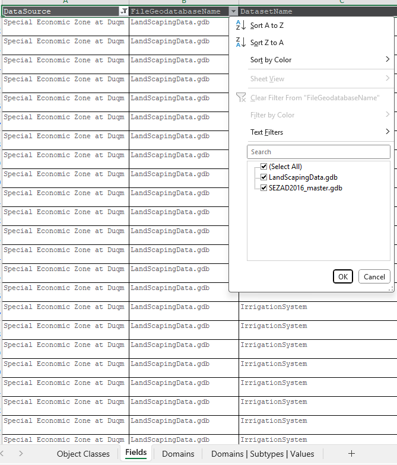 

<div style="page-break-before: always;"></div>

> [!TIP] Mapping sheet contains irrelevant databases
>
> 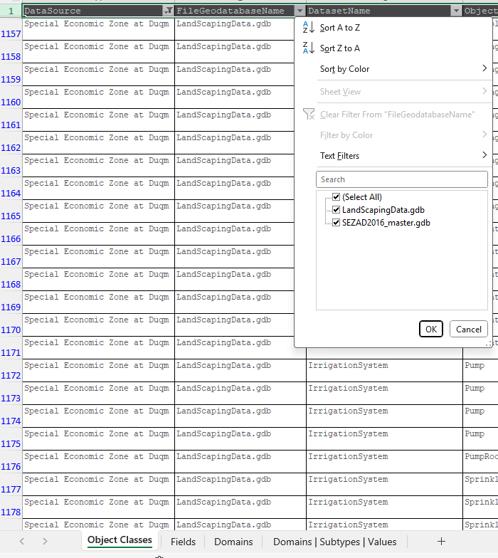

<div style="page-break-before: always;"></div>

> [!TIP] Unmapped values in domains within the mapping sheet
>
> The mapping sheet contains domains with several unmapped values. Samples:
> - **Domain serviceProviderValue** for the destination field `serviceProvider` sourced from fields such as:
> > - `Service_Provider` in `Duqm, Original_GIS_GDB_Ex_Telco_Omantel` table has unmapped values such as (Oman Broadband, OmanTel, Apprvoal).
> > - `Service_Provider` in `Duqm, Original_GIS_GDB_Ex_Water` table has unmapped values such as (DIAM, Durhat, Alayoon, Gilfar, IDWT, Marafiq, SEZAD).
> - **Domain spatialSourceValue** for the destination field `spatialSource` sourced from field `Source` in `Sohar` in multiple tables in the column SourceEntityGroup in the following screenshot:
> 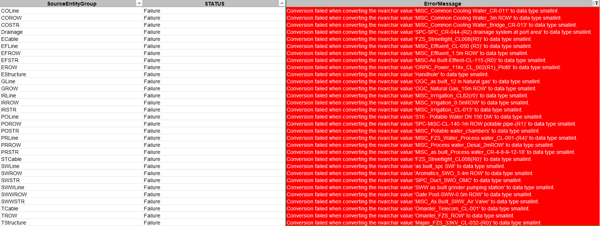

<div style="page-break-before: always;"></div>

> [!TIP] Unmapped values in domains within the mapping sheet
>
> Notice the values in the ErrorMessage column are all missing from the mapping sheet as illustrated in the screenshot below:
> 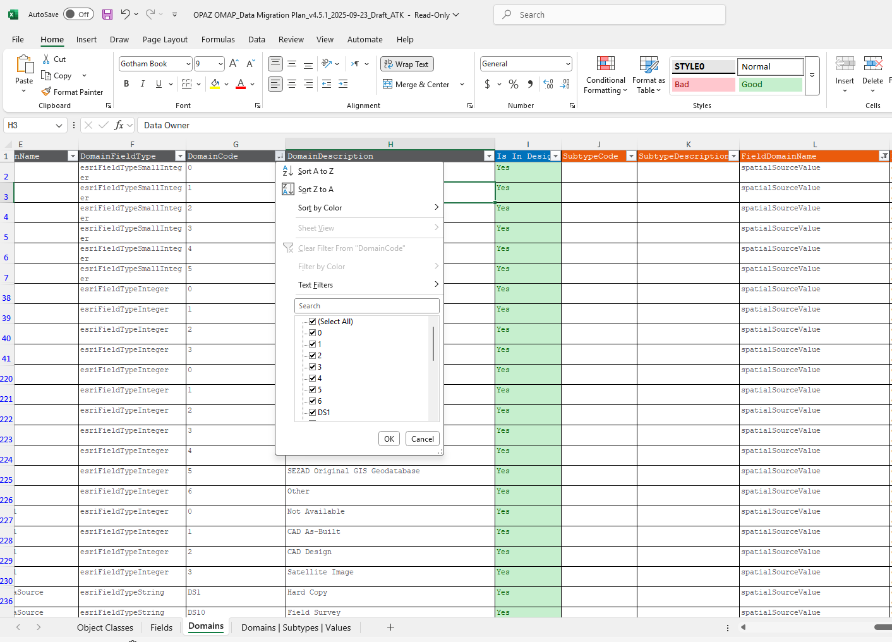
> 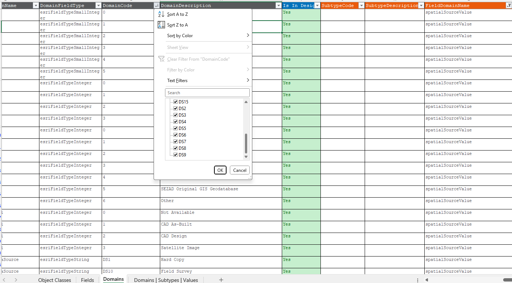

<div style="page-break-before: always;"></div>

> [!TIP] Missing mapping for `detailedlanduseen` in `MasterPlanPlot`
> 
> The mapping sheet is missing entries for the `detailedlanduseen` field in the `MasterPlanPlot` table. As a result, the source values are not properly mapped and are instead carried over directly from source to destination.

> [!TIP] Source and Destination Field Data Type Mismatches
>
> There are several cases where the source data type does not match the destination data type, such as source being a string or integer while the destination is a date.
> In such cases, the mapping sheet should explicitly provide the conversion expression in the source field, using a ```format compatible with SQL Server syntax, and the field name should be preceded by the source table name with dot notation``` as agreed previously.
> Below are some samples (not all):
> - ```Duqm```: 
>   - 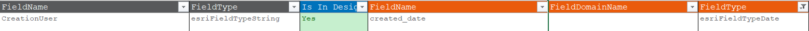
>   - 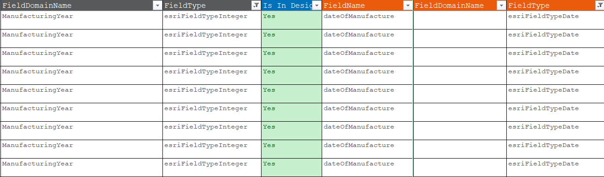
> - ```Salalah```:
>   - 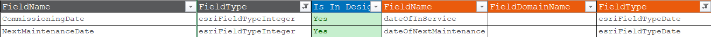
> - ```Sohar```:
>   - 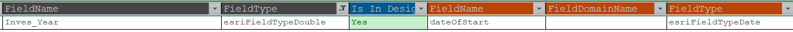
> For the majority of these fields, the data values represent only the year (e.g., "2020"). Why are we mapping them to the destination as a complete date? Do we actually need the full date, or is storing just the year sufficient?

<div style="page-break-before: always;"></div>

> [!TIP] Merge equation for multiple source fields to one destination field
>
> For fields where multiple source fields are merged into a single destination field, As previously agreed upon, the mapping sheet should provide the merge expression in the source field, using a ```format compatible with SQL Server syntax``` with certain rules as follows:
> - The expression should be included inside brackets ```(Expression)```.
> - Any field name should be preceded by the source table name with dot notation, e.g., ```(TableName.FieldName + '/' + TableName.AnotherFieldName)```.
> - If multifields are being included in the expression no need to repeat the expression with each field, just include it once with all the fields.
> Below are some samples (not all):
> - ```Duqm```:
>   - 
> - ```Salalah```:
>   - 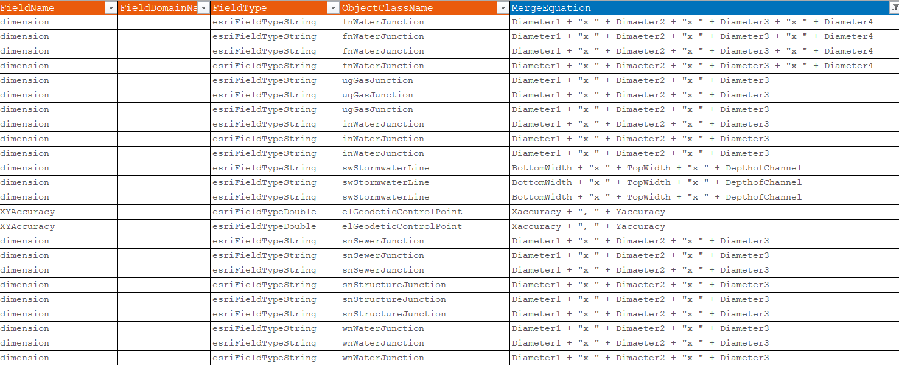
> Following some examples from the mapping sheet:
> - 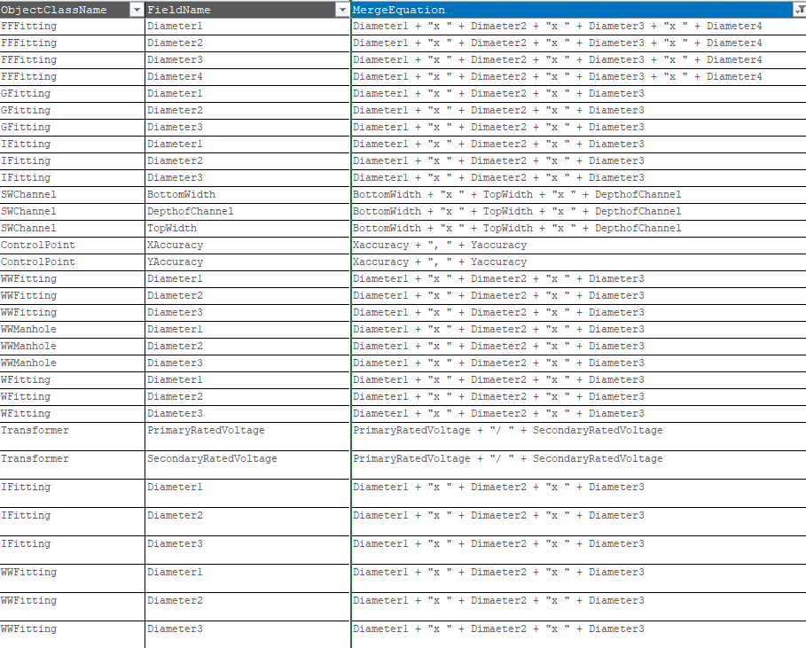

<div style="page-break-before: always;"></div>

> [!TIP] Merge equation for multiple source fields to one destination field
>
> I have created the necessary expressions for the current cases in the sheet. Please follow the same pattern for other cases as well (e.g., type mismatch cases mentioned above):
>
> | Current Merge Expression | Source table | New Expression in the Source Field |
> |--------------------------|--------------|------------------------------------|
> | ```Diameter1 + "x " + Dimaeter2 + "x " + Diameter3 + "x " + Diameter4``` | ```FFFitting``` | ```(CONCAT(FFFitting.Diameter1, 'x ', FFFitting.Diameter2, 'x ', FFFitting.Diameter3, 'x ', FFFitting.Diameter4))``` |
> | ```Diameter1 + "x " + Diameter2 + "x " + Diameter3``` | ```GFitting``` | ```(CONCAT(GFitting.Diameter1, 'x ', GFitting.Diameter2, 'x ', GFitting.Diameter3))``` |
> | ```Diameter1 + "x " + Diameter2 + "x " + Diameter3``` | ```IFitting``` | ```(CONCAT(IFitting.Diameter1, 'x ', IFitting.Diameter2, 'x ', IFitting.Diameter3))``` |
> | ```BottomWidth + "x " + TopWidth + "x " + DepthofChannel``` | ```SWChannel``` | ```(CONCAT(SWChannel.BottomWidth, 'x ', SWChannel.TopWidth, 'x ', SWChannel.DepthofChannel))``` |
> | ```Xaccuracy + ", " + Yaccuracy``` | ```ControlPoint``` | ```(CONCAT(ControlPoint.Xaccuracy, ', ', ControlPoint.Yaccuracy))``` |
> | ```Diameter1 + "x " + Diameter2 + "x " + Diameter3``` | ```WWFitting``` | ```(CONCAT(WWFitting.Diameter1, 'x ', WWFitting.Diameter2, 'x ', WWFitting.Diameter3))``` |
> | ```Diameter1 + "x " + Diameter2 + "x " + Diameter3``` | ```WWManhole``` | ```(CONCAT(WWManhole.Diameter1, 'x ', WWManhole.Diameter2, 'x ', WWManhole.Diameter3))``` |
> | ```Diameter1 + "x " + Diameter2 + "x " + Diameter3``` | ```WFitting``` | ```(CONCAT(WFitting.Diameter1, 'x ', WFitting.Diameter2, 'x ', WFitting.Diameter3))``` |
> | ```PrimaryRatedVoltage + "/ " + SecondaryRatedVoltage``` | ```Transformer``` | ```(CONCAT(Transformer.PrimaryRatedVoltage, '/ ', Transformer.SecondaryRatedVoltage))``` |

<div style="page-break-before: always;"></div>

> [!TIP] Multiple fields mapping to the same destination field with no merge expression (only comments)
>
> For cases where multiple source fields map to the same destination field and only comments are provided like:
> - 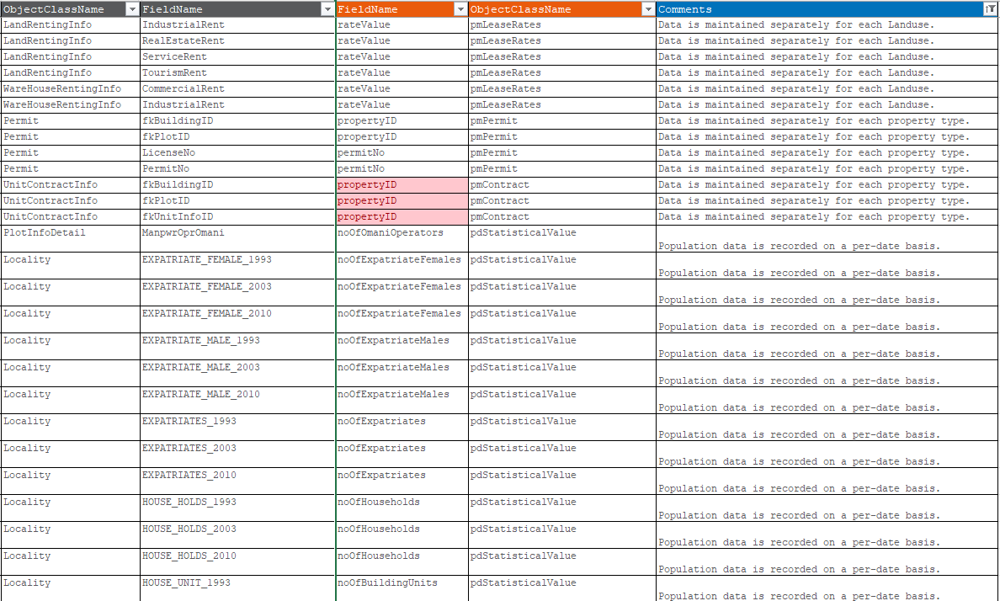
> These should be replaced with a single merge expression where applicable. If a merge is not possible, then a clear rule must be defined for how to map these fields to the destination field, using a format suitable for the ETL tool.

<div style="page-break-before: always;"></div>

# Required Rules for the Mapping Sheet
Any violation of these rules will result in either errors while mapping or incorrect data in the destination database.

> [!TIP] Rules
>
> 1. **Unique Field Mapping**: No more than one source field may map to the same destination field.
> 1. **Expressions**: 
> >  - The expression should be included inside brackets ```(Expression)```.
> >  - Any field name should be preceded by the source table name with dot notation, e.g., ```(TableName.FieldName + '/' + TableName.AnotherFieldName)```.
> >  - If multifields are being included in the expression no need to repeat the expression with each field, just include it once with all the fields.
> 1. **Source Tables Mapping to Destination Exist**: At least one source table (or group of tables) must be defined to map to the destination entity.
> 1. **Destination Entity Exists**: The specified destination entity (table/feature class) must already exist in the destination database schema.
> 1. **Entity Fields Exist in Destination Table**: All destination fields defined in the mapping must exist as columns in the destination table.
> 1. **No Empty or Null Mapping Fields**: Source fields, destination fields, and related mapping information must not be null or empty as long as they are in the design.
> 1. **Primary Key Mapping**: For any destination entity that relies on a join between source tables, the related primary key field must be defined in the Related Primary Key column within Fields Mapping. In addition, the Related Primary Entity column must specify the primary table name used in the join.
> 1. **Destination ID References**: Destination fields that reference the ID field as their primary key must be marked as Yes in the References Destination ID column in Fields Mapping.
> 1. **Subtype Field Names**: Any type field that contains a subtype (e.g., detailedLanduse) must specify its subtype field name in the Subtype Field column in Fields Mapping.
> 1. **Restrict Source Databases**: The mapping sheet should only include source databases that are part of our ETL process. Any irrelevant databases should be removed to avoid confusion and incorrect mappings.
> 1. **Where Clause for Filtering**: If a source table requires filtering, the Where Clause column must contain a valid SQL WHERE clause with the following rules:
> >  - The clause should not include the `WHERE` keyword itself; it should be just the condition inside braackets, e.g., `(condition)`.
> >  - The condition should use field names preceded by the source table name with dot notation, e.g., `(TableName.FieldName = 'Value')`.
> >  - Ensure that there is only one condition per source group (source group is a set of related source tables with joins that maps to the same destination table). If multiple conditions are needed, they should be combined using logical operators (AND, OR) within the same clause.