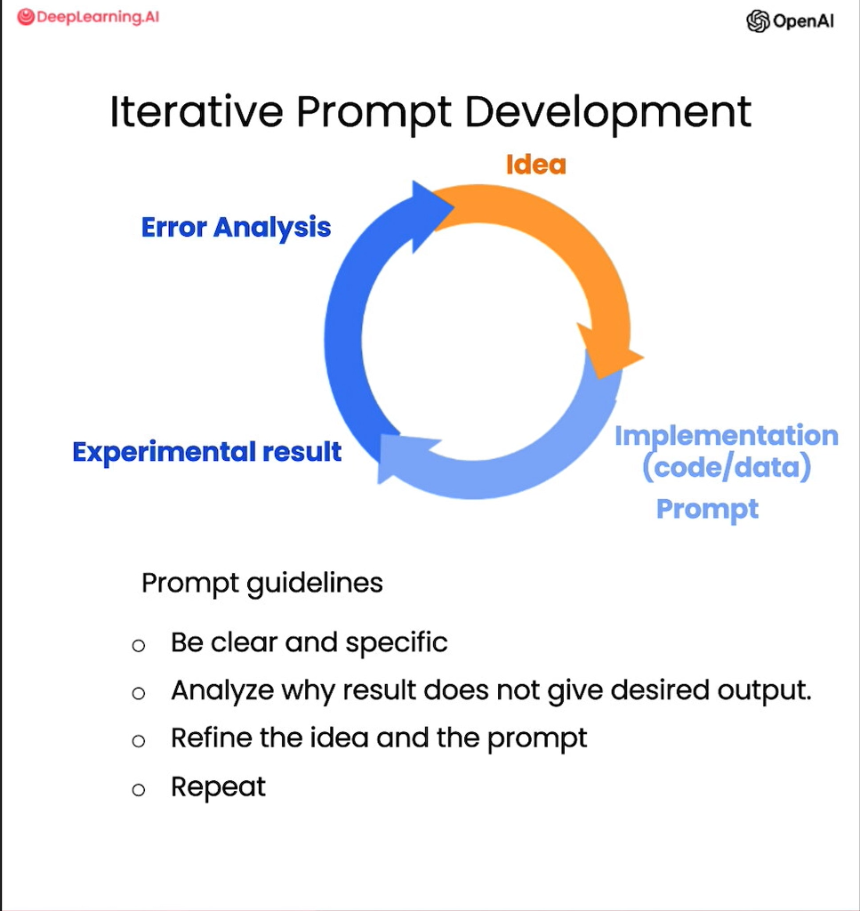
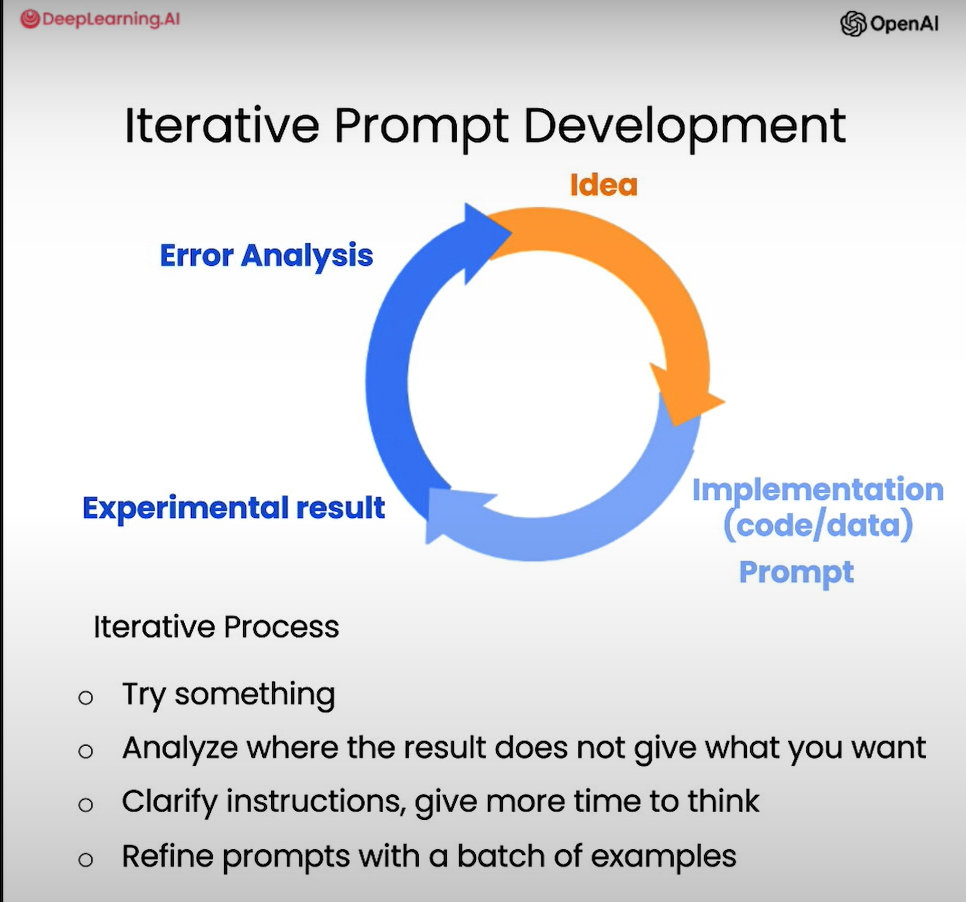

# Iterative Prompt Development
Iterative prompt development is a process of refining and improving prompts through multiple iterations to achieve better results from language models. Keep in mind there is no perfect prompt, and the goal is to find a prompt that works well for your specific use case.Z|



> [!NOTE] Example
>
> 
```Python
fact_sheet_chair = """
OVERVIEW
- Part of a beautiful family of mid-century inspired office furniture, 
including filing cabinets, desks, bookcases, meeting tables, and more.
- Several options of shell color and base finishes.
- Available with plastic back and front upholstery (SWC-100) 
or full upholstery (SWC-110) in 10 fabric and 6 leather options.
- Base finish options are: stainless steel, matte black, 
gloss white, or chrome.
- Chair is available with or without armrests.
- Suitable for home or business settings.
- Qualified for contract use.

CONSTRUCTION
- 5-wheel plastic coated aluminum base.
- Pneumatic chair adjust for easy raise/lower action.

DIMENSIONS
- WIDTH 53 CM | 20.87”
- DEPTH 51 CM | 20.08”
- HEIGHT 80 CM | 31.50”
- SEAT HEIGHT 44 CM | 17.32”
- SEAT DEPTH 41 CM | 16.14”

OPTIONS
- Soft or hard-floor caster options.
- Two choices of seat foam densities: 
 medium (1.8 lb/ft3) or high (2.8 lb/ft3)
- Armless or 8 position PU armrests 

MATERIALS
SHELL BASE GLIDER
- Cast Aluminum with modified nylon PA6/PA66 coating.
- Shell thickness: 10 mm.
SEAT
- HD36 foam

COUNTRY OF ORIGIN
- Italy
"""

# =========== Example of an initial prompt ================

prompt = f"""
Your task is to help a marketing team create a 
description for a retail website of a product based 
on a technical fact sheet.

Write a product description based on the information 
provided in the technical specifications delimited by 
triple backticks.

The description is intended for furniture retailers, 
so should be technical in nature and focus on the 
materials the product is constructed from.

At the end of the description, include every 7-character 
Product ID in the technical specification.

Use at most 50 words.

Technical specifications: (delimeter(triple backticks, didn't write as it will mess up the formatting)){fact_sheet_chair}(delimeter)
"""
response = get_completion(prompt)
print(response)

# =========== Example of another prompt ================
prompt = f"""
Your task is to help a marketing team create a 
description for a retail website of a product based 
on a technical fact sheet.

Write a product description based on the information 
provided in the technical specifications delimited by 
triple backticks.

The description is intended for furniture retailers, 
so should be technical in nature and focus on the 
materials the product is constructed from.

At the end of the description, include every 7-character 
Product ID in the technical specification.

After the description, include a table that gives the 
product's dimensions. The table should have two columns.
In the first column include the name of the dimension. 
In the second column include the measurements in inches only.

Give the table the title 'Product Dimensions'.

Format everything as HTML that can be used in a website. 
Place the description in a <div> element.

Technical specifications: (delimiter){fact_sheet_chair}(delimiter)
"""

response = get_completion(prompt)
print(response)
```

## Steps for Iterative Prompt Development
These steps are generated with Copilot auto completion, take an idea from them.
1. **Define the Objective**: Clearly outline what you want to achieve with the prompt. This could be generating text, answering questions, summarizing information, etc.
2. **Create an Initial Prompt**: Start with a basic prompt that aligns with your objective. This can be a simple question or statement.
3. **Test the Prompt**: Run the initial prompt through the language model and evaluate the output. Take note of what works well and what doesn't.
4. **Analyze the Output**: Review the generated responses to identify patterns, strengths, and weaknesses. Consider factors like relevance, coherence, creativity, and accuracy.
5. **Refine the Prompt**: Based on your analysis, make adjustments to the prompt. This could involve rephrasing, adding context, specifying constraints, or changing the format.
6. **Repeat the Process**: Continue testing, analyzing, and refining the prompt through multiple iterations until you achieve satisfactory results.
7. **Document Changes**: Keep track of the changes made to the prompt and the corresponding outputs. This documentation can help you understand what works best and why.
8. **Seek Feedback**: If possible, get feedback from others to gain different perspectives on the prompt and its effectiveness.
9. **Finalize the Prompt**: Once you are satisfied with the results, finalize the prompt for your use case.
10. **Monitor Performance**: After deploying the prompt, continue to monitor its performance and be open to making further adjustments as needed.
11. **Experiment with Variations**: Try different variations of the prompt to see if they yield better results. This could include changing the tone, length, or structure of the prompt.
12. **Leverage Advanced Techniques**: Consider using techniques like few-shot learning, where you provide examples in the prompt to guide the model's responses.
13. **Utilize Model-Specific Features**: Different language models may have unique features or capabilities. Tailor your prompts to leverage these features effectively.
14. **Stay Updated**: Keep abreast of advancements in language models and prompt engineering techniques to continuously improve your prompts.
15. **Consider Ethical Implications**: Ensure that your prompts do not lead to biased or harmful outputs. Regularly review and adjust prompts to align with ethical standards.
16. **Use Tools and Resources**: Utilize available tools and resources for prompt engineering, such as prompt libraries, forums, and research papers.
17. **Collaborate with Others**: Engage with the community of prompt engineers to share insights and learn from their experiences.
18. **Test Across Different Models**: If possible, test your prompts on different language models to see how they perform and adapt accordingly.
19. **Incorporate User Feedback**: If your prompt is part of a user-facing application, gather feedback from users to understand their experience and make necessary adjustments.
20. **Be Patient and Persistent**: Iterative prompt development can be a time-consuming process. Be patient and persistent in your efforts to refine and improve your prompts. 