> [!tip] Data Leaks Websites:
>
> - **github repositories**: some developers upload links for the leaked databases.
> - [Have I Been Pwned](https://haveibeenpwned.com/) ebrahim hegazy
> - [Dehashed](https://dehashed.com/) AI suggestion and the rest also
> - [Shodan.io](https://www.shodan.io/) ebrahim hegazy
> - [HackedEMail](https://hacked-emails.com/) ebrahim hegazy
> - [Intelligence X](https://intelx.io/)
> - [Hunter.io](https://hunter.io/)
> - [Snusbase](https://snusbase.com/)
> - [WeLeakInfo](https://weleakinfo.to/)
> - [LeakedSource](https://leakedsource.ru/)
> - [LeakCheck](https://leakcheck.io/)

> [!note]
>
> - have i been pwned provide details about the breach where and when it happened and the data that was leaked.
> - hacked-emails are transferred to something called constella and you have to request a demo to use it.
> - shodan provides dbs compormised or protected i still don't know the usage of it.
> - for hashed passwords you can use multiple websites to find the original password like hashkiller, crackstation, etc.

# linux commands lectures

## lec1

> [!note] lec1 refers to the third video in the playlist.

> [!TIP] lec1
>
> the first thing to do after installing a new linux machine is to update it using the following command:
>
> ```bash
> sudo apt update && sudo apt upgrade -y
> ```
>
> - **man**: command is used to get the manual of a command.
> - **apt-cache**: search is used to search for a package.
> - **apt-get install**: install is used to install a package.
> - **apt-get remove**: remove is used to remove a package.
> - **apt-get autoremove**: autoremove is used to remove the package and the dependencies of a package.

> [!note]
>
> when there is a question in the terminal giving you options like (Y/n) you can press enter to choose the default option which is the capital letter.

> [!question] apt vs apt-get
>
> apt is a newer version of apt-get and it has more features and is more user friendly.

## lec2

> [!TIP] Commands
>
> - **locate**: is used to search for a file in the system.
> - **find**: is used to search for a file in the system.
> - **curl**: is used to download a file from the internet.
> - **wget**: is used to download a file from the internet.
> - **grep**: is used to search for a string in a file.
> - **cat**: is used to display the content of a file.
> - **touch**: is used to create a file.
> - **echo**: is used to display a string in the terminal or to write a string in a file.

> [!note]
>
> curl by default make a get request, we can make a post request using the following command:
>
> ```bash
> curl -X POST -d "username=admin&password=admin" http://example.com/login
> ```

> [!example]
>
> i downloaded a cat image using the following command:
>
> ```bash
> curl -o cat.jpg "https://encrypted-tbn0.gstatic.com/images?q=tbn:ANd9GcRXJA32WU4rBpx7maglqeEtt3ot1tPIRWptxA&s"
> xdg-open cat.jpg # to open the image
> ```
>
> -o is used to save the file with a specific name in this case cat.jpg.

> [!note]
>
> if you downloaded a web page with curl it will be displayed in the terminal, to save it in a file you can use the following command:
>
> ```bash
> curl -o index.html "http://example.com"
> ```
>
> or you can use wget to download the page directly to a file.

> [!question] locate vs find
>
> - locate is faster than find because it searches in a database that is updated daily and find searches in the system.
> - find is more powerful than locate because it can search for a file with a specific size or a specific name (more options).

> [!note] echo
>
> echo can be used to write a string in a file using the following command:
>
> ```bash
> echo "hello world" > file.txt
> ```
>
> the above command will create a file called file.txt and write hello world in it, or overwrite the file if it already exists.
> to append to the file you can use the following command:
>
> ```bash
> echo "hello world" >> file.txt
> ```
>
> the above command will append hello world to the file.txt file.

# Lec 3

> [!TIP] Commands
>
> - **| (pipe or standard output)**: is used to send the output of a command to another command.
> - **>**: is used to write the output of a command to a file.
> - **>>**: is used to append the output of a command to a file.
> - **ifconfig**: is used to display the network configuration of the machine (ip address, mac address, etc).
> - **< (standard input)**: is used to read the input of a command from a file.
> - **2> (standard error)**: is used to write the error of a command to a file.
> - **grep -i "word to search for"**: is used to search for a string in a file case insensitive.
> - **cut -d "delimiter" -f "field number"**: is used to cut a specific field from a file, it's like split in programming languages, where delimiter is the separator and field number is the index of the field.
> - **awk**: is used to manipulate text files, it is a programming language.
> - **sed**: is used to manipulate text files, it is a programming language.
> - **&**: is used to run a command in the background.
> - **;**: is used to run multiple commands in one line.
> - **jobs**: is used to display the background processes.
> - **head**: is used to display the first 10 lines of a file, you can specify the number of lines using the -n option.
> - **tail**: is used to display the last 10 lines of a file, you can specify the number of lines using the -n option.

> [!note] & vs ;
>
> - & is used to run a command in the background as follows:
>
> ```bash
> sleep 10 &
> ```
>
> the above command will run the sleep command in the background for 10 seconds and you can use the terminal regardless of it's done or not, you can check the background processes using the following command:
>
> ```bash
> jobs
> ```
>
> - ; is used to run multiple commands in one line as follows:
>
> ```bash
> echo "hello"; echo "world"
> ```
>
> 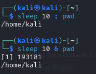
>
> in the above example the command using ; will be executed after 10 seconds but the command using & will be executed immediately and the sleep command will be executed in the background.
> 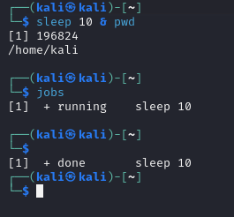
>
> you can chaeck the background processes using the jobs command as shown in the image above.

> [!note] tail
>
> tail also can be used with th logs files to display the last lines of the logs file as follows:
>
> ```bash
> tail -f /var/log/apache2/access.log
> ```
>
> **access.log** is the logs file of the apache server, **access.log** is the first file checked by the security team to check the logs of the server in case of an attack.

# Lec 4

> [!TIP] Commands
> **cat**: is used to display the content of a file.

> [!note] grep
>
> - grep can be used with regular expressions to search for a string in a file as follows:
>
> ```bash
> grep -i -o "[a-z][0-9a-z_.]*@gmail.com" file.txt
> ```
>
> the above command will search for emails in the file.txt file and display them in the terminal, -o is used to display only the emails without the line number.
> then we can sort the distinct emails using the following command:
>
> ```bash
> grep -i -o "[a-z][0-9a-z_.]*@gmail.com" file.txt | sort -u | tee emails.txt
> ```
>
> the above command will sort the emails and save them in a file called emails.txt.

> [!note] ps
>
> ps is used to display the processes running on the machine, you can use the following command to display the processes:
>
> ```bash
> ps aux
> ```
>
> aux is used to display all the processes running on the machine, if i write only ps it will display only the processes running in the current terminal.

> [!note] kill
>
> kill is used to kill a process, you can use the following command to kill a process:
>
> ```bash
> kill -9 PID
> ```
>
> PID is the process id of the process, while the -9 is to force kill the process.
> 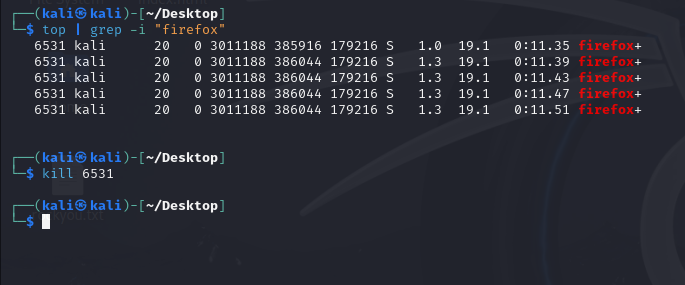

> [!note] top
>
> top is used to display the processes running on the machine and the resources they are using, you can use the following command to display the processes:
>
> ```bash
> top
> ```

> [!note] df
>
> df is used to display the disk space of the machine, you can use the following command to display the disk space:
>
> ```bash
> df -h
> ```
>
> -h is used to display the disk space in human readable format.

# Lec 5

> [!TIP] File Permissions
>
> - **r**: read permission.
> - **w**: write permission.
> - **x**: execute permission.
> - **-**: no permission.
> - **d**: directory.
> - **l**: link.
> - **s**: setuid/setgid.
> - **t**: sticky bit.
> - **rwxrwxrwx**: owner, group, others.
> - **chmod**: is used to change the permissions of a file.
> - **chown**: is used to change the owner of a file.
> - **chgrp**: is used to change the group of a file.
> - **ls -l**: is used to display the permissions of a file.
> - **ls -ld**: is used to display the permissions of a directory.
> - **ls -a**: is used to display the hidden files.
> - **ls -lh**: is used to display the permissions of a file in human readable format.
> - **ls -lS**: is used to display the files sorted by size.
> - **adduser**: is used to add a user.
>
> 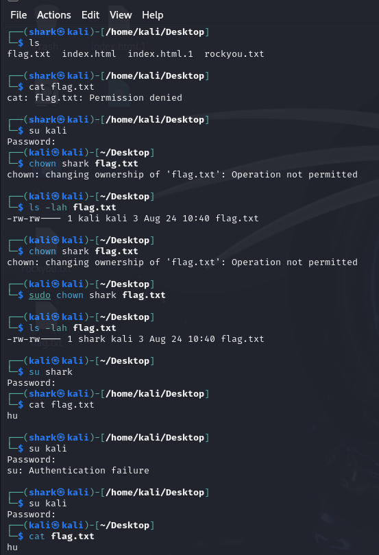

# Lec 6

> [!TIP] Hashing, Encryption, and Encoding
>
> - **Hashing**: is a one way function that converts a string to a fixed length string, it is used to store passwords securely.
> - **Encryption**: is a two way function that converts a string to another string and can be decrypted back to the original string.
> - **Encoding**: is a way to convert a string to another string using a specific encoding like base64.

> [!note] Hashing
>
> - Hashing output is always the same for the same input.
> - Hashing output always have the same length for different inputs.
> - we can't decrypt a hashed string, the way we hack a hashed password is by hashing all the possible passwords and compare the hashes with the hashed password.
> - the most common hashing algorithms are md5, sha1, sha256, sha512.
> - the most secure hashing algorithm is sha512.

> [!question] why hashing is used?
>
> - hashing is used to store passwords securely.
> - hashing is used to check the integrity of a file, like when you send a file you can send the hash of the file and the receiver can check the hash of the file to make sure it's not tampered with.

> [!note] different hashing algorithms
>
> - md5 is the weakest hashing algorithm, output length is 32 characters.
> - sha1 is stronger than md5 but still weak, output length is 40 characters.
> - sha256 is stronger than sha1, output length is 64 characters.

> [!tip] CMD5 website
>
> you can use [CMD5](https://www.cmd5.org/) website to know the type of the hashing algorithm used in a hash.

> [!note] Salting
>
> - salting is adding a random string to the password before hashing it.
> - salting is used to prevent rainbow table attacks.
> - salting is used to make the hashed password unique even if the password is the same.

> [!question] what is rainbow table attack?
>
> - rainbow table attack is a precomputed table for reversing cryptographic hash functions, it's used to crack hashed passwords.
> - the attacker can use the rainbow table to find the original password of a hashed password.
> - the idea behind the rainbow table is to hash all the possible passwords and store them in a table and when the attacker gets a hashed password he can search for it in the table to find the original password.

> [!question] is salting random? if so how can we compare the password?
>
> - salting is random and unique for each password.
> - we can store the salt with the hashed password in the database.
> - when the user logs in we can get the salt from the database and add it to the password and hash it and compare it with the hashed password in the database.

# Lec 7

> [!TIP] Encoding
>
> - Encoding is used to convert a string to another string using a specific replacement table for example replacing all the spaces with %20 or all the special characters with their ascii values.
> - Encoding is used to send data over the internet, for example when you send a url with spaces you can encode the url to replace the spaces with %20.
> - the most common encoding is base64.

> [!note] why encoding is used?
>
> - encoding is used to send data over the internet or to convert large data to a smaller data.

> [!note] base64
>
> base64 is used to encode binary data to text data, it's used to encode images, files, etc.
> you can use the following command to encode a file to base64:
>
> ```bash
> base64 file.jpg
> ```
>
> the above command will encode the file.jpg file to base64 and display it in the terminal, to save it in a file you can use the following command:
>
> ```bash
> base64 file.jpg > file.txt
> ```
>
> the above command will encode the file.jpg file to base64 and save it in a file called file.txt.
> to decode the base64 file you can use the following command:
>
> ```bash
> base64 -d file.txt > file.jpg
> ```

> [!note] one common exampleis alert(2222) used in xss attacks, how can we encode it?
>
> - we can encode the alert(2222) to base64 using the following command:
>
> ```bash
> echo -n "alert(2222)" | base64
> ```
>
> the above command will encode the alert(2222) to base64, some hackers encode the xss payloads to base64 to bypass the filters.

# Lec 8

> [!TIP] Symmetric Encryption
>
> - **Symmetric Encryption**: is a two way encryption that uses the same key to encrypt and decrypt the data.
> - examples of symmetric encryption algorithms are aes, des, 3des, twofish, etc, blow fish.

> [!note] why symmetric encryption isn't secure?
>
> - symmetric encryption isn't secure because the key is shared between the sender and the receiver.
> - if the key is leaked the attacker can decrypt all the data encrypted with this key.
> - the key is shared using a secure channel like a usb or a secure email.

> [!note] is symmetric encryption used in the real world?
>
> - symmetric encryption is used in the real world but the key is encrypted using asymmetric encryption.
> - the key is encrypted using the public key of the receiver and the receiver can decrypt the key using his private key.

> [!note]
>
> encrypted data is called ciphertext and the original data is called plaintext.

> [!note] ceaser cipher
>
> ceaser cipher is a simple symmetric encryption algorithm that shifts the letters by a specific number, for example if we shift the letters by 1 the letter a will be b, the letter b will be c, etc.
> you can use the following command to encrypt a string using ceaser cipher:
>
> ```bash
> echo "hello" | tr 'a-z' 'b-za'
> ```
>
> the above command will encrypt the hello string using ceaser cipher with a shift of 1.
> to decrypt the string you can use the following command:
>
> ```bash
> echo "ifmmp" | tr 'a-z' 'z-a'
> ```

# Lec 9

> [!TIP] Asymmetric Encryption
>
> - **Asymmetric Encryption**: is a two way encryption that uses two keys a public key and a private key, the public key is used to encrypt the data and the private key is used to decrypt the data.
> - the public key is shared with everyone and the private key is kept secret.
> - examples of asymmetric encryption algorithms are rsa, dh, DSA, ECDH, etc.
> - asymmetric encryption is used to encrypt the key of the symmetric encryption.

> [!question] what is ssh?
>
> - ssh is a secure shell protocol that is used to connect to a remote machine securely.
> - ssh uses asymmetric encryption to encrypt the key of the symmetric encryption.
> - in more details when you connect to a remote machine using ssh the client generates a symmetric key and encrypts it using the public key of the server and sends it to the server, the server decrypts the key using it's private key and uses it to encrypt the data.
> - ssh uses rsa or dsa for the asymmetric encryption.
> - we can generate a key pair private and public as follows.
>   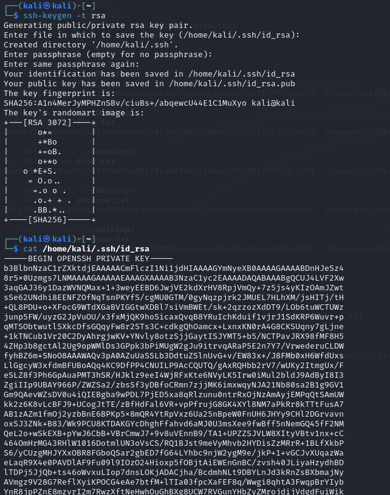
> - form the above image the private key is stored in the client machine and the public key is stored or sent to the server machine.
>   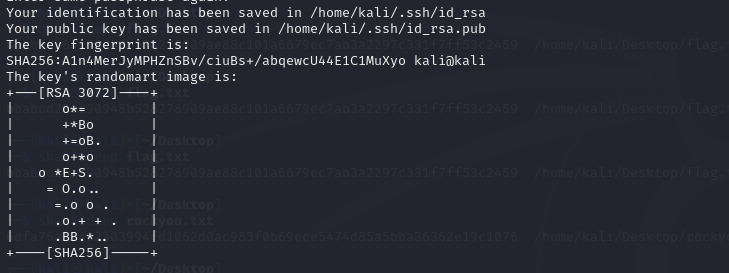

> [!note] we can later use the private key to connect to the server using the following command:
>
> ```bash
> ssh -i public_key user@ip
> ```

> [!tip] RSA
>
> - RSA is a popular asymmetric encryption algorithm.
> - RSA is used to encrypt the key of the symmetric encryption.
> - how it works simply is that the public key is the product of two prime numbers and the private key is the inverse of the public key.
>   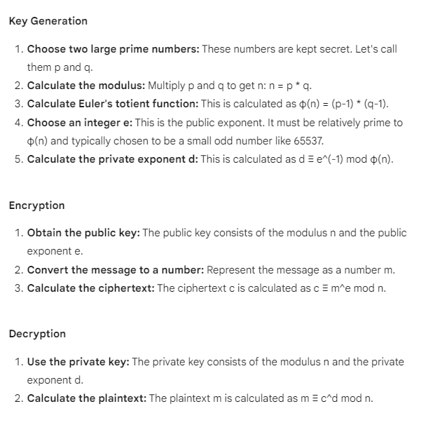

> [!TIP] create SSL for a website
>
> - to create an SSL certificate for a website you can use certbot website for free ... (i still don't know what is this).

> [!question] what is SSL and how it works?
>
> - SSL is a secure socket layer protocol that is used to secure the communication between the client and the server.
> - SSL uses asymmetric encryption to encrypt the symmetric key.
> - SSL uses symmetric encryption to encrypt the data.
> - SSL uses hashing to check the integrity of the data.
> - SSL uses certificates to verify the identity of the server.
> - SSL uses a chain of trust to verify the certificates.
> - SSL uses a certificate authority to sign the certificates.
> - SSL uses a public key infrastructure to manage the certificates.

# Lec 10

> [!question] why learning about encryption in cyber security?
>
> - encryption is used to secure the communication between the client and the server.
> - book recommendation: CISSP All in one exam chapter 7.

> [!question] what is browser certificate?
>
> - browser certificate is a certificate that is used to verify the identity of the server.

> [!question] what actually the certificate is?
>
> - the certificate is a file that contains some information: the domain name, the public key of the server, the expiry date, the certificate authority that signed the certificate, the server encrypted public key.

> [!question] the lifecycle of the certificate?
>
> - the server generates a key pair private and public.
> - the server sends the public key to the certificate authority requesting a certificate for a certain validation like domain validation, organization validation, extended validation ... the certificate authority validate the domain and the organization (stilldon't know how) and sign the certificate.
> - also the certificate authority encrypt the public key of the server using it's private key and send it to the server.
> - the server sends the certificate to the client.
> - the client decrypt the public key of the server using the public key of the certificate authority and use it to encrypt the data.
> - the client sends the encrypted data to the server.
> - the server decrypt the data using it's private key.
> - the client and the server can communicate securely.

> [!question] as mentioned above CA encrypt the public key of the server using it's private key, i always know that the public key is used to encrypt and the private key is used to decrypt, how the CA encrypt the public key using it's private key?
>
> - encrypting using th private key is called signing.
> - the CA sign the public key of the server using it's private key.

> [!question] again what is the content of the certificate exactly?
>
> - the certificate contains the domain name, the public key of the server, the expiry date, the certificate authority that signed the certificate, the server encrypted public key.

> [!question] what is the root certificate?
>
> - the root certificate is a certificate that is used to sign the intermediate certificate, in our case the certificate authority is the root certificate.

> [!question] what is intermediate certificate?
>
> - intermediate certificate is a certificate that is signed by the root certificate authority and used to sign the server certificate, like cloudflare.

> [!question] what is the chain of trust?
>
> - the chain of trust is the trust between the root certificate, the intermediate certificate, and the server certificate.

> [!question] what is the public key infrastructure?
>
> - the public key infrastructure is the infrastructure that is used to manage the certificates.
> - the public key infrastructure is used to manage the certificates, the certificate authorities, the certificate revocation lists, the certificate signing requests, etc.

> [!question] how the chain of trust works?
>
> - the client receives the server certificate.
> - the client decrypt the public key of the server using the public key of the certificate authority.
> - the client sends a request to the certificate authority to get the public key of the certificate authority.
> - the client decrypt the public key of the certificate authority using the public key of the root certificate authority.
> - the client sends a request to the root certificate authority to get the public key of the root certificate authority.
> - the client decrypt the public key of the root certificate authority using the public key of the root certificate authority.
> - the client can verify the chain of trust and trust the server certificate.
> - the client can communicate securely with the server.

> [!question] what i CRL?
>
> - CRL is a (certificate revocation list) that is used to revoke the certificates that are compromised or expired.
> - the certificate authority publish the CRL to the client and the client can check the CRL to make sure the certificate is not revoked.
> - the CRL is signed by the certificate authority.
> - the CRL contains the serial number of the certificate, the date of the revocation, the reason of the revocation, etc.
> - the CRL is published in the certificate authority website.

> [!question] what is OCSP?
>
> - OCSP is a (online certificate status protocol) that is used to check the status of the certificate.
> - the client sends a request to the certificate authority to check the status of the certificate.
> - the certificate authority sends a response to the client with the status of the certificate.
> - OCSP is faster than CRL because it's online.
> - OCSP is used to check the status of the certificate in real time.

> [!question] what is the difference between CRL and OCSP?
>
> - CRL is a list of revoked certificates that is published by the certificate authority.
> - OCSP is a protocol that is used to check the status of the certificate in real time.
> - CRL is slower than OCSP because it's a list.
> - OCSP is faster than CRL because it's online.
> - OCSP is used to check the status of the certificate in real time.
> - CRL is used to check the status of the certificate offline.

> [!question] how https works?
>
> - https is a secure version of http that uses SSL to secure the communication between the client and the server.
> - https uses symmetric encryption to encrypt the data.
> - at the beginning asymmetric encryption is used to encrypt the symmetric key.
> - then both the client and the server use the symmetric key to encrypt and decrypt the data, and no one can decrypt the data except the client and the server as the key is not sent over the network.

# Lec 11

> [!TIP] OSI Model
>
> - **OSI Model**: is a model that is used to understand how the network works.
> - **OSI Model**: is a 7 layer model that is used to understand the communication between the client and the server.

> [!note] OSI Model Layers

> [!TIP] what is DHCP?
>
> - DHCP is a (dynamic host configuration protocol) that is used to assign an ip address to the client.
> - DHCP is used to assign the ip address dynamically.

> [!TIP] how DHCP works?
>
> - the client sends a request to the DHCP server to get an ip address.
> - the DHCP server sends a response to the client with the ip address.
> - the client can communicate with the server using the ip address.

> [!TIP] where DHCP is used?
>
> - DHCP is used in the local network to assign an ip address to the client.
> - DHCP is used in the local network to assign the default gateway to the client.
> - The operaation of DHCP happens automatically when the client connects to the network, but for some companies it needs manual configuration for security reasons.
> - you can see the ip through the following command:
>
> ```bash
> sudo dhclient -v eth0
> ```
>
> - eth0 is the network interface.
> - -v is used to display the verbose output.
> - dhclient is used to get the ip address from the DHCP server.
> - the output is as follows:
>
> 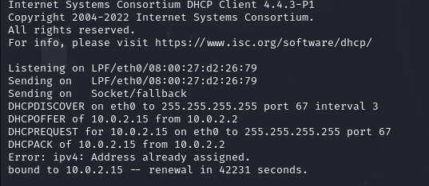
>
> - the DHCPDISCOVER is the client request to see which device is the DHCP server.
> - the DHCPOFFER is the server response with the ip address offer.
> - the DHCPREQUEST is the client request to get the ip address.
> - the DHCPACK stands for the server acknowledgment of the ip address.
> - bound is the client status that it got the ip address.

> [!tip] what happens scince writing in the browser https website and press enter?
>
> - the client sends a request to the DNS server to get the ip address of the website.
> - the DNS server sends a response to the client with the ip address of the website.
> - the client sends a request to the server to get the website.
> - the server sends its public key to the CA to get a certificate.
> - the CA sends a response to the server with the certificate.
> - the server sends the certificate to the client.
> - the client decrypt the public key of the server using the public key of the CA.
> - the client encrypt the symmetric key using the public key of the server.
> - the client sends the encrypted symmetric key to the server.
> - the server decrypt the symmetric key using the private key of the server.
> - the client and the server both have the symmetric key and they can communicate securely without exposing the key over the network.

# Lec 12

> [!TIP] TCP & UDP
>
> - **TCP**: stands for (transmission control protocol) is a connection oriented protocol that is used to send data over the network, it's known as a stateful protocol.
> - **UDP**: stands for (user datagram protocol) is a connectionless protocol that is used to send data over the network, it's known as a stateless protocol.

> [!note] TCP
>
> - TCP works with a handshake mechanism to establish a connection between the client and the server called the 3 way handshake.
> - the handshake is as follows: the client sends a SYN(Synchronize) packet to the server, the server sends a SYN-ACK(Synchronize-Acknowledgment) packet to the client, the client sends an ACK(Acknowledgment) packet to the server.

> [!BUG] handshake vulnerability
>
> - the handshake mechanism is vulnerable to a DOS(Denial of Service) attack called SYN flood attack.
> - the attacker sends a lot of SYN packets to the server without completing the handshake and the server will wait for the ACK packet until the timeout and the server will be down.
> - the solution for the SYN flood attack is to use a firewall to block the ip address of the attacker.
> - the solution for the SYN flood attack is to use a SYN cookie mechanism to complete the handshake without waiting for the ACK packet.

> [!question] why the handshake mechanism is used?
>
> - the handshake mechanism is used to establish the connection making sure the client and the server are ready to communicate.

> [!question] how the handshake is related to https and certificates what its advantage over them?
>
> - not directly related asthe handshake is used to establish the connection between the client and the server at the transport layer (layer 4) and the certificates are used to verify the identity of the server at the application layer (layer 7).

> [!note] what the SYN packet contains?
>
> - the SYN packet contains the sequence number of the packet.
> - the sequence number is used to make sure the packets are in order.
> - the sequence number is used to make sure the packets are not duplicated.
> - the sequence number is used to make sure the packets are not lost.
> - the sequence number is used to make sure the packets are not tampered with.

> [!question] what does the ACK packet contain?
>
> - the ACK packet contains the acknowledgment number of the packet.
> - the acknowledgment number is used to make sure the packets are received.
> - the acknowledgment number is used to make sure the packets are in order.

> [!question] TCP connection happens before or after https?
>
> - the TCP connection happens before the https connection.
> - the TCP connection is used to establish the connection between the client and the server before going to the CA or making encryption.

> [!question] how firewall can protect against SYN flood attack?
>
> - the firewall can protect against the SYN flood attack by blocking the ip address of the attacker.
> - but then the attacker can change the ip address and attack again which called ip spoofing and make DDOS attack (will get into it later).

> [!question] what is the SYN cookie mechanism?
>
> - the SYN cookie mechanism is used to complete the handshake without waiting for the ACK packet.
> - the server sends a SYN-ACK packet with a cookie to the client.
> - the client sends an ACK packet with the cookie to the server.
> - the server can verify the cookie and complete the handshake.

> [!note] UDP
>
> - UDP is a connectionless protocol that is used to send data over the network.
> - it doesn't have a handshake mechanism.
> - it's faster than TCP because it doesn't have a handshake mechanism.
> - it's used in real time applications like video streaming, voice over IP, etc.

> [!bug] IP spoofing & DNS
>
> - IP spoofing is a technique used by the attacker to change the ip address of the packet to make it look like it's coming from a trusted source.
> - the attacker can change the ip address of the packet to make it look like it's coming from myserver instead of the attacker ten sends multi requests to multi DNS servers requesting their DNS cache then the DNS servers will send the response to my server instead of the attacker as they use UDP protocol which is connectionless and doesn't check for identity ... so let's say the attacker send to a million server the request to get the DNS cache then the million servers will send the response to my server which will make it down.
> - the solution for the IP spoofing is to use the DNSSEC protocol that is used to sign the DNS records and make sure the DNS records are not tampered with.

> [!note] there is a maximum transmission unit (MTU) for the packets that is used to make sure the packets are not fragmented and the packets are not lost, so some times in TCP with the large data the data is divided into multiple packets and the packets are sent over the network and the receiver can reassemble the packets to get the original data.

> [!question] if the packets are divided in TCP how can the receiver reassemble the packets?
>
> - the packets are divided into multiple packets and each packet contains the sequence number of the packet.
> - the receiver can reassemble the packets using the sequence number of the packet.

> [!question] what is the meaning of the packets are not fragmented?
>
> - the packets are not fragmented means the packets are not divided into multiple packets and aretreated as one packet.

> [!question] in UDP if the data is divided into multiple packets how can the receiver reassemble the packets?
>
> - the receiver can reassemble the packets using the order of the packets as there is no sequence number in UDP.

> [!question] does the udp provide the sequence number of the packet?
>
> - no UDP doesn't provide the sequence number of the packet.

> [!question] how the receiver can reassemble the packets in UDP, as the packets doesn'thave a sequence number?
>
> - the receiver can reassemble the packets using the order of the packets.

> [!tip] wire shark
>
> - wire shark is a tool that is used to capture the packets over the network (any traffic over your network from layer 2 to layer 7).
> - i can open it using the following command:
>
> ```bash
> wireshark
> ```
>
> - then i can start selecting a networkand monitor the trafffic over it.

# Lec 13

> [!TIP] DNS
>
> - **DNS**: stands for (domain name system) is a system that is used to convert the domain name to the ip address.
>   i can use the following command to get the ip address of the domain name:
>
> ```bash
> nslookup domain.com
> ```
>
> - we can select the DNS server to use by modifying the /etc/resolv.conf file.

> [!note] PTR record
>
> PTR record is a record that is used to convert the ip address to the domain name.

> [!bug] DNS poisoning
>
> - DNS poisoning is a technique used by the attacker to change the ip address of the domain name in the DNS server making the client connect to the attacker server instead of the original server.

> [!note] virus total
>
> virus total is a website that is used to check the reputation of the domain name or the ip address, it also can be used to check which DNS server is used by the domain name.

> [!bug] don't use google as your DNS server as it's not secure and can be used to track you (company wise).

# Lec 14

> [!TIP] DNS Records types
>
> - **A record**: is a record that is used to convert the domain name to the ipv4 address, example( by ebrahim that i'mnot sure of its validity): if my original websute is yahoo.com then the A record will be www.yahoo.com ... it's also called subdomain.
> - **AAAA record**: is a record that is used to convert the domain name to the ipv6 address, website.
> - **MX record**: is a record that is used to get the mail service domain name for a specific domain name, example: if i have a domain name called example.com and i want to get the mail service domain name for it i can use the MX record, we can use mxtoolbox website to check the MX record of a domain name.
> - **CNAME record**: is a record that is used to convert the domain name to another domain name, example: if i have a domain name called example.com and i want to redirect it to yahoo.com i can use the CNAME record.

> [!question] what is DNS Record at simple words?
>
> - DNS Record is a record in a DNS server database that is used to convert the domain name to the ip address.

> [!question] why needing CNAME record?
>
> - CNAME record is used to redirect the domain name to another domain name.
> - it allow us to have multiple domain names for the same website.

> [!question] why possibly we need multiple domain names for the same website, and mention a real world example?
>
> - we can use multiple domain names for the same website for marketing purposes.
> - real world example like having multiple website for a brand, or having a multi tenancy website like shopify.

> [!question] can more than one domain name have the same ip address?
>
> - yes more than one domain name can have the same ip address.

> [!question] tell me a case where more than one domain name have the same ip address?
>
> - the case of shared hosting for example, where multiple websites are hosted on the same server and have the same ip address.

> [!question] in shared hosqting if the same websites have the same ip address how can the server know which website to serve?
>
> - the server can know which website to serve using the host header in the http request.

> [!question] why not using the port number to serve the website in shared hosting?
>
> - the port number is used to serve the service not the website.
> - the port number is used to serve the service like http, https, ftp, etc.
> - in shared hosting multiple websites are served on the same service like http or https, not like the local development where we use the port number to serve the website.

> [!question] who manages the DNS server?
>
> - the DNS server is managed by the domain name registrar.

> [!question] what is the domain name registrar?
>
> - the domain name registrar is a company that is used to register the domain name.

> [!question] what is subdomain takeover?
>
> - subdomain takeover is a technique used by the attacker to take over the subdomain of the domain name.

> [!question] how the attacker can take over the subdomain in detail, illustrate with an example?
>
> - first let's say a company created a subdomain called sub.example.com and the company used a service like github pages to host the subdomain.
> - the company deleted the repository in github pages but didn't remove the CNAME record in the DNS server.
> - so now the example.com is pointing to the github pages but the repository is deleted.
> - now what the attacker do is get into github and create a repository with the same name of the subdomain pointing to the attacker server.
> - now whenever the user access the sub.example.com the user will be redirected to the attacker server.
> - the attacker can use the subdomain takeover to steal the cookies of the user, to steal the credentials of the user, to steal the session of the user, etc.

> [!question] how to prevent the subdomain takeover?
>
> - to prevent the subdomain takeover you can remove the CNAME record in the DNS server when you delete the repository in the service.

# Lec 15

> [!TIP] Dig and cache snooping
>
> - **Dig**: is a tool that is used to get the DNS records of a domain name.
> - **Cache Snooping**: is a technique used by the attacker to get the DNS cache of the DNS server.

> [!TIP] how to search for hacking tools over the internet?
>
> - if you write for example subdomain takeover tool in the search engine probably you will get alot of articles not the tools so the best way is to search for **the tools in the github, or after the name of the tool write github**.

> [!note] tool for subdomain takeover
>
> - [HostileSubBruteforcer](https://github.com/nahamsec/HostileSubBruteforcer)
> - the describtion of how it works is written on the readmeon github, (basically it searches the subdomains of the domain name existance in different services like github, heroku, AWS, etc).

> [!note] what zone transfer is?
>
> - zone transfer is a technique used by the attacker to get the DNS records of the DNS server.
> - the attacker can use the dig tool to get the DNS records of the DNS server.

> [!note] DNS servers architecture
>
> - the DNS servers are divided into multiple levels like the root server, the top level domain server, the authoritative serverand DNS resolver.

> [!note] the journy of the DNS request
>
> 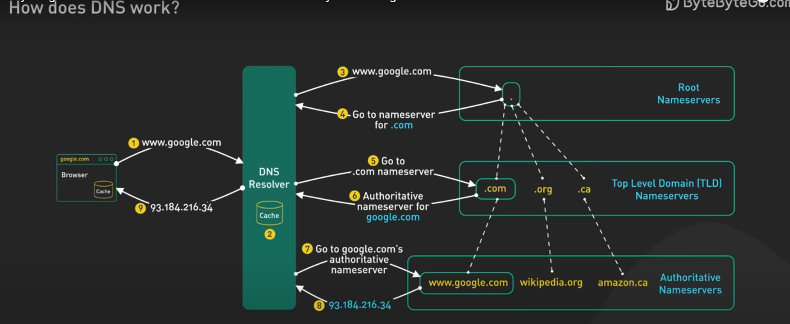.
>
> - the client checks the browser cache for the ip address of the domain name.
> - if not found the client checks the operating system cache for the ip address of the domain name.
> - if not found the client checks the router cache for the ip address of the domain name.
> - if not found the client sends a request to the DNS resolver to get the ip address of the domain name.
> - the DNS resolver checks the cache for the ip address of the domain name.
> - if not found the DNS resolver sends a request to the root server to get the ip address of the domain name.
> - the root server sends a response to the DNS resolver with the top level domain server.
> - the DNS resolver sends a request to the top level domain server to get the ip address of the domain name.
> - the top level domain server sends a response to the DNS resolver with the authoritative server.
> - the DNS resolver sends a request to the authoritative server to get the ip address of the domain name.
> - the authoritative server sends a response to the DNS resolver with the ip address of the domain name.
> - the DNS resolver sends a response to the client with the ip address of the domain name.
> - the client can communicate with the server using the ip address.

> [!question] what is the DNS resolver?
>
> the DNS resolver is a server that is used to resolve the domain name to the ip address (ISP) like tedata in egypt.

> [!question] what is the root server?
>
> the root server is a server that is used to resolve the top level domain server, there is about 13 root servers in the worldthat stores the top level domain server ip address, root server have info about the top level domain server like .com, .org, .net, etc.

> [!question] what is the top level domain server?
>
> the top level domain server is a server that is used to resolve the authoritative server, it has info about the websites related to the top level domain like .com, .org, .net, etc ... for example the .com top level domain server has the info about the websites that ends with .com.

> [!question] what is the authoritative server?
>
> the authoritative server is a server that is used to resolve the ip address of the domain name, it has the info about the domain name and the ip address of the domain name.

# Lec 16

> [!TIP] Nmap
>
> nmap is a tool that is used to scan the ports of the server, check the open ports, check the services running, check the version of the services running on the server.

> [!note] how to use nmap?
>
> - you can use the following command to scan the ports of the server:
>
> ```bash
> nmap ip
> ```
>
> - the above command will scan the ports of the server and display the open ports of the server.

> [!note] ports states in nmap
>
> - **open**: the port is open and the service is running, as a hacker this is the port you are looking for you can exploit the service running on the port.
> - **closed**: the port is closed and the service is not running.
> - **filtered**: the port is filtered and the service is not accessible, meaning that there is a firewall blocking the port.

> [!note] what is iptables?
>
> - iptables is a tool that is used to manage the firewall rules of the server.
> - it's used to allow or block the ports of the server.

> [!note]
>
> nmap is usually the first tool used at the beginning of the penetration testing to scan the ports of the server and check the open ports of the server.

> [!note]
>
> some ports are available for programmers for debugging like port 7001 for java developers at development environment so port like this should be closed at production environment, and as a hacker you can use nmap to check the open ports and exploit them.

> [!note]
>
> nmap by default scans only 1000 ports, the most common ports, but you can scan all the ports using the following command:
>
> ```bash
> nmap -p- ip
> ```
>
> ip can be replaced by the domain name like yahoo.com.

> [!note] SNMP
>
> - **SNMP**: stands for (simple network management protocol) is a protocol that is used to manage the network devices.
> - **SNMP**: is used to get the information about the network devices like the ip address, the mac address, the operating system, the services running on the device, etc.
> - it runs on port 161, so if you find the port 161 open you can use SNMP to get the information about the network devices and manipulate the network devices.

> [!note] how to scan a specific port using nmap?
>
> - you can use the following command to scan a specific port:
>
> ```bash
> nmap -p port ip
> ```
>
> - the above command will scan the specific port of the server and display the state of the port.

> [!question] how to scan a range of ports using nmap?
>
> - you can use the following command to scan a range of ports:
>
> ```bash
> nmap -p start-end ip
> ```

> [!question] what is -sT -sU --top-ports in nmap?
>
> - **-sT**: is used to scan the ports using the TCP protocol.
> - **-sU**: is used to scan the ports using the UDP protocol.
> - **--top-ports**: is used to scan the top ports of the server.
> - what does this command do?:
>
> ```bash
> sudo nmap -sT -sU --top-ports 10 yahoo.com
> ```

> ```
> - the above command will scan the top 10 ports of the server using the TCP and UDP protocols.
> ```

> [!question] what is -A in nmap?
>
> sometimes you find a port open but you don't know the service running on the port, you can use the -A option to get the information about the service running on the port, it works as follows:
> nmap starts sending different packets or payloads to the port sometimes as ssh, http, etc and the service will respond namp will get the response and analyze it to know the service running on the port.
> sometimes the response is **tcp wrapped** so nmap can't get the service running on the port.
>
> 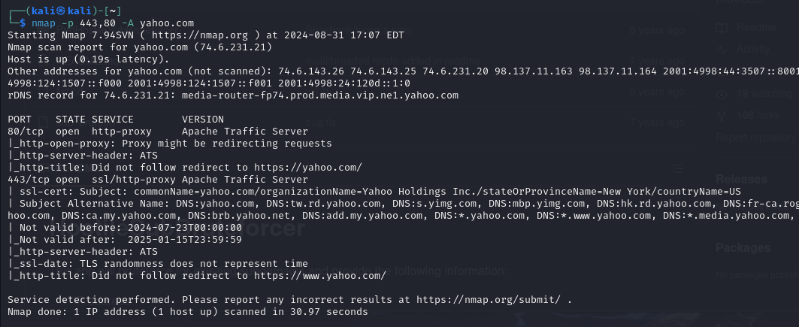
>
> the image above shows the nmap scan of the port 80 and 443 of the yahoo.com website with -A option showing not only the open ports but also the services running on the ports and the version of the server.
> also it shows the host of the ip or the domain so knowing the host of the ip or the domain takes us to the point of checking the subdomains of the domain name, if it has a subdomain that is vulnerable to subdomain takeover we can take over the subdomain and redirect the user to our server and steal the cookies, the credentials, the session, etc.

# Lec 17

> [!TIP] advanced nmap

> [!question] what does this command do nmap -iL ips.txt?
>
> - the above command will scan the ip addresses in the ips.txt file.
> - each ip address should be in a new line in the ips.txt file.

> [!question] what does this command do nmap -iL ips.txt -sn?
>
> - the above command will scan the ip addresses in the ips.txt file using the ping scan.

> [!question] what is exploit database?
>
> - exploit database is a website that is used to get the exploits of the vulnerabilities.

> [!question] how to use the exploit database efficiently?
>
> - you can use the search bar to search for the vulnerability.
> - you can use the filters to filter the results.

> [!question] what is msfconsole?
>
> msfconsole is a tool that is used to get the exploits of the vulnerabilities.
> 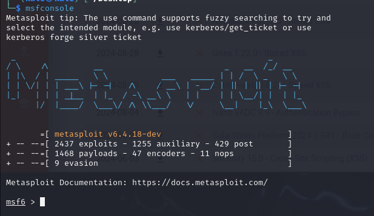

> [!question] what does msfconsole stands for?
>
> - **msf**: stands for (metasploit framework).
> - **console**: is a command line interface.

> [!question] what is metasploit framework?
>
> mateasploit framework is a framework that is used to get the exploits of the vulnerabilities.
> it's used to get the exploits of the vulnerabilities, to get the payloads of the exploits, to get the encoders of the payloads, to get the listeners of the payloads, etc.

> [!question] stepstouse mfsconsole?
>
> - you can use the following command to start the msfconsole:
>
> ```bash
> msfconsole
> ```
>
> - you can use the search command to search for the exploit as follows:
>
> ```bash
> search exploit
> ```
>
> - you can use the use command to use the exploit as follows:
>
> ```bash
> use exploit
> ```
>
> - you can use the show options command to show the options of the exploit as follows:
>
> ```bash
> show options
> ```
>
> the options are the configuration of the exploit like the target, the payload, the listener, etc ... some options are required and some are optional.
>
> - you can use the set command to set the options of the exploit as follows:
>
> ```bash
> set option value
> ```
>
> - after setting the options you can use the exploit command to exploit the vulnerability as follows:
>
> ```bash
> exploit
> ```

> [!note] nmap not just to scan the ports, it also has some scripts that can be used as a brute force attack to guess the username and password of the server, to get the information about the server, to get the information about the services running on the server, etc.

> [!note] nmap scripts
>
> it has toomany scripts for a lot of services like ftp, oracle, ssh, etc ... you can use the following command to get the scripts:
>
> ```bash
> ls /usr/share/nmap/scripts
> ```
>
> you can use the following command to use the script:
>
> ```bash
> nmap domain.com -p 21 --script=ftp-anon
> ```
>
> the above command will scan the port 21 of the domain.com using the ftp-anon script.

> [!question] what language the scripts are written in?
>
> - the scripts are written in lua language.
> - lua is a scripting language that is used to write the scripts.

> [!question] is there any other tool like nmap?
>
> yes there is a tool called hydra that is used to brute force the username and password of the server.

# Lec 18

> [!TIP] nmap email list full disclosure
>
> subscribe to the nmap email list to get the full disclosure of the vulnerabilities and the new features of the nmap.

> [!tip] saving the output of the nmap
>
> you can use the following command to save the output of the nmap:
>
> ```bash
> nmap ip --oG output.txt
> ```
>
> the above command will save the output of the nmap in the output.txt file, G stands for grepable (can use grep to search for the output).
> you can use the following command to save the output of the nmap in all formats:
>
> ```bash
> nmap ip -oA output
> ```
>
> the above command will save the output of the nmap in the output.xml, output.nmap, output.gnmap files.

> [!question] what is the difference between the output.xml, output.nmap, output.gnmap files?
>
> - **output.xml**: is an xml file that is used to save the output of the nmap, in xml format.
> - **output.nmap**: is a text file that is used to save the output of the nmap, in text format.
> - **output.gnmap**: is a grepable file that is used to save the output of the nmap, in grepable format.

## Lec 19

> [!TIP] Burp Suite
>
> **Burp Suite**: is a tool that is used to test the security of the web applications.

> [!question] whay is the usage of burp suite?
>
> - burp suite is used to test the security of the web applications, the main idea is making burp act as a proxy between the client and the server so it can intercept the requests and the responses and analyze them.

> [!question] what is foxy proxy?
>
> - foxy proxy is a tool that is used to set the proxy of the browser.
> - you can use the foxy proxy to set the proxy of the browser to burp suite, by setting the default port of the proxy to the burp suite port.

> [!question] what are the prerequistes to use burp suite?
>
> - you need to set the proxy of the browser to burp suite.
> - you need to add burp suite as a trusted certificate authority in the browser, if you didn't you won't be able to connect to the websites as you can't provide the certificate of the website.

## Lec 20

> [!TIP] Burp Suite tabs
>
> - **Proxy**: is a tab that is used to intercept the requests and the responses.
> - **Target**: is a tab that is used to get the information about the target like the ip address, the domain name, the services running on the target, etc.
> - **Intruder**: is a tab that is used to brute force the username and password of the target.
> - **Repeater**: is a tab that is used to repeat the requests.
> - **Sequencer**: is a tab that is used to analyze the randomness of the token.
> - **Decoder**: is a tab that is used to decode the encoded data.
> - **Comparer**: is a tab that is used to compare the requests.
> - **Extender**: is a tab that is used to add the extensions to the burp suite.
> - **Scanner**: is a tab that is used to scan the target for the vulnerabilities.
> - **Spider**: is a tab that is used to crawl the target for the links.

> [!note] target tab
>
> - you can use the target tab to get the information about the target like the ip address, the domain name, the services running on the target, etc.
> - target tab has sub tabs like the site map, the scope and the issue definitions.
>   

> [!note] site map
>
> - site map is a tab that is used to get the information about the target like the ip address, the domain name, response infor and headers, request headers and everything about the requests ... also it provides a filter to filter the requests whether the file types, response status codes and so on.
>   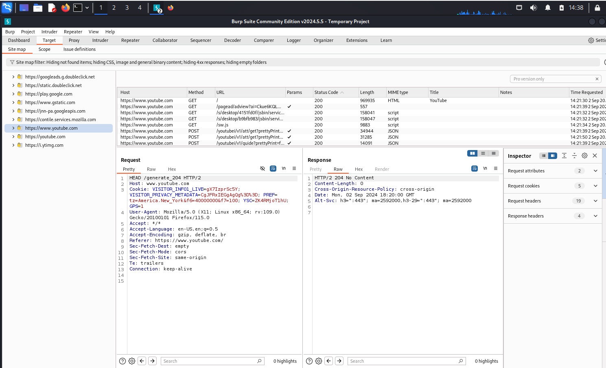

> [!note] scope
>
> - scope is a tab that is used to set the scope of the target, like the ip address or the domain name ( the subdomains are included by default) ... so if you set the scope of the target to the domain name the burp suite will only scan the domain name and the subdomains of the domain name ... you can also make exclusion in the execlude window.
>   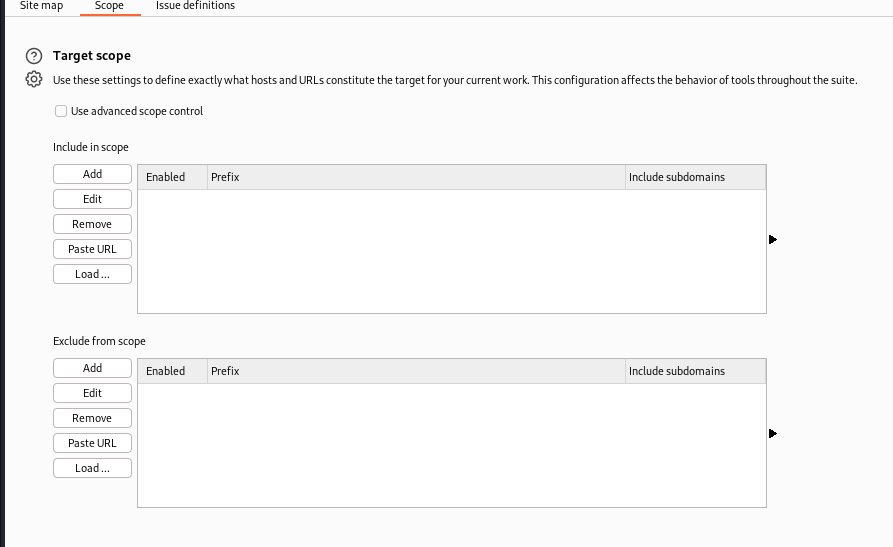
> - tip when you set the scope of the target to the domain name exclude the logout, exit, signout, etc pages as they are not needed in the scan.

> [!note] issue definitions
>
> - issue definitions is a tab that is used to get the information about the vulnerabilities of the target, it has a lot of vulnerabilities like the sql injection, the xss, the csrf, etc ... you can use the issue definitions to get the information about the vulnerabilities and the impact of the vulnerabilities.

> [!note] proxy tab
>
> - you can use the proxy tab to intercept the requests and the responses.

> [!note] proxy sub tabs
>
> - **Intercept**: is a sub tab that is used to intercept the requests and the responses, you can forward, drop, repeat, etc the requests and the responses.
> - **HTTP history**: is a sub tab that is used to get the history of the requests and the responses.
> - **Web sockets**: is a sub tab that is used to intercept the web sockets.
> - **Options**: is a sub tab that is used to set the options of the proxy like the intercept on/off, the intercept filter, etc.

> [!note] options tab sections in proxy
>
> - **Response modiication rules**: modify the response of the server like unhide the hidden fields, change the response status code, etc.
> - **Request modification rules**: modify the request of the client like add the headers, change the request method, etc.
> - **Match and replace**: match the request headers or the response and replace it with another value.
>   there is also toomany options that are very useful youcan explore them as you go.

> [!tip] spider tab
>
> - you can use the spider tab to crawl the target for the links, meaning that the burp suite will visit the target and get the links of the target and visit the links and get the links of the links and so on.

> [!tip] intruder tab
>
> - you can use the intruder tab to brute force the username and password of the target.

> [!question] how to use the intruder tab?
>
> - first intercept a request using the intercept tab, generally a formlike login for example.
> - then send the intercepted request to the intruder tab.
> - set the payload position in the request, like the password.
> - set the payload different values you wanna try and then start attack.

## lec 21

> [!TIP] repeater tab
>
> it's used to make repeating the requests easier rather than intercepting and sending the request manually from the browser or from the interceptor in the proxy, so you can send the request to the repeater and start modyfing the request and sending it again and again and the response is displayed beside it in the same tab.

> [!note] sequencer tab
>
> sequencer tab is used to analyze the randomness of the session, like the csrf token, the session token, etc ... it's used to analyze the randomness of the token and make sure the token is not predictable.

> [!note] what is the problem with session fixation?
>
> it's more vulnerable and easy to exploit if the session token is predictable, so the attacker can predict the session token and steal the session of the user.

> [!question] how to use the sequencer tab?
>
> - first intercept the request that contains the token.
> - then send the request to the sequencer tab.
> - set the token position in the request.
> - start the sequencer and analyze the randomness of the token, the requests count must exceed 100 to be able to analyze he tokens and check its randomness.

> [!tip] Decoder tab
>
> - you can use the decoder tab to decode the encoded data like the base64, the hex, the url, etc ... sometimesyou find some data encoded in the request or the response and you want to decode it to get the original data then the decoder tab is the solution.

> [!tip] Comparer tab
>
> you can use the comparer tab to compare the requests and the responses, like comparing the requests and the responses of the login page with the requests and the responses of the logout page to see the difference between them or comparing different response times ofthe same request with different payloads and so on.

> [!tip] Extender tab
>
> Extender tab is used to add the extensions to the burp suite, like the sqlmap extension, the wappalyzer extension, etc ... you can use the extender tab to add the extensions to the burp suite.

> [!tip] Alert tab
>
> Alert tab is used to get the alerts of the burp suite, like the alerts of the vulnerabilities, the alerts of the issues, etc.

> [!tip] Project options
>
> you can use the project options to set the options of the project like the scope of the project, the issue definitions of the project, etc.

> [!tip] user options
>
> you can use the user options to set the options of the user like the proxy options, the target options, etc.
> a very important usage is if you have a proxy that you wanna forward the requests to it you can set the proxy options in the user options.

## Lec 22

> [!TIP] HTTP methods, request and response headers

> [!note] HEAD method
>
> HEAD method is used to get the headers of the response without getting the body of the response.

> [!question] HEAD vs GET and POST
>
> it's used to get the headers of the response without getting the body of the response, so it's faster than the GET and POST methods.

> [!note] OPTIONS method
>
> OPTIONS method is used to get the allowed methods of the server.
> it's used to get the allowed methods of the server like the GET, POST, PUT, DELETE, etc.

> [!note] TRACE method
>
> TRACE method is used to get the request headers of the client in the response.
> it's used to get the request headers of the client in the response, it's used to check the headers of the client.

> [!question] we can get the cookies of the client using GET method and also xss attack, so why we use TRACE method?
>
> - the TRACE method is used to get the request headers of the client in the response, it's used to check the headers of the client as sometimes the server admin makesthe cookies httponly so the cookies can't be accessed by the client (javascript) so the attacker can use the TRACE method to get the headers of the client inside the response.

> [!note] Host header
>
> Host header is a header that is used to get the domain name of the server.
> host headder can be exploited in host header attack.

> [!note] User-Agent header
>
> User-Agent header is a header that is used to get the information about the client like the operating system, the browser, the version, etc.
> example: Mozilla/5.0 (Windows NT 10.0; Win64; x64) AppleWebKit/537.36 (KHTML, like Gecko) Chrome/58.0.3029.110 Safari/537.36.

> [!note]
>
> xss sometimes can be done from specific user agent headers so when making xss attack you can change the user agent header to make the attack successful.

> [!note] Important response headers
>
> - **Status code**: is a header that is used to get the status code of the response: 200=the page is found, 404=the page is not found, 500=internal server error, 300=redirect, etc.
> - **Content-Type**: is a header that is used to get the content type of the response: text/html, application/json, image/png, etc.
> - **Date**: is a header that is used to get the date of the response.
> - **Set-Cookie**: is a header that is used to set the cookies of the client.
> - **X-Frame-Options**: is a header that is used to prevent the clickjacking attack.
> - **X-XSS-Protection**: is a header that is used to prevent the xss attack.

> [!note] how can date header be useful in the attack?
>
> in file upload the developer sometimes setsthe file name to the date of the upload or to the epoch time( the time in seconds from 1970) so the attacker can use the date header to get the file name or to understand that the number in the file name isn't random and is the epoch time.

> [!note] how can the content type header be useful in the attack?
>
> the content type header can be useful in the attack as the developer sometimes sets the content type of the file to text/html so the attacker can add a script in the get request and the server will execute the script as it thinks the content type is text/html.

> [!question] what is status code 307?
>
> a message your web browser receives from a website server, indicating that the page or content you're looking for has moved temporarily to a new location.
> it's used to redirect the client to another location.

> [!question] what is webDav?
>
> webDav is a protocol that is used to upload the files to the server.

## Lec 23

> [!tip] how attacks happens?
>
> the gloss of what ebrahimsaid is there is no validation over the input specifically the url query parameters which allow the attacker to make xss attacks.

## Lec 24

> [!TIP] XSS attacks
>
> XSS attacks are attacks that are used to inject the script in the website and steal the cookies, the credentials, the session, etc.

> [!note] types of xss attacks
>
> - **Reflected XSS**: is an attack that is used to inject the script in the url and the script is reflected back in the response (in other meaning the attacker sends the malicious link to the user and the user clicks on the link and the script in the link is executed in the user browser reflecting the response back to the attacker with the user data fetched by the script).
> - **Stored XSS**: is an attack that is used to inject the script in the website and the script is stored in the website (in other meaning the attacker injects the script in the website itself like adding a comment with the script and the script is stored in the website and executed in the user browser when the user visits the website page that have the attacker comment with the script the stealing the data and sending it to the attacker).
> - **DOM based XSS**: is an attack that is used to inject the script in the website and the script is executed in the client side (in other meaning the attacker injects the script in the website and the script is executed in the client side in the browser of the user).

> [!question] how the DOM based XSS is different from the reflected and stored XSS?
>
> - **Reflected XSS**: the script is reflected back in the response.
> - **Stored XSS**: the script is stored in the website.
> - **DOM based XSS**: the script is executed in the client side.

> [!note] mention a realexample of the DOM based XSS, illustrating each stepthe attacker takeand thevictim also.
>
> - let's say the attacker injects the script in the website in the search bar and the script is executed in the client side in the browser of the user not reaching the server like the reflected and stored XSS.

> [!note] how to prevent the xss attacks?
>
> - **Reflected XSS**: you can prevent the reflected XSS by validating the input of the url query parameters.
> - **Stored XSS**: you can prevent the stored XSS by validating the input of the website.
> - **DOM based XSS**: you can prevent the DOM based XSS by validating the input of the website.

> [!note] how to validate the input of the website?
>
> - you can validate the input of the website by escaping the special characters like the <, >, ", ', etc.
>   encoding the input of the website like the base64 encoding, the url encoding, etc.
> - you can use the CSP (content security policy) to prevent the xss attacks.

> [!question] what is CSP?
>
> - **CSP**: stands for (content security policy) is a policy that is used to prevent the xss attacks.
> - it's used to prevent the xss attacks by setting the policy of the website like the allowed sources of the website, the allowed scripts of the website, etc.
> - you can use the CSP to prevent the xss attacks by setting the policy of the website.

> [!question] what is policy like in CSP isit a header?
>
> - yes the CSP is a header that is used to set the policy of the website.
> - you can use the CSP header to set the policy of the website.

> [!note] html5sec.org
>
> html5sec.org is a website that is used to get the xss payloads to test the xss vulnerabilities and shows which payloads are supported by each browser.

> [!note] xss game
>
> xss game is a game that is used to test the xss vulnerabilities.

> [!note] onload event and xss
>
> the onload event is an event that is used to execute the script when the page is loaded, so if there is input passed directly to the onload function like in the following image the attacker can write the js code directly in the onload function without needing to write them inside a script tag.
> 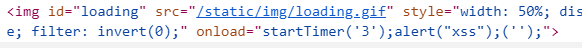
> so insteadof passing only 3 to the onload function the attacker can pass the js code like this for example:
> 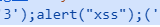
> to reach the correct form for the code to be executed as functions in order in the browser.
> but sometimes the url is filtered fromthe scripts or from some special digits so to bypass that we need to encode the js code using URL encoding as the above text in the image will be converted to something like this:
> 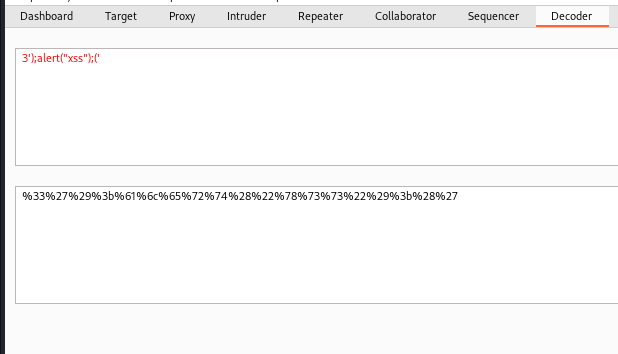

> [!note] onerror event in the img tag
>
> the onerror event is an event that is used to execute the script when the image is not found, so the attacker can use the onerror event to execute the script in the browser.
